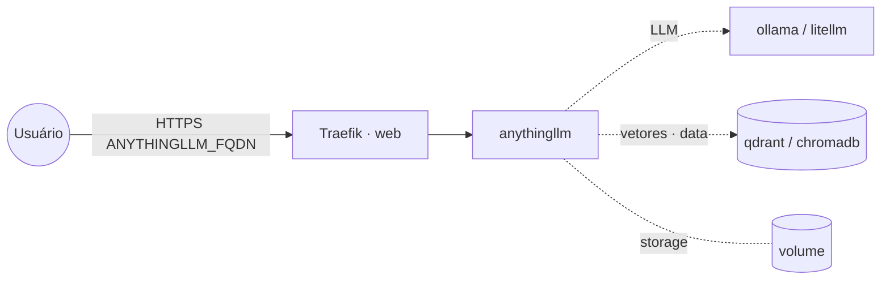

# anythingllm — AnythingLLM (RAG tudo-em-um)

**AnythingLLM** é um app completo de **RAG/chat com documentos** e agentes: workspaces, ingestão de
arquivos, múltiplos provedores de LLM e vector stores. Publicado via Traefik v3 com TLS; persiste em
volume local. O LLM e o vector store são escolhidos **na própria UI**.

## Arquitetura

## Variáveis de ambiente
| Variável | Obrigatória | Default | Descrição |
|---|---|---|---|
| `ANYTHINGLLM_FQDN` | sim | — | domínio público (ex.: `rag.exemplo.com`) |
| `ANYTHINGLLM_JWT_SECRET` | não | — | segredo JWT (recomendado; `openssl rand -hex 32`) |
| `ANYTHINGLLM_DISABLE_TELEMETRY` | não | `true` | desativa a telemetria |
| `ANYTHINGLLM_IMAGE_TAG` | não | `latest` | tag da imagem mintplexlabs/anythingllm |
| `PROXY_NET` | não | `web` | rede externa do Traefik |
| `DATA_NET` | não | `data` | rede overlay dos serviços compartilhados |
| `WORKER_HOSTNAME` | não | — | fixa o volume num nó (cluster multi-worker) |

## Pré-requisitos
- Stack `balancer` (Traefik) + rede `web`; DNS de `ANYTHINGLLM_FQDN` apontando para o host.
- Rede `data` (para alcançar `qdrant`/`chromadb` internamente, se usados).
- Um backend de LLM (`ollama`/`litellm`) e, opcionalmente, um vector store (`qdrant`/`chromadb`).

## Uso
1. Faça o deploy e acesse `https://ANYTHINGLLM_FQDN`. O **primeiro acesso** faz o onboarding (admin).
2. Em **Settings**, escolha o provedor de LLM (ex.: Ollama em `http://ollama:11434` se na mesma rede,
   ou a URL pública) e o vector store (ex.: Qdrant em `http://qdrant:6333` pela rede `data`).
3. Crie um workspace, suba documentos e converse.

## Troubleshooting
| Sintoma | Causa | Ação |
|---|---|---|
| Não responde / sem LLM | provedor não configurado | definir LLM em Settings (URL/credencial corretas) |
| Vetores não persistem | vector store interno em volume efêmero | usar `qdrant`/`chromadb` externos na rede `data` |
| Documentos somem ao reagendar | volume local ao nó (multi-worker) | fixar `node.hostname` via `WORKER_HOSTNAME` |
| 404/sem TLS | DNS não aponta / fora da `web` | conferir rede/labels e DNS |
