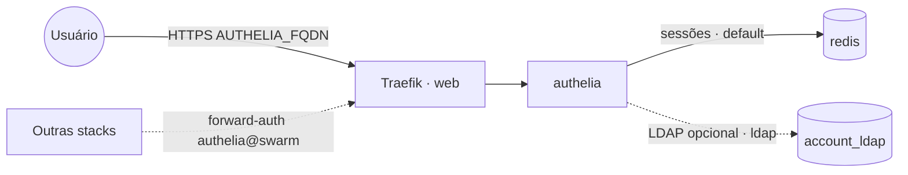

# authelia — Authelia (autenticação/2FA) + Redis

Portal de autenticação **Authelia** publicado via Traefik v3 com TLS. Oferece login com 2FA (TOTP)
e atua como provedor de **forward-auth** para proteger outras stacks expostas no Traefik.
Usa **Redis** (rede interna) para sessões.

## Componentes
| Serviço | Imagem | URL | Função |
|---|---|---|---|
| `authelia` | `authelia/authelia` | `AUTHELIA_FQDN` | portal de login / forward-auth |
| `redis` | `redis` | interno (`redis:6379`) | armazenamento de sessões |

## Arquitetura



## Variáveis de ambiente
| Variável | Obrigatória | Default | Descrição |
|---|---|---|---|
| `AUTHELIA_FQDN` | sim | — | domínio público do portal (ex.: `auth.exemplo.com`) |
| `AUTHELIA_JWT_SECRET` | sim | — | segredo para assinar JWTs (recuperação de identidade) |
| `AUTHELIA_SESSION_SECRET` | sim | — | segredo de criptografia das sessões |
| `AUTHELIA_STORAGE_ENCRYPTION_KEY` | sim | — | chave de criptografia do storage (mín. 20 caracteres) |
| `AUTHELIA_CONFIG_NAME` | não | `authelia_config_v1` | nome do Docker config com o `configuration.yml` |
| `AUTHELIA_IMAGE_TAG` | não | `latest` | tag da imagem Authelia |
| `REDIS_IMAGE_TAG` | não | `alpine` | tag da imagem Redis |
| `PROXY_NET` | não | `web` | rede externa do Traefik |
| `WORKER_HOSTNAME` | não | — | hostname do worker para fixar volumes (multi-worker) |

## Pré-requisitos
- Traefik (stack `balancer`) e rede `web` ativos.
- DNS de `AUTHELIA_FQDN` apontando para o host (porta 80 acessível para o Let's Encrypt).
- Docker config externo do `configuration.yml` criado (abaixo).

## Pré-requisito: Docker config externo do `configuration.yml`
O serviço `authelia` espera um Docker config já existente no Swarm, montado em
`/config/configuration.yml`. Crie-o a partir do template em [`config/`](config/) (ajuste domínios,
regras de acesso e backend de usuários antes):

```bash
# 1) edite config/configuration.yml (AUTHELIA_FQDN, domínio, access_control, backend de usuários)
docker config create authelia_config_v1 config/configuration.yml
```
> Docker config é **imutável**. Para alterar depois, crie uma nova versão (`authelia_config_v2`),
> aponte `AUTHELIA_CONFIG_NAME` para ela e atualize a stack.

Os segredos **não** ficam no `configuration.yml`: `jwt_secret`, `session.secret` e
`storage.encryption_key` são injetados por variável de ambiente (`AUTHELIA_JWT_SECRET`,
`AUTHELIA_SESSION_SECRET`, `AUTHELIA_STORAGE_ENCRYPTION_KEY`). Gere valores aleatórios fortes, por
exemplo com `docker run --rm authelia/authelia authelia crypto rand --length 64 --charset alphanumeric`.

O template já referencia o **Redis** desta stack (`session.redis.host: redis`) e traz dois backends de
usuários: **file** (padrão) e **LDAP** (`ldap://account_ldap:389`, comentado — reaproveita a stack
`account`). Para usar LDAP, descomente o bloco e anexe a rede externa `ldap` ao serviço `authelia`.

## Uso

### Deploy
1. Crie o Docker config (acima) e defina os segredos como variáveis da stack.
2. Faça o deploy. Acesse `https://AUTHELIA_FQDN` — surge o portal de login do Authelia.

### Proteger outras stacks com forward-auth
A stack publica um middleware Traefik chamado `authelia` (referenciado como `authelia@swarm`).
Em **outra** stack, aplique o middleware no router do serviço que deseja proteger:

```yaml
deploy:
  labels:
    - traefik.enable=true
    - traefik.http.routers.<app>.rule=Host(`app.exemplo.com`)
    - traefik.http.routers.<app>.entrypoints=websecure
    - traefik.http.routers.<app>.tls=true
    - traefik.http.routers.<app>.tls.certresolver=letsencryptresolver
    - traefik.http.routers.<app>.middlewares=authelia@swarm
    - traefik.http.services.<app>.loadbalancer.server.port=<porta>
```

O middleware definido nesta stack aponta para:
`traefik.http.middlewares.authelia.forwardauth.address=http://authelia:9091/api/verify?rd=https://${AUTHELIA_FQDN}`

Requisições não autenticadas são redirecionadas para o portal (`rd=`); após o login o usuário volta
ao app original. As regras de acesso (`bypass`/`one_factor`/`two_factor`) ficam no `configuration.yml`.

## Troubleshooting
| Sintoma | Causa | Ação |
|---|---|---|
| Deploy falha por config inexistente | Docker config não criado | criar `authelia_config_*` antes do deploy |
| Authelia não inicia | segredo ausente / chave de storage curta | definir `AUTHELIA_JWT_SECRET`, `AUTHELIA_SESSION_SECRET`, `AUTHELIA_STORAGE_ENCRYPTION_KEY` (≥ 20 chars) |
| 404/sem TLS | fora da rede `web` / DNS não aponta | conferir rede/labels e DNS de `AUTHELIA_FQDN` |
| `authelia@swarm` não encontrado em outra stack | middleware não publicado / nome errado | garantir que a stack `authelia` está no ar e usar `authelia@swarm` |
| Loop de redirecionamento no login | `session.domain` não cobre os apps | ajustar `session.domain` para o domínio-pai comum no `configuration.yml` |
| Sessões perdidas a cada restart | Redis indisponível | conferir o serviço `redis` e `session.redis.host: redis` |
| Mudança no `configuration.yml` não aplica | Docker config é imutável | criar `_v2`, apontar `AUTHELIA_CONFIG_NAME` e redeploy |
