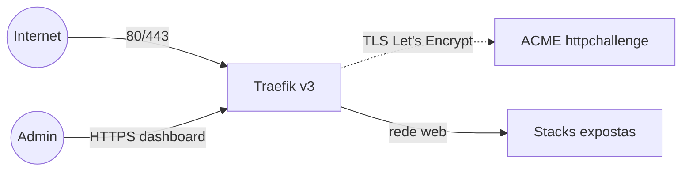

# balancer — Traefik v3 (reverse proxy + TLS)

Reverse proxy **Traefik v3** com TLS automático via Let's Encrypt (httpchallenge) e dashboard
protegido por basicauth. Cria o ponto de entrada (`:80`/`:443`) e usa a rede externa pública por
onde as demais stacks publicam.

> **Swarm vs standalone.** `docker-compose.yml` = Docker **Swarm** (App Template type 2, provider
> `swarm`). `docker-compose.standalone.yml` = Docker **standalone** (type 3, provider `docker`,
> labels no container, rede `web` bridge: `docker network create web`). As stacks expostas devem
> usar a variante correspondente (Swarm lê `deploy.labels`; standalone lê `labels:` do container).

## Arquitetura



## Variáveis de ambiente
| Variável | Obrigatória | Default | Descrição |
|---|---|---|---|
| `DOMAIN` | sim | — | domínio base (dashboard em `traefik.balancer.DOMAIN`) |
| `ACME_EMAIL` | sim | — | e-mail de contato do Let's Encrypt |
| `HTTP_AUTH_BASIC` | sim | — | basicauth do dashboard, formato `usuario:hash_bcrypt` (gere com `htpasswd -nbB user senha`) |
| `PROXY_NET` | não | `web` | nome da rede overlay pública |
| `TRAEFIK_IMAGE_TAG` | não | `v3.6` | tag da imagem Traefik |
| `TRAEFIK_LOG_LEVEL` | não | `WARN` | nível de log (`DEBUG`/`INFO`/`WARN`/`ERROR`) |

## Pré-requisitos
- **Hardware mínimo:** 1 vCPU · 256 MB RAM · 5 GB disco
- **Hardware ideal:** 1 vCPU · 512 MB RAM · 10 GB disco
- Roda no nó **manager** (acessa o socket do Docker).
- A rede overlay pública precisa existir e ser **attachable**:
  ```bash
  docker network create --driver overlay --attachable web
  ```
- Portas 80 e 443 livres no host (publicadas em modo `host`).
- DNS dos serviços apontando para o host (o httpchallenge valida na porta 80).

## Como as outras stacks publicam
Cada serviço exposto entra na rede `web` e declara, em `deploy.labels`:
```yaml
- traefik.enable=true
- traefik.http.routers.<nome>.rule=Host(`<fqdn>`)
- traefik.http.routers.<nome>.entrypoints=websecure
- traefik.http.routers.<nome>.tls=true
- traefik.http.routers.<nome>.tls.certresolver=letsencryptresolver
- traefik.http.services.<nome>.loadbalancer.server.port=<porta-interna>
```
> `exposedByDefault=false`: sem `traefik.enable=true` o serviço não é roteado.

## Troubleshooting
| Sintoma | Causa | Ação |
|---|---|---|
| 404 em todos os serviços | rede `web` não existe / Traefik não subiu no manager | criar a rede; conferir placement `node.role == manager` |
| Certificado não emite | DNS não aponta / porta 80 fechada / rate limit do LE | conferir DNS e firewall; ver `logs` |
| Dashboard 401 eterno | `$` do hash comido pela interpolação do Compose | dobrar cada `$` do `HTTP_AUTH_BASIC` (ver nota abaixo) |
| Dashboard 502 Bad Gateway | router sem `service=api@internal` | atualizar a stack — a 8080 só existe com `--api.insecure=true` |
| Serviço novo não aparece | faltou `traefik.enable=true` ou está fora da `web` | adicionar label/rede |

> **`$` de hash de senha precisa virar `$$`.** O Compose interpola os valores do `.env`
> (e do `stack.env` que o Portainer gera), então um hash bcrypt `$2y$05$...` ou apr1
> `$apr1$...` perde os pedaços **sem gerar erro** — o sintoma é `401` mesmo com a senha
> correta. Gere já escapado, ou converta um valor existente:
>
> ```bash
> htpasswd -nbB <usuario> '<senha>' | sed 's/\$/$$/g'
> ```
>
> Para conferir o que realmente chegou no container:
>
> ```bash
> docker inspect <container-do-traefik> \
>   --format '{{index .Config.Labels "traefik.http.middlewares.traefik-auth.basicauth.users"}}'
> ```
>
> Um hash íntegro começa com `$2y$05$` (bcrypt, 60 caracteres) ou `$apr1$`. Se aparecer só
> `usuario:` ou um fragmento curto, foi a interpolação.
