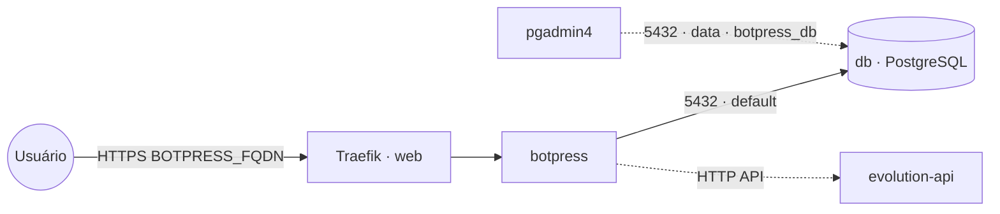

# botpress — Botpress (plataforma de chatbots)

**Botpress** (plataforma open source para criar chatbots/assistentes) publicado via Traefik v3 com TLS,
com **PostgreSQL embarcado** (serviço `db` próprio da stack). O banco fica na rede interna `default` e
também na `data` **só** para ferramentas de administração (pgadmin4) o alcançarem como `botpress_db`.
Pode entregar respostas no WhatsApp via stack **`evolution-api`**.

## Arquitetura

## Variáveis de ambiente
| Variável | Obrigatória | Default | Descrição |
|---|---|---|---|
| `BOTPRESS_FQDN` | sim | — | domínio público (ex.: `botpress.exemplo.com`) |
| `BOTPRESS_DB_PASSWORD` | sim | — | senha do PostgreSQL (usada pelo app e pelo `db`) |
| `BOTPRESS_DB_HOST` | não | `db` | host do banco (serviço interno desta stack) |
| `BOTPRESS_DB_PORT` | não | `5432` | porta do PostgreSQL |
| `BOTPRESS_DB_USER` | não | `postgres` | usuário do banco |
| `BOTPRESS_DB_NAME` | não | `botpress` | banco usado pelo Botpress |
| `BOTPRESS_IMAGE_TAG` | não | `latest` | tag da imagem botpress/server |
| `BOTPRESS_DB_IMAGE_TAG` | não | `16-alpine` | tag da imagem PostgreSQL |
| `PROXY_NET` | não | `web` | rede externa do Traefik |
| `DATA_NET` | não | `data` | rede externa p/ ferramentas de admin alcançarem o banco |
| `WORKER_HOSTNAME` | não | — | fixa o volume num nó (cluster multi-worker) |

## Pré-requisitos
- Stack `balancer` (Traefik) + rede `web`; DNS de `BOTPRESS_FQDN` apontando para o host.
- Rede `data`: `docker network create --driver overlay --attachable data` (usada pelas ferramentas de admin).
- **Não** precisa da stack `postgres-pgvector`: o banco sobe junto. Para administrá-lo, aponte o
  `pgadmin4` para o host `botpress_db` (porta 5432) na rede `data`.

## Uso
1. Faça o deploy informando `BOTPRESS_FQDN` e `BOTPRESS_DB_PASSWORD`. O banco/usuário são criados
   automaticamente na primeira subida e o Botpress aplica as migrações no primeiro start.
2. Acesse `https://BOTPRESS_FQDN` e crie a conta de administrador.
3. **WhatsApp via Evolution API:** num nó de chamada HTTP, dispare
   `POST https://<evolution_fqdn>/message/sendText/<instância>` com o header `apikey`.

### Migrar para outro host
Como o banco é dedicado, basta migrar os volumes `db-data` (banco) e `botpress-data` (dados do app)
para o novo nó e subir a stack lá — sem mexer em banco compartilhado de outras stacks.

## Troubleshooting
| Sintoma | Causa | Ação |
|---|---|---|
| Erro de conexão com o banco | `db` ainda subindo / senha divergente | aguardar o `db`; conferir `BOTPRESS_DB_PASSWORD` igual no app e no banco |
| Admin não abre / URL errada | `EXTERNAL_URL` ≠ domínio público | conferir `BOTPRESS_FQDN` |
| 404/sem TLS | DNS não aponta / fora da `web` | conferir rede/labels e DNS |
| pgadmin4 não acha o banco | host errado | usar `botpress_db:5432` na rede `data` |
| Dados somem ao reagendar | volumes locais ao nó (multi-worker) | fixar `node.hostname` via `WORKER_HOSTNAME` |
