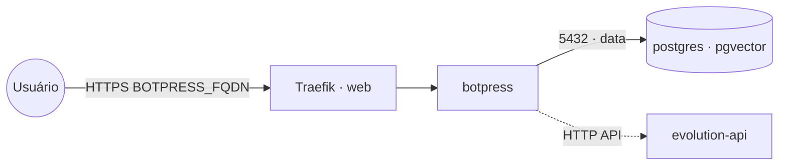

# botpress — Botpress (plataforma de chatbots)

**Botpress** (plataforma open source para criar chatbots/assistentes) publicado via Traefik v3 com TLS.
Reaproveita o **PostgreSQL** compartilhado (stack `postgres-pgvector`) na rede `data` — não sobe banco
próprio. Pode entregar respostas no WhatsApp via stack **`evolution-api`**.

## Arquitetura



## Variáveis de ambiente
| Variável | Obrigatória | Default | Descrição |
|---|---|---|---|
| `BOTPRESS_FQDN` | sim | — | domínio público (ex.: `botpress.exemplo.com`) |
| `BOTPRESS_DB_PASSWORD` | sim | — | senha do usuário do PostgreSQL |
| `BOTPRESS_DB_HOST` | não | `postgres` | host do PostgreSQL na rede `data` |
| `BOTPRESS_DB_PORT` | não | `5432` | porta do PostgreSQL |
| `BOTPRESS_DB_USER` | não | `postgres` | usuário do PostgreSQL |
| `BOTPRESS_DB_NAME` | não | `botpress` | banco usado pelo Botpress |
| `BOTPRESS_IMAGE_TAG` | não | `latest` | tag da imagem botpress/server |
| `PROXY_NET` | não | `web` | rede externa do Traefik |
| `DATA_NET` | não | `data` | rede overlay dos serviços compartilhados |
| `WORKER_HOSTNAME` | não | — | fixa o volume num nó (cluster multi-worker) |

## Pré-requisitos
- Stack `balancer` (Traefik) + rede `web`; DNS de `BOTPRESS_FQDN` apontando para o host.
- Rede `data`: `docker network create --driver overlay --attachable data`.
- Stack **`postgres-pgvector`** na rede `data` com um banco para o Botpress:
  ```sql
  CREATE DATABASE botpress;
  ```

## Uso
1. Crie o banco `botpress` e faça o deploy. O Botpress aplica as migrações no primeiro start.
2. Acesse `https://BOTPRESS_FQDN` e crie a conta de administrador.
3. **WhatsApp via Evolution API:** num nó de chamada HTTP, dispare
   `POST https://<evolution_fqdn>/message/sendText/<instância>` com o header `apikey`.

## Troubleshooting
| Sintoma | Causa | Ação |
|---|---|---|
| Erro de conexão com o banco | `data` ausente / banco não criado / senha errada | criar a rede, o banco e conferir `BOTPRESS_DB_*` |
| Admin não abre / URL errada | `EXTERNAL_URL` ≠ domínio público | conferir `BOTPRESS_FQDN` |
| 404/sem TLS | DNS não aponta / fora da `web` | conferir rede/labels e DNS |
| Dados somem ao reagendar | volume local ao nó (multi-worker) | fixar `node.hostname` via `WORKER_HOSTNAME` |
