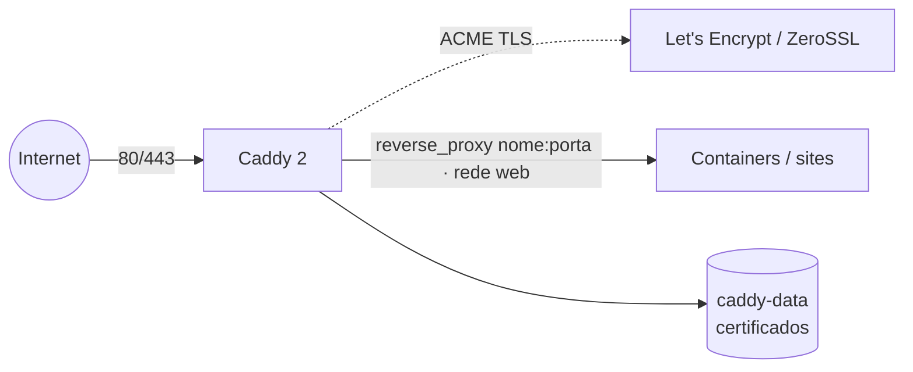

# caddy — Caddy 2 (reverse proxy + HTTPS automático)

[Caddy](https://caddyserver.com/) como **reverse proxy** com **HTTPS automático** (obtém e renova
certificados Let's Encrypt/ZeroSSL sozinho). Configuração por **Caddyfile**. É o ponto de entrada
(`:80`/`:443`) do host.

> **Caddy × `balancer` (Traefik):** os dois fazem reverse proxy + TLS automático — são
> **alternativas**. Use um **ou** o outro no mesmo host (ambos disputam as portas 80/443). O Caddy
> se configura por um arquivo (Caddyfile); o Traefik, por labels dos containers. Para o estilo
> "labels" com Caddy, veja `caddy-docker-proxy` na seção *Alternativas*.

## Arquitetura



## Variáveis de ambiente

| Variável | Obrigatória | Default | Descrição |
|---|---|---|---|
| `CADDY_ACME_EMAIL` | não | — | e-mail do ACME (recomendado para avisos de expiração) |
| `CADDY_CONFIG_NAME` | Swarm | `caddy_caddyfile_v1` | nome do Docker config com o Caddyfile (só Swarm) |
| `CADDY_CONFIG_FILE` | — | `./config/Caddyfile` | caminho do Caddyfile no host (só standalone) |
| `CADDY_IMAGE_TAG` | não | `2-alpine` | tag da imagem `caddy` |
| `PROXY_NET` | não | `web` | rede externa por onde o Caddy alcança os containers |

## Pré-requisitos

1. Rede externa `web` (para o Caddy alcançar os containers a proxiar pelo nome):
   - Swarm: `docker network create --driver overlay --attachable web`
   - Standalone: `docker network create web`
2. DNS dos domínios que o Caddy vai servir apontando para o host (necessário para o ACME emitir TLS).
3. O Caddyfile com seus sites (ver abaixo).

## Uso

### Configuração (Caddyfile)
Edite o [`config/Caddyfile`](config/Caddyfile). Exemplo mínimo:

```caddyfile
{
	email {$CADDY_ACME_EMAIL}
}

app.exemplo.com {
	reverse_proxy app:8080
}
```
O Caddy resolve `app` pelo nome do container/serviço na rede `web` e emite o TLS de
`app.exemplo.com` automaticamente. Env vars entram no Caddyfile via `{$NOME_DA_VAR}`.

### Swarm (`docker-compose.yml`, App Template type 2)
O Caddyfile é um **Docker config** externo. Crie-o antes do deploy:

```bash
docker config create caddy_caddyfile_v1 caddy/config/Caddyfile
```
Para alterar depois: crie `caddy_caddyfile_v2`, aponte `CADDY_CONFIG_NAME=caddy_caddyfile_v2` e
atualize a stack (Docker config é imutável).

### Standalone (`docker-compose.standalone.yml`, App Template type 3)
O Caddyfile é um **bind mount** de host: aponte `CADDY_CONFIG_FILE` para o seu arquivo (default
`./config/Caddyfile`). Para recarregar após editar:

```bash
docker exec <container_caddy> caddy reload --config /etc/caddy/Caddyfile
```

## Alternativas

- **`caddy-docker-proxy`** (`lucaslorentz/caddy-docker-proxy`): configura o Caddy por **labels**
  dos containers (estilo Traefik), sem Caddyfile central. Bom se você prefere descoberta automática.
- **`balancer`** (Traefik): o reverse proxy padrão deste repo (labels + middlewares).

## Troubleshooting

| Sintoma | Causa | Ação |
|---|---|---|
| TLS não emite | DNS do domínio não aponta para o host, ou 80/443 bloqueadas | ajuste o DNS e libere 80/443; veja `docker logs` do Caddy |
| `dial tcp: lookup app` falha | Caddy e o alvo não compartilham a rede `web` | coloque o container alvo na rede `web` e use o nome dele |
| Alterei o Caddyfile e não aplicou | Caddy não recarregou | `caddy reload` (standalone) ou recrie a stack / novo `_v2` (Swarm) |
| Certificados sumiram ao reagendar | volume `caddy-data` local ao nó (multi-worker) | fixe o serviço no nó (`WORKER_HOSTNAME`) |
| Rate limit do Let's Encrypt | muitos testes de emissão | use o CA de staging durante testes (`acme_ca` no Caddyfile) |
