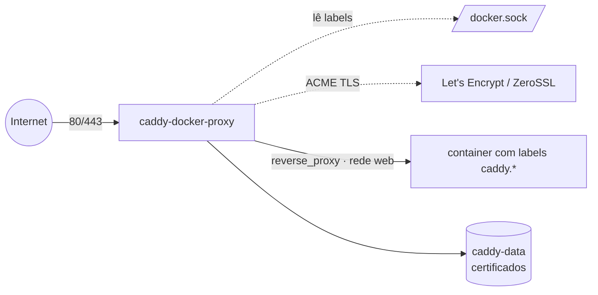

# caddy — caddy-docker-proxy (reverse proxy + HTTPS automático por labels)

[Caddy](https://caddyserver.com/) com o plugin
[`lucaslorentz/caddy-docker-proxy`](https://github.com/lucaslorentz/caddy-docker-proxy): o Caddy
monta a configuração **automaticamente a partir de labels** dos containers/serviços (auto-descoberta,
no estilo do Traefik), com **HTTPS automático** (Let's Encrypt/ZeroSSL). É o ponto de entrada
(`:80`/`:443`) do host.

> **Caddy × `balancer` (Traefik):** os dois fazem reverse proxy + TLS automático por labels — são
> **alternativas**. Use um **ou** o outro no mesmo host (ambos disputam 80/443). O label do Caddy é
> `caddy…`; o do Traefik é `traefik…`.

## Como funciona

O container `caddy` lê o **`/var/run/docker.sock`**, observa os containers/serviços, converte os
labels `caddy…` em configuração de Caddy e **recarrega sozinho** a cada mudança. Ele resolve o
endereço do alvo pela rede definida em `CADDY_INGRESS_NETWORKS` (a rede `web`).



## Variáveis de ambiente

| Variável | Obrigatória | Default | Descrição |
|---|---|---|---|
| `PROXY_NET` | não | `web` | rede externa por onde o Caddy alcança os alvos (`CADDY_INGRESS_NETWORKS`) |
| `CADDY_IMAGE_TAG` | não | `2.9-alpine` | tag de `lucaslorentz/caddy-docker-proxy` |
| `CADDY_ACME_CA` | não | LE produção | endpoint do ACME (troque pelo **staging** do Let's Encrypt durante testes) |

> **E-mail do ACME** é opcional (avisos de expiração). Para definir, descomente o label
> `caddy.email=seu-email@exemplo.com` **no serviço `caddy`** (não em cada app).

## Pré-requisitos

1. Rede externa `web` (por onde o Caddy fala com os alvos):
   - Standalone: `docker network create web`
   - Swarm: `docker network create --driver overlay --attachable web`
2. DNS de cada domínio que o Caddy vai servir apontando para o host (o ACME precisa disso para emitir TLS).
3. Os containers a expor precisam estar **na rede `web`** e ter os labels `caddy…` (abaixo).

---

## Integração com containers (labels)

Cada app declara suas próprias rotas. **Onde colocar os labels depende do modo:**

- **Standalone** (`docker compose` / Portainer Compose stack): labels no **container** — chave `labels:`.
- **Swarm** (`docker stack` / App Template type 2): labels no **serviço** — chave `deploy.labels:`.

### Exemplo básico — reverse proxy de uma app

**Standalone:**
```yaml
services:
  minha-app:
    image: minha/app
    networks: [web]                 # mesma rede do caddy (CADDY_INGRESS_NETWORKS)
    labels:
      caddy: app.exemplo.com        # o domínio (site)
      caddy.reverse_proxy: "{{upstreams 8080}}"   # -> IP do container na porta 8080
networks:
  web: { external: true, name: web }
```

**Swarm** (mesma app, labels em `deploy.labels`):
```yaml
services:
  minha-app:
    image: minha/app
    networks: [web]
    deploy:
      labels:
        caddy: app.exemplo.com
        caddy.reverse_proxy: "{{upstreams 8080}}"
networks:
  web: { external: true, name: web }
```

Pronto: `https://app.exemplo.com` já sobe com TLS emitido automaticamente.

### O template `{{upstreams}}`
Resolve o endereço do próprio container/serviço na rede de ingress:
- `{{upstreams}}` → porta **80**
- `{{upstreams 8080}}` → porta **8080**
- `{{upstreams https 8443}}` → esquema **https** + porta 8443

### Padrões comuns

**Vários domínios / redirect de www:**
```yaml
labels:
  caddy_0: exemplo.com
  caddy_0.reverse_proxy: "{{upstreams 8080}}"
  caddy_1: www.exemplo.com
  caddy_1.redir: https://exemplo.com{uri} permanent
```
(Use sufixos numerados `caddy_0`, `caddy_1`… quando o container tem **mais de um** site.)

**Cabeçalhos / compressão:**
```yaml
labels:
  caddy: app.exemplo.com
  caddy.reverse_proxy: "{{upstreams 3000}}"
  caddy.encode: gzip zstd
  caddy.header.-Server: ""          # remove o header Server
```

**Basic auth:**
```yaml
labels:
  caddy: admin.exemplo.com
  caddy.reverse_proxy: "{{upstreams 8080}}"
  caddy.basicauth.usuario: $2a$14$hash_bcrypt   # gere com: caddy hash-password
```

**Sub-path (roteia /api para outra app):**
```yaml
labels:
  caddy: exemplo.com
  caddy.handle_path./api/*: ""
  caddy.handle_path./api/*.reverse_proxy: "{{upstreams 9000}}"
```

**TLS interno (sem ACME, para uso interno/sem domínio público):**
```yaml
labels:
  caddy: https://app.local
  caddy.reverse_proxy: "{{upstreams 8080}}"
  caddy.tls: internal
```

### Global (no serviço `caddy`, não nas apps)
Opções globais vão como label **no próprio `caddy`**:
```yaml
# no serviço caddy:
labels:
  - caddy.email=seu-email@exemplo.com        # ACME
  - caddy.acme_ca=https://acme-staging-v02.api.letsencrypt.org/directory   # staging p/ testes
```

---

## Segurança — docker.sock

O Caddy precisa ler o `docker.sock` (montado `:ro`). Isso dá visibilidade da API do Docker ao
container — em produção, o ideal é colocar um **docker-socket-proxy**
([tecnativa/docker-socket-proxy](https://github.com/Tecnativa/docker-socket-proxy)) na frente,
limitando a API só ao necessário (`CONTAINERS`, `SERVICES`, `TASKS`, `NETWORKS`), e apontar o Caddy
para o proxy via `DOCKER_HOST=tcp://socket-proxy:2375` em vez de montar o socket direto.

## Swarm vs standalone

| Arquivo | Modo | App Template | Labels em | Roda em |
|---|---|---|---|---|
| `docker-compose.yml` | Swarm | type 2 | `deploy.labels` dos serviços | **manager** (lê os serviços) |
| `docker-compose.standalone.yml` | standalone | type 3 | `labels` dos containers | host único |

## Troubleshooting

| Sintoma | Causa | Ação |
|---|---|---|
| TLS não emite | DNS do domínio não aponta para o host, ou 80/443 bloqueadas | ajuste DNS e libere 80/443; veja `docker logs` do caddy |
| App não aparece no Caddy | container fora da rede `web`, ou label no lugar errado (Swarm usa `deploy.labels`) | ponha o alvo na `web` e confira onde colocou os labels |
| `{{upstreams}}` aponta errado | mais de uma rede no container | garanta que o alvo está em `CADDY_INGRESS_NETWORKS` (a `web`) |
| Muitos erros de emissão (rate limit LE) | testes repetidos | use `CADDY_ACME_CA` = staging do Let's Encrypt durante testes |
| Certificados sumiram ao reagendar | `caddy-data` local ao nó | fixe o serviço no nó (`WORKER_HOSTNAME`) |
| Não lê os serviços (Swarm) | rodando em worker | o Caddy precisa do **manager** (constraint `node.role == manager`) |
