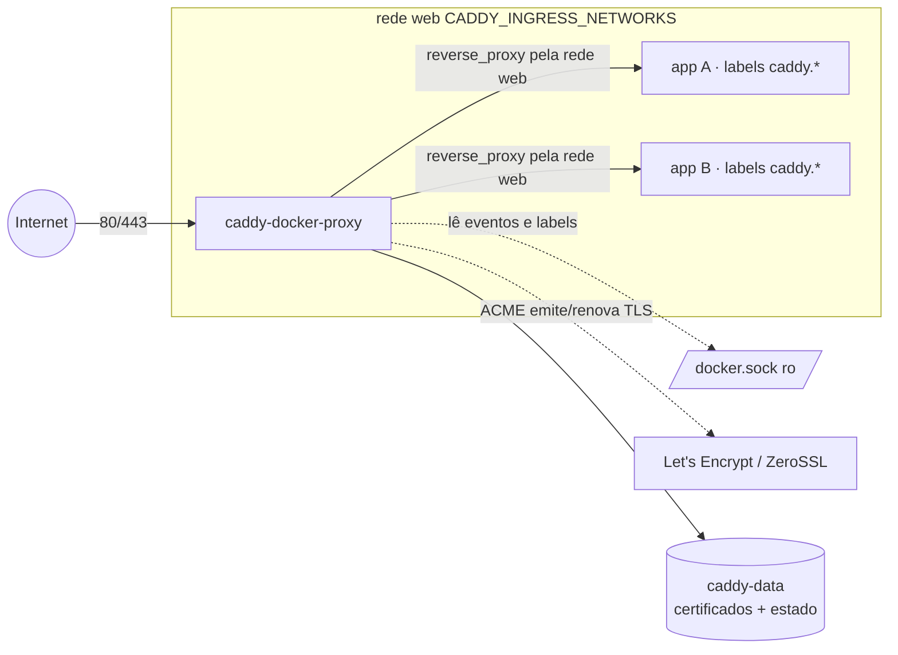
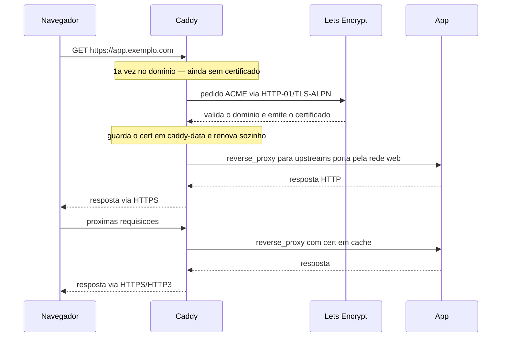

# caddy — caddy-docker-proxy (reverse proxy + HTTPS automático por labels)

[Caddy](https://caddyserver.com/) com o plugin
[`lucaslorentz/caddy-docker-proxy`](https://github.com/lucaslorentz/caddy-docker-proxy) (CDP): o
Caddy monta a configuração **automaticamente a partir de labels** dos containers/serviços
(auto-descoberta, no estilo do Traefik), com **HTTPS automático** (Let's Encrypt/ZeroSSL) e
**HTTP/3**. É o ponto de entrada (`:80`/`:443`) do host.

> **Caddy × `balancer` (Traefik):** os dois fazem reverse proxy + TLS automático por labels — são
> **alternativas**. Use um **ou** o outro no mesmo host (ambos disputam as portas 80/443). O label
> do Caddy é `caddy…`; o do Traefik é `traefik…`. Há uma **tabela de tradução** entre os dois mais
> abaixo.

## Sumário
- [Como funciona](#como-funciona)
- [Arquitetura](#arquitetura)
- [Fluxo](#fluxo)
- [Pré-requisitos](#pré-requisitos)
- [Variáveis de ambiente](#variáveis-de-ambiente)
- [Integração com containers (labels)](#integração-com-containers-labels) — o principal
- [Tradução Caddy ↔ Traefik](#tradução-caddy--traefik)
- [Segurança — docker.sock](#segurança--dockersock)
- [Swarm vs standalone](#swarm-vs-standalone)
- [Troubleshooting](#troubleshooting)
- [Referências externas](#referências-externas)

---

## Como funciona

1. O container `caddy` (imagem `lucaslorentz/caddy-docker-proxy`) monta o **`/var/run/docker.sock`**
   em modo leitura e **observa** os eventos do Docker (containers e serviços Swarm).
2. Para cada alvo, lê os **labels que começam com `caddy`** e os **converte em um Caddyfile**
   equivalente, em memória.
3. Aplica esse Caddyfile via a **Admin API** do Caddy e **recarrega sem downtime** (`caddy reload`
   automático) a cada mudança — subir/derrubar um container reconfigura o proxy sozinho.
4. Resolve o endereço de cada upstream pela rede definida em **`CADDY_INGRESS_NETWORKS`** (aqui, a
   rede `web`): o template `{{upstreams porta}}` vira o IP:porta do container **nessa** rede.
5. **HTTPS automático**: ao ver um site com domínio (ex.: `app.exemplo.com`), o Caddy pede o
   certificado ao ACME (Let's Encrypt/ZeroSSL), renova sozinho e guarda tudo no volume
   **`caddy-data`** (`/data`). Sem certificado manual, sem cron de renovação.

Diferença-chave vs. o Caddy "clássico": **não há Caddyfile central** para editar — a configuração
mora nos labels de cada app.

## Arquitetura



- **`web`** é a rede por onde o Caddy alcança os alvos. Todo container a ser exposto entra nela.
- **`caddy-data`** guarda os certificados e o estado do ACME — **persistir sempre** (senão o Caddy
  re-emite tudo e pode bater no rate limit do Let's Encrypt).

## Fluxo

Primeira requisição a um domínio novo (emite o certificado) e as seguintes:



## Pré-requisitos

1. Rede externa `web` (por onde o Caddy fala com os alvos):
   - Standalone: `docker network create web`
   - Swarm: `docker network create --driver overlay --attachable web`
2. **DNS** de cada domínio que o Caddy vai servir apontando para o IP do host (o ACME exige isso
   para validar e emitir o TLS).
3. **Portas 80 e 443** abertas no host/firewall (a 80 é usada no desafio ACME HTTP-01 e no redirect
   para HTTPS; a 443/udp habilita HTTP/3).
4. Os containers a expor precisam estar **na rede `web`** e ter os labels `caddy…` (abaixo).
5. Não rodar Caddy **e** Traefik (`balancer`) no mesmo host — ambos querem 80/443.

## Variáveis de ambiente

| Variável | Obrigatória | Default | Descrição |
|---|---|---|---|
| `PROXY_NET` | não | `web` | rede externa por onde o Caddy alcança os alvos (`CADDY_INGRESS_NETWORKS`) |
| `CADDY_IMAGE_TAG` | não | `2.9-alpine` | tag de `lucaslorentz/caddy-docker-proxy` |
| `CADDY_ACME_CA` | não | LE produção | endpoint do ACME (troque pelo **staging** do Let's Encrypt durante testes — evita rate limit) |

> **E-mail do ACME** é opcional (recebe avisos de expiração). Para definir, descomente o label
> `caddy.email=seu-email@exemplo.com` **no próprio serviço `caddy`** (não em cada app). Não deixe o
> valor vazio — `email` sem argumento quebra o Caddyfile.

---

## Integração com containers (labels)

É aqui que a mágica acontece: **cada app declara suas próprias rotas** via labels `caddy…`. O Caddy
descobre, roteia e emite o TLS sozinho.

### Onde colocar os labels (importa!)

| Modo | Onde | Chave |
|---|---|---|
| **Standalone** (`docker compose` / Portainer Compose stack) | no **container** | `labels:` |
| **Swarm** (`docker stack` / App Template type 2) | no **serviço** | `deploy.labels:` |

Colocar no lugar errado (ex.: `labels:` do container num serviço Swarm) faz o Caddy **não enxergar**
a app. E o container precisa estar na **rede `web`** (a de `CADDY_INGRESS_NETWORKS`).

### Receita mínima (o essencial)

```yaml
labels:
  caddy: app.exemplo.com                      # o domínio (site)
  caddy.reverse_proxy: "{{upstreams 8080}}"   # -> IP do container na porta 8080
```
Com o container na rede `web`, `https://app.exemplo.com` já sobe com TLS automático.

### Exemplo completo

**Standalone:**
```yaml
services:
  minha-app:
    image: minha/app
    networks: [web]                 # mesma rede do caddy (CADDY_INGRESS_NETWORKS)
    labels:
      caddy: app.exemplo.com
      caddy.reverse_proxy: "{{upstreams 8080}}"
networks:
  web: { external: true, name: web }
```

**Swarm** (mesma app — labels em `deploy.labels`):
```yaml
services:
  minha-app:
    image: minha/app
    networks: [web]
    deploy:
      labels:
        caddy: app.exemplo.com
        caddy.reverse_proxy: "{{upstreams 8080}}"
networks:
  web: { external: true, name: web }
```

### O template `{{upstreams}}`
Resolve o endereço do próprio container/serviço na rede de ingress (`web`):
- `{{upstreams}}` → porta **80**
- `{{upstreams 8080}}` → porta **8080**
- `{{upstreams https 8443}}` → esquema **https** + porta 8443

### Padrões comuns

**Vários domínios no mesmo container / redirect de www** (sufixos numerados `caddy_0`, `caddy_1`…):
```yaml
labels:
  caddy_0: exemplo.com
  caddy_0.reverse_proxy: "{{upstreams 8080}}"
  caddy_1: www.exemplo.com
  caddy_1.redir: https://exemplo.com{uri} permanent
```

**Compressão e headers:**
```yaml
labels:
  caddy: app.exemplo.com
  caddy.reverse_proxy: "{{upstreams 3000}}"
  caddy.encode: gzip zstd
  caddy.header.-Server: ""          # remove o header Server
```

**Basic auth** (proteger uma app):
```yaml
labels:
  caddy: admin.exemplo.com
  caddy.reverse_proxy: "{{upstreams 8080}}"
  caddy.basicauth.usuario: "$$2a$$14$$hash_bcrypt"   # gere com: caddy hash-password
```
> Em compose, `$` precisa ser escrito como `$$` (senão vira interpolação de variável). O hash bcrypt
> tem vários `$` — dobre todos.

**Sub-path** (roteia `/api` para outra app):
```yaml
labels:
  caddy: exemplo.com
  caddy.handle_path./api/*: ""
  caddy.handle_path./api/*.reverse_proxy: "{{upstreams 9000}}"
```

**TLS interno** (sem ACME — uso interno / sem domínio público):
```yaml
labels:
  caddy: https://app.local
  caddy.reverse_proxy: "{{upstreams 8080}}"
  caddy.tls: internal
```

**Backend em HTTPS / pulando verificação de cert do upstream:**
```yaml
labels:
  caddy: app.exemplo.com
  caddy.reverse_proxy: "{{upstreams https 8443}}"
  caddy.reverse_proxy.transport: http
  caddy.reverse_proxy.transport.tls_insecure_skip_verify: ""
```

### Opções globais (no serviço `caddy`, não nas apps)
Labels sem domínio, aplicados **no próprio `caddy`**, viram opções globais do Caddyfile:
```yaml
# no serviço caddy:
labels:
  - caddy.email=seu-email@exemplo.com                                       # ACME
  - caddy.acme_ca=https://acme-staging-v02.api.letsencrypt.org/directory    # staging p/ testes
```

### Aplicando às stacks deste repo
As stacks deste repositório vêm com labels **`traefik.*`** (para o `balancer`). Se você usa **Caddy
no lugar do Traefik**, os labels `traefik.*` são ignorados — adicione os `caddy.*` equivalentes ao
serviço da app (ver tabela abaixo) e garanta que ele está na rede `web`. Um serviço pode ter os dois
conjuntos de labels convivendo; cada proxy lê só o seu.

## Tradução Caddy ↔ Traefik

| Objetivo | Caddy (label) | Traefik (label) |
|---|---|---|
| Habilitar/expor | implícito ao ter `caddy: dominio` | `traefik.enable=true` |
| Domínio (rota) | `caddy: app.exemplo.com` | `traefik.http.routers.app.rule=Host(\`app.exemplo.com\`)` |
| Porta do upstream | `caddy.reverse_proxy: {{upstreams 8080}}` | `traefik.http.services.app.loadbalancer.server.port=8080` |
| TLS automático | implícito (domínio público) | `...routers.app.tls=true` + `...tls.certresolver=letsencryptresolver` |
| Rede do proxy | `CADDY_INGRESS_NETWORKS` (env do caddy) | `traefik.docker.network` (standalone) |
| Basic auth | `caddy.basicauth.<user>: <hash>` | `traefik.http.middlewares.x.basicauth.users=<user>:<hash>` |
| Redirect | `caddy.redir: <destino> permanent` | `...middlewares.x.redirectregex...` |
| Compressão | `caddy.encode: gzip zstd` | `...middlewares.x.compress=true` |

---

## Segurança — docker.sock

O Caddy precisa ler o `docker.sock` (montado `:ro`). Isso dá visibilidade da API do Docker ao
container. Em **produção**, prefira um **docker-socket-proxy**
([tecnativa/docker-socket-proxy](https://github.com/Tecnativa/docker-socket-proxy)) na frente,
liberando só o necessário (`CONTAINERS`, `SERVICES`, `TASKS`, `NETWORKS`, `NODES`), e apontar o
Caddy para ele com `DOCKER_HOST=tcp://socket-proxy:2375` em vez de montar o socket direto.

## Swarm vs standalone

| Arquivo | Modo | App Template | Labels em | Roda em |
|---|---|---|---|---|
| `docker-compose.yml` | Swarm | type 2 | `deploy.labels` dos serviços | **manager** (`node.role == manager`) |
| `docker-compose.standalone.yml` | standalone | type 3 | `labels` dos containers | host único |

No **Swarm** o Caddy precisa rodar num **manager** (ele lê os serviços pela API do Swarm). Em
cluster com HA, dá para separar em modo *controller* (lê os eventos) + *server* (serve o tráfego) —
ver a doc do CDP.

## Troubleshooting

| Sintoma | Causa | Ação |
|---|---|---|
| TLS não emite | DNS do domínio não aponta p/ o host, ou 80/443 bloqueadas | ajuste o DNS e libere 80/443; veja `docker logs` do caddy |
| App não aparece no Caddy | container fora da rede `web`, ou label no lugar errado (Swarm usa `deploy.labels`) | ponha o alvo na `web` e confira onde colocou os labels |
| `{{upstreams}}` aponta errado | container em mais de uma rede | garanta que o alvo está em `CADDY_INGRESS_NETWORKS` (a `web`) |
| Muitos erros de emissão (rate limit LE) | testes repetidos | use `CADDY_ACME_CA` = staging do Let's Encrypt durante os testes |
| Certificados somem ao reagendar | volume `caddy-data` local ao nó | fixe o serviço no nó (`WORKER_HOSTNAME`); persista `caddy-data` |
| "This node is not a swarm manager" | Caddy rodando/agendado num worker | fixe no **manager** (`node.role == manager`) |
| `502`/`connection refused` p/ a app | porta errada no `{{upstreams}}` ou app não escuta nela | confira a porta interna real do container |
| Basic auth não valida | `$` do hash não escapado no compose | dobre para `$$` cada `$` do hash bcrypt |

## Referências externas

- **Caddy — documentação:** https://caddyserver.com/docs/
- **Caddyfile (sintaxe/diretivas):** https://caddyserver.com/docs/caddyfile
- **`reverse_proxy`:** https://caddyserver.com/docs/caddyfile/directives/reverse_proxy
- **HTTPS automático (como o ACME funciona no Caddy):** https://caddyserver.com/docs/automatic-https
- **caddy-docker-proxy (labels, `{{upstreams}}`, Swarm, controller/server):** https://github.com/lucaslorentz/caddy-docker-proxy
- **Let's Encrypt — staging (para testes sem rate limit):** https://letsencrypt.org/docs/staging-environment/
- **docker-socket-proxy (hardening do socket):** https://github.com/Tecnativa/docker-socket-proxy
- **Imagem:** https://hub.docker.com/r/lucaslorentz/caddy-docker-proxy
