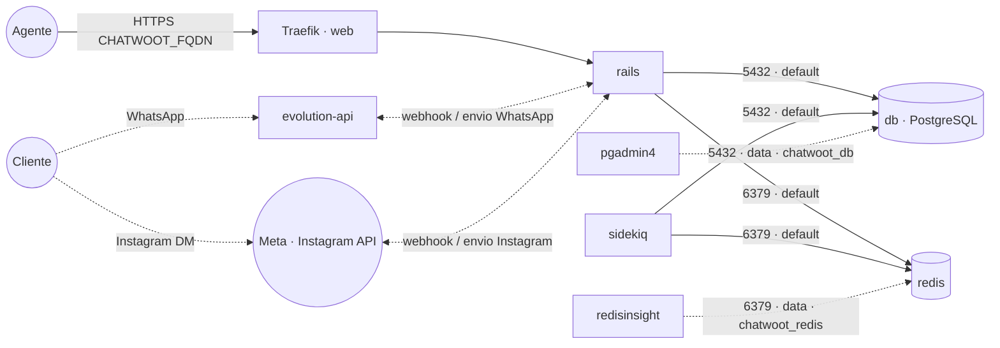

# chatwoot — Chatwoot (atendimento omnichannel)

**Chatwoot** (plataforma open source de atendimento ao cliente / CRM de conversas: caixa de entrada
compartilhada, agentes, WhatsApp, e-mail, chat de site) publicado via Traefik v3 com TLS, com
**PostgreSQL e Redis embarcados** (serviços `db` e `redis` próprios da stack) — não usa o
`postgres-pgvector` nem a stack `redis` compartilhados. O banco/cache ficam na rede interna `default`
e também na `data` **só** para ferramentas de administração os alcançarem como `chatwoot_db` /
`chatwoot_redis`. Integra com a stack **`evolution-api`** como canal de WhatsApp. Volumes dedicados =
fácil migrar de host.

## Componentes
| Serviço | Imagem | Função |
|---|---|---|
| `rails` | `chatwoot/chatwoot` | Web + API, exposto via Traefik na porta 3000 |
| `sidekiq` | `chatwoot/chatwoot` | Jobs assíncronos (envio de mensagens, automações, e-mail) |
| `db` | `postgres` | Banco PostgreSQL embarcado desta stack |
| `redis` | `redis` | Cache/fila embarcado desta stack |

## Arquitetura



## Canais: WhatsApp (Evolution) + Instagram (Meta)

O Chatwoot é o **hub omnichannel**: reúne numa mesma caixa de entrada o **WhatsApp** (via stack
`evolution-api`) e o **Instagram/Messenger** (via Meta). Importante: a **Evolution API é só WhatsApp** —
o Instagram **não** passa pela Evolution, e sim pela **Meta Graph / Instagram Messaging API**.

| Canal | Como conecta no Chatwoot |
|---|---|
| **WhatsApp** | Na **Evolution**, configure a integração Chatwoot (URL da conta, `account_id` e um token de acesso de agente). As mensagens viram uma inbox de WhatsApp. |
| **Instagram / Messenger** | No Chatwoot, crie a inbox **Instagram** (ou Facebook) e autorize via **Meta** (app no Meta for Developers + página/conta business vinculada). Requer FQDN público com TLS para os webhooks da Meta. |

> Para **automação** entre os dois canais (bots, roteamento, IA), use `workflows` (n8n) — que tem nó da
> Evolution + nós da Meta/Instagram — ou os bots `typebot`/`flowise`/`botpress` apontando para a Evolution.

## Variáveis de ambiente
| Variável | Obrigatória | Default | Descrição |
|---|---|---|---|
| `CHATWOOT_FQDN` | sim | — | domínio público (ex.: `chat.exemplo.com`) |
| `CHATWOOT_SECRET_KEY_BASE` | sim | — | chave de sessão Rails (gere com `openssl rand -hex 64`) |
| `CHATWOOT_DB_PASSWORD` | sim | — | senha do PostgreSQL (usada pelos apps e pelo `db`) |
| `CHATWOOT_DB_HOST` | não | `db` | host do banco (serviço interno desta stack) |
| `CHATWOOT_DB_PORT` | não | `5432` | porta do PostgreSQL |
| `CHATWOOT_DB_USER` | não | `postgres` | usuário do PostgreSQL |
| `CHATWOOT_DB_NAME` | não | `chatwoot` | banco usado pelo Chatwoot |
| `CHATWOOT_REDIS_URL` | não | `redis://redis:6379` | URI do Redis (com senha: `redis://default:<senha>@redis:6379`) |
| `CHATWOOT_ENABLE_SIGNUP` | não | `false` | permite auto-cadastro de contas |
| `CHATWOOT_IMAGE_TAG` | não | `v4.6.0` | tag da imagem chatwoot/chatwoot |
| `CHATWOOT_DB_IMAGE_TAG` | não | `16-alpine` | tag da imagem PostgreSQL |
| `CHATWOOT_REDIS_IMAGE_TAG` | não | `7-alpine` | tag da imagem Redis |
| `PROXY_NET` | não | `web` | rede externa do Traefik |
| `DATA_NET` | não | `data` | rede externa p/ ferramentas de admin alcançarem banco/cache |
| `WORKER_HOSTNAME` | não | — | fixa os serviços num nó (cluster multi-worker) |

## Pré-requisitos
- Stack `balancer` (Traefik) + rede `web`; DNS de `CHATWOOT_FQDN` apontando para o host.
- Rede `data`: `docker network create --driver overlay --attachable data` (usada pelas ferramentas de admin).
- **Não** precisa das stacks `postgres-pgvector` nem `redis`: o banco e o cache sobem junto. Para
  administrá-los, aponte o `pgadmin4` para o host `chatwoot_db` (porta 5432) e o `redisinsight` para
  `chatwoot_redis` (porta 6379), ambos na rede `data`.

## Uso
1. Gere o `CHATWOOT_SECRET_KEY_BASE` (`openssl rand -hex 64`) e defina o `CHATWOOT_DB_PASSWORD`.
2. Faça o deploy da stack — o banco `chatwoot` e o usuário são criados automaticamente pelo serviço
   `db` na primeira subida.
3. **Prepare o banco** (migrações + seed) na primeira vez — em um nó do Swarm, rode num container
   temporário com as MESMAS variáveis de ambiente, apontando para o `db` embarcado pela rede `data`:
   ```bash
   docker run --rm --network data \
     -e RAILS_ENV=production -e INSTALLATION_ENV=docker \
     -e POSTGRES_HOST=chatwoot_db -e POSTGRES_USERNAME=postgres \
     -e POSTGRES_PASSWORD='<senha>' -e POSTGRES_DATABASE=chatwoot \
     -e REDIS_URL=redis://chatwoot_redis:6379 -e SECRET_KEY_BASE='<chave>' \
     chatwoot/chatwoot:v4.6.0 bundle exec rails db:chatwoot_prepare
   ```
4. Acesse `https://CHATWOOT_FQDN` e crie a conta de administrador.
5. **WhatsApp via Evolution API:** na Evolution, configure a integração Chatwoot (URL da conta,
   `account_id` e um token de acesso de agente do Chatwoot). As mensagens passam a aparecer como uma
   caixa de entrada de WhatsApp.

### Migrar para outro host
Como o banco/cache são dedicados, basta migrar os volumes `db-data`, `redis-data` e `chatwoot-storage`
para o novo nó e subir a stack lá — sem mexer em banco/cache compartilhado de outras stacks.

## Troubleshooting
| Sintoma | Causa | Ação |
|---|---|---|
| `PG::ConnectionBad` / app não sobe | `db` ainda subindo / `db:chatwoot_prepare` não rodado | aguardar o `db` e rodar o prepare (passo 3) |
| Mensagens não enviam | `sidekiq` parado ou `redis` inacessível | garantir o `sidekiq` ativo e o `redis` no ar |
| WhatsApp não conecta | integração Evolution↔Chatwoot mal configurada | conferir URL/`account_id`/token e a instância da Evolution |
| 404/sem TLS | fora da `web` / DNS não aponta | conferir rede/labels e DNS |
| Setup reaparece | volume do banco resetado | preservar o volume `db-data` |
| Anexos/Redis somem ao reagendar | volume local ao nó (multi-worker) | fixar `node.hostname` via `WORKER_HOSTNAME` |
| pgadmin4/redisinsight não acham | host errado | usar `chatwoot_db:5432` / `chatwoot_redis:6379` na rede `data` |
