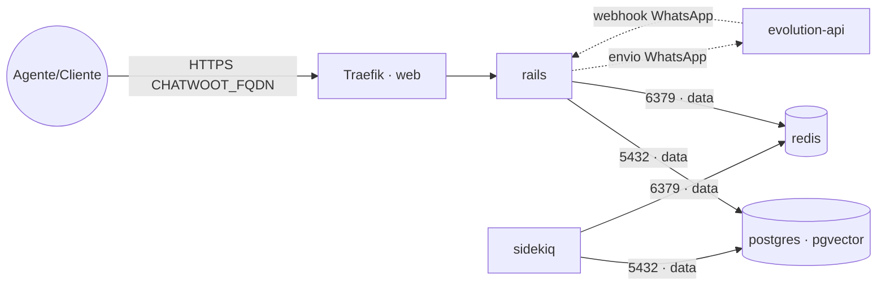

# chatwoot — Chatwoot (atendimento omnichannel)

**Chatwoot** (plataforma open source de atendimento ao cliente / CRM de conversas: caixa de entrada
compartilhada, agentes, WhatsApp, e-mail, chat de site) publicado via Traefik v3 com TLS. Reaproveita
os serviços compartilhados da rede `data`: **PostgreSQL** (stack `postgres-pgvector`) e **Redis**
(stack `redis`) — não sobe banco/cache próprios. Integra com a stack **`evolution-api`** como canal
de WhatsApp.

## Componentes
| Serviço | Imagem | Função |
|---|---|---|
| `rails` | `chatwoot/chatwoot` | Web + API, exposto via Traefik na porta 3000 |
| `sidekiq` | `chatwoot/chatwoot` | Jobs assíncronos (envio de mensagens, automações, e-mail) |

## Arquitetura



## Variáveis de ambiente
| Variável | Obrigatória | Default | Descrição |
|---|---|---|---|
| `CHATWOOT_FQDN` | sim | — | domínio público (ex.: `chat.exemplo.com`) |
| `CHATWOOT_SECRET_KEY_BASE` | sim | — | chave de sessão Rails (gere com `openssl rand -hex 64`) |
| `CHATWOOT_DB_PASSWORD` | sim | — | senha do usuário do PostgreSQL |
| `CHATWOOT_DB_HOST` | não | `postgres` | host do PostgreSQL na rede `data` |
| `CHATWOOT_DB_PORT` | não | `5432` | porta do PostgreSQL |
| `CHATWOOT_DB_USER` | não | `postgres` | usuário do PostgreSQL |
| `CHATWOOT_DB_NAME` | não | `chatwoot` | banco usado pelo Chatwoot |
| `CHATWOOT_REDIS_URL` | não | `redis://redis:6379` | URI do Redis (com senha: `redis://default:<senha>@redis:6379`) |
| `CHATWOOT_ENABLE_SIGNUP` | não | `false` | permite auto-cadastro de contas |
| `CHATWOOT_IMAGE_TAG` | não | `v4.6.0` | tag da imagem chatwoot/chatwoot |
| `PROXY_NET` | não | `web` | rede externa do Traefik |
| `DATA_NET` | não | `data` | rede overlay dos serviços compartilhados |
| `WORKER_HOSTNAME` | não | — | fixa os serviços num nó (cluster multi-worker) |

## Pré-requisitos
- Stack `balancer` (Traefik) + rede `web`; DNS de `CHATWOOT_FQDN` apontando para o host.
- Rede `data`: `docker network create --driver overlay --attachable data`.
- Stack **`postgres-pgvector`** na rede `data` com um banco para o Chatwoot:
  ```sql
  CREATE DATABASE chatwoot;
  ```
  > O Chatwoot usa a extensão `vector` (recursos de IA); a stack `postgres-pgvector` já a fornece.
- Stack **`redis`** na rede `data` (se tiver senha, use a URI autenticada em `CHATWOOT_REDIS_URL`).

## Uso
1. Crie o banco `chatwoot` e gere o `CHATWOOT_SECRET_KEY_BASE`.
2. **Prepare o banco** (migrações + seed) na primeira vez — em um nó do Swarm, rode num container
   temporário com as MESMAS variáveis de ambiente:
   ```bash
   docker run --rm --network data \
     -e RAILS_ENV=production -e INSTALLATION_ENV=docker \
     -e POSTGRES_HOST=postgres -e POSTGRES_USERNAME=postgres \
     -e POSTGRES_PASSWORD='<senha>' -e POSTGRES_DATABASE=chatwoot \
     -e REDIS_URL=redis://redis:6379 -e SECRET_KEY_BASE='<chave>' \
     chatwoot/chatwoot:v4.6.0 bundle exec rails db:chatwoot_prepare
   ```
3. Faça o deploy da stack. Acesse `https://CHATWOOT_FQDN` e crie a conta de administrador.
4. **WhatsApp via Evolution API:** na Evolution, configure a integração Chatwoot (URL da conta,
   `account_id` e um token de acesso de agente do Chatwoot). As mensagens passam a aparecer como uma
   caixa de entrada de WhatsApp.

## Troubleshooting
| Sintoma | Causa | Ação |
|---|---|---|
| `PG::ConnectionBad` / app não sobe | banco não criado / `db:chatwoot_prepare` não rodado | criar o banco e rodar o prepare (passo 2) |
| Mensagens não enviam | `sidekiq` parado ou Redis inacessível | garantir o `sidekiq` ativo e o Redis acessível |
| WhatsApp não conecta | integração Evoluton↔Chatwoot mal configurada | conferir URL/`account_id`/token e a instância da Evolution |
| 404/sem TLS | fora da `web` / DNS não aponta | conferir rede/labels e DNS |
| Anexos somem ao reagendar | volume local ao nó (multi-worker) | fixar `node.hostname` via `WORKER_HOSTNAME` |
