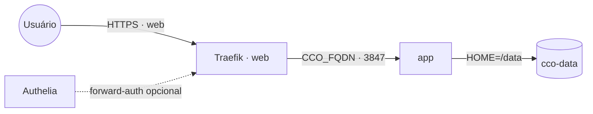

# claude-code-organizer — Claude Code Organizer (CCO)

Dashboard para gerenciar toda a configuração do Claude Code — memories, skills, MCP
servers, rules, hooks e settings — entre os escopos **global** e **por projeto**, com
scanner de segurança de MCP, orçamento de tokens de contexto e limpeza de duplicados.

Empacota o projeto open-source [`@mcpware/claude-code-organizer`](https://github.com/mcpware/claude-code-organizer)
na imagem `ghcr.io/marcelofmatos/claude-code-organizer`. O dashboard escuta na porta
**3847** e é exposto via Traefik.

**Autocontido:** a configuração vive num volume (`cco-data`) montado em `/data`. Dentro
dele ficam `/data/.claude` (pasta) e `/data/.claude.json` (arquivo) — o CCO usa `HOME=/data`.

## Arquitetura



O volume `cco-data` guarda `.claude` + `.claude.json`. O CCO não fala com nenhum banco
nem outra stack; é um painel isolado sobre o conteúdo do volume.

## Variáveis de ambiente

| Variável | Obrigatória | Default | Descrição |
|---|---|---|---|
| `CCO_FQDN` | Sim | — | Domínio público do dashboard (ex.: `cco.exemplo.com`) |
| `CCO_IMAGE_TAG` | Não | `latest` | Tag da imagem no GHCR (ex.: `1.0.0` para fixar/rollback) |
| `PROXY_NET` | Não | `web` | Nome da rede externa do Traefik |
| `WORKER_HOSTNAME` | Não | — | Fixa o nó em cluster multi-worker (volume é local ao nó) |
| `CCO_AUTH_MIDDLEWARE` | Não | — | Middleware de forward-auth (ex.: Authelia) — ver Segurança |

## Pré-requisitos

- Rede externa `web` com Traefik v3 (certresolver `letsencryptresolver`).
- DNS do `CCO_FQDN` apontando para o proxy.

## Uso

1. Deploy pela App Template do Portainer (ou `docker stack deploy`), informando `CCO_FQDN`.
2. **Popule o volume** `cco-data` com sua config (um volume novo nasce vazio). Ex., a
   partir de uma máquina que já tem o Claude Code, no nó onde o volume vive:
   ```bash
   docker run --rm \
     -v cco-data:/data \
     -v "$HOME/.claude:/src/.claude:ro" \
     -v "$HOME/.claude.json:/src/.claude.json:ro" \
     alpine sh -c 'cp -a /src/.claude /data/.claude && cp /src/.claude.json /data/.claude.json'
   ```
   Alternativa: usar o **Backup/restore** do próprio CCO (repo privado).
3. Acessar `https://<CCO_FQDN>`.

> **Comportamento ocioso:** o CCO se encerra sozinho após ~5 min sem browser (ou 30s após
> fechar a última aba). A imagem o relança em loop, então o serviço fica de pé e a URL
> volta a responder em ~2s — relançamentos periódicos no log são normais.

## Segurança

- **Sem autenticação própria.** O CCO lê/edita configuração e roda um scanner — **não** o
  exponha aberto na internet. Proteja com **forward-auth** (ex.: Authelia): defina
  `CCO_AUTH_MIDDLEWARE` e descomente a label de middleware no compose.
- **`.claude.json` guarda o token OAuth do Claude Code.** Trate o volume como sensível;
  restrinja quem acessa o dashboard e o nó onde o volume reside.
- Ao usar o **Backup Center** do CCO, aponte para repositório **privado**.

## Troubleshooting

| Sintoma | Causa provável | Ação |
|---|---|---|
| Dashboard vazio (sem projetos/skills) | volume `cco-data` ainda não populado | copiar `.claude`/`.claude.json` para o volume (ver Uso) |
| 404 no Traefik | serviço fora da `web` ou label ausente | conferir `deploy.labels` e a rede `web` |
| 502 / Bad Gateway | app ainda subindo / porta errada | conferir porta interna `3847` e o status da task |
| Cert inválido | Let's Encrypt ainda emitindo / DNS errado | conferir DNS do `CCO_FQDN` e logs do Traefik |
