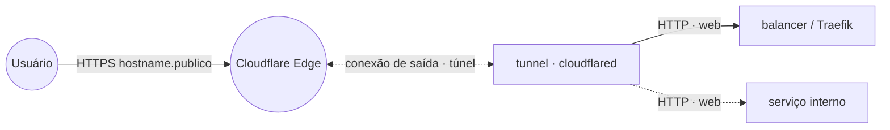

# cloudflared — Cloudflare Tunnel

**cloudflared** publica serviços internos na internet através de um **túnel de saída** para a borda
da Cloudflare — **sem abrir portas no firewall**, **sem IP público** e **sem entrada pelo Traefik**.
O conector faz uma conexão *egress* (saída) para a Cloudflare; o roteamento dos hostnames públicos
para os serviços internos é definido **no painel** (Cloudflare Zero Trust → Tunnels), no modo
*remote-managed* (token). É um complemento ao `balancer`/Traefik, útil quando o host não tem IP
público ou você quer expor sem mexer no roteador/firewall.

## Arquitetura

> O tráfego do usuário entra pela Cloudflare e desce pelo túnel já estabelecido (saída) até o
> conector, que repassa para o Traefik (`balancer:80`) ou direto para um serviço na rede `web`.

## Variáveis de ambiente
| Variável | Obrigatória | Default | Descrição |
|---|---|---|---|
| `CLOUDFLARED_TUNNEL_TOKEN` | sim | — | Token do conector (Cloudflare Zero Trust → Networks → Tunnels → token). **Segredo** |
| `CLOUDFLARED_IMAGE_TAG` | não | `latest` | tag da imagem `cloudflare/cloudflared` |
| `PROXY_NET` | não | `web` | rede externa do Traefik/serviços |

## Pré-requisitos
- Rede `web`: `docker network create --driver overlay --attachable web` (a mesma do `balancer`).
- Uma conta Cloudflare com um domínio ativo e um **túnel criado** no painel Zero Trust → Tunnels.
- As **rotas de ingress** configuradas no painel apontando cada hostname público para o serviço
  interno (ex.: `Service = http://balancer:80` para cair no Traefik, ou `http://<servico>:<porta>`).

## Uso
1. No painel Cloudflare (Zero Trust → Networks → Tunnels), crie um túnel e copie o **token**.
2. Faça o deploy informando `CLOUDFLARED_TUNNEL_TOKEN`. O conector conecta-se sozinho à Cloudflare
   (status do túnel fica **HEALTHY** no painel).
3. No túnel, adicione os **Public Hostnames** apontando para os serviços internos. Como o conector
   está na rede `web`, use os nomes de serviço (ex.: `http://balancer:80`).
4. Escale com `replicas` > 1 para alta disponibilidade — a Cloudflare balanceia entre os conectores
   do mesmo túnel.

## Troubleshooting
| Sintoma | Causa | Ação |
|---|---|---|
| Túnel fica `DOWN`/`INACTIVE` no painel | token inválido/ausente | conferir `CLOUDFLARED_TUNNEL_TOKEN` (recriar no painel se preciso) |
| `502/error 1033` ao acessar o hostname | ingress aponta para serviço/porta errados | ajustar o Public Hostname (host:porta) no painel |
| Conector sobe mas não alcança o serviço | serviço fora da rede `web` | colocar o serviço na `web` ou rotear via `balancer:80` |
| Hostname não resolve | DNS do túnel não criado | criar o Public Hostname no painel (gera o CNAME automático) |
