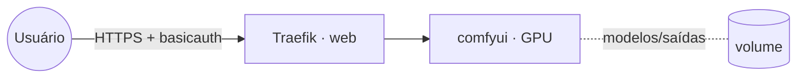

# comfyui — ComfyUI (geração de imagem)

**ComfyUI** é um editor de fluxos por nós para **Stable Diffusion** / geração de imagem. Publicado via
Traefik v3 com TLS e protegido por **basicauth** (ComfyUI não tem login próprio).

> ⚠️ **Requer GPU NVIDIA** no nó (driver + `nvidia-container-runtime`). A imagem e o caminho de dados
> dependem do build de ComfyUI escolhido — ajuste `COMFYUI_IMAGE` e `COMFYUI_DATA_PATH`.

## Arquitetura



## Variáveis de ambiente
| Variável | Obrigatória | Default | Descrição |
|---|---|---|---|
| `COMFYUI_FQDN` | sim | — | domínio público (ex.: `comfy.exemplo.com`) |
| `COMFYUI_AUTH_BASIC` | sim | — | basicauth do Traefik `usuario:hash_bcrypt` (`htpasswd -nbB`) |
| `COMFYUI_IMAGE` | não | `yanwk/comfyui-boot:latest` | imagem ComfyUI (CUDA) a usar |
| `COMFYUI_DATA_PATH` | não | `/root` | caminho de dados dentro do container (depende da imagem) |
| `PROXY_NET` | não | `web` | rede externa do Traefik |
| `WORKER_HOSTNAME` | não | — | fixa o serviço no nó com GPU |

## Pré-requisitos
- Stack `balancer` (Traefik) + rede `web`; DNS de `COMFYUI_FQDN` apontando para o host.
- Nó com **GPU NVIDIA**: driver + `nvidia-container-runtime`. Para expor a GPU ao Swarm, configure
  `node-generic-resources` no `daemon.json` do nó e descomente o bloco `generic_resources` do compose:
  ```json
  { "node-generic-resources": ["NVIDIA-GPU=0"] }
  ```
  (e habilite `swarm-resource = "DOCKER_RESOURCE_NVIDIA_GPU"` no `/etc/nvidia-container-runtime/config.toml`).
- Gere o basicauth: `htpasswd -nbB usuario senha` → `COMFYUI_AUTH_BASIC`.

## Uso
1. Ajuste `COMFYUI_IMAGE`/`COMFYUI_DATA_PATH` conforme a imagem, configure a GPU e faça o deploy.
2. Acesse `https://COMFYUI_FQDN` (passa pelo basicauth). Coloque os checkpoints/modelos no diretório de
   modelos do volume (varia conforme a imagem, ex.: `.../ComfyUI/models`).

## Troubleshooting
| Sintoma | Causa | Ação |
|---|---|---|
| Container não inicia / sem CUDA | GPU não exposta ao container | conferir runtime NVIDIA e `generic_resources` |
| `port 8188` não responde | imagem usa outra porta | ajustar a porta no label do Traefik conforme a imagem |
| Modelos somem ao reagendar | volume local ao nó (multi-worker) | fixar `node.hostname` via `WORKER_HOSTNAME` |
| 404/sem TLS | DNS não aponta / fora da `web` | conferir rede/labels e DNS |
