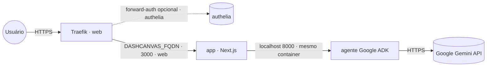

# dashboard-canvas — AI Dashboard Canvas Agent

Agente de **UI generativa** que monta e edita um **painel interativo por conversa**: fixa
métricas e desenha gráficos (linha/barra/pizza) num canvas, buscando dados na web por meio de
um sub-agente de busca do Google. Front **Next.js** com **CopilotKit** + **AG-UI** e agente
**Google ADK/FastAPI** (Gemini).

Empacotado numa **imagem combinada** publicada em `ghcr.io/marcelofmatos/ai-dashboard-canvas-agent`
(fonte: [awesome-llm-apps](https://github.com/Shubhamsaboo/awesome-llm-apps), Apache-2.0 · repo de build
[marcelofmatos/ai-dashboard-canvas-agent](https://github.com/marcelofmatos/ai-dashboard-canvas-agent)).

| Componente | Porta | Papel |
|---|---|---|
| Front (Next.js) | `3000` | UI web exposta via Traefik |
| Agente (Google ADK/FastAPI) | `8000` | Interno (mesmo container); Gemini; detém a chave |

> **Sem login próprio.** A UI não tem autenticação — não deixe aberta no público. Proteja com
> forward-auth (stack `authelia`) descomentando a label de middleware no compose.
>
> **Stateless.** O estado do painel (métricas e gráficos) vive em memória por sessão — não há volume nem banco.

## Arquitetura



## Variáveis de ambiente

| Variável | Obrigatória | Default | Descrição |
|---|:---:|---|---|
| `DASHCANVAS_FQDN` | ✅ | — | Domínio (FQDN) onde a UI é exposta |
| `GOOGLE_API_KEY` | ✅ | — | Chave Google/Gemini usada pelo agente ADK |
| `DASHCANVAS_IMAGE_TAG` | ❌ | `latest` | Tag da imagem no GHCR |
| `PROXY_NET` | ❌ | `web` | Rede externa do proxy (Traefik) |
| `DASHCANVAS_AUTH_MIDDLEWARE` | ❌ | — | Middleware de forward-auth (ex.: `authelia@docker`), se descomentar a label |

## Pré-requisitos

- **Swarm** (App Template `type 2`): rede externa `web` já criada pelo Traefik.
- **Standalone** (`docker compose`): crie a rede antes — `docker network create web`.
- Chave **Google/Gemini** válida (https://makersuite.google.com/app/apikey).

## Uso

1. No Portainer, escolha o template **dashboard-canvas — AI Dashboard Canvas Agent** e preencha
   `DASHCANVAS_FQDN` e `GOOGLE_API_KEY`.
2. Aponte o DNS de `DASHCANVAS_FQDN` para o proxy; o Traefik emite o certificado.
3. Acesse `https://DASHCANVAS_FQDN` e converse com o agente (ex.: "monte um painel com as vendas
   de smartphones por trimestre").

Fora do Portainer:

```bash
cp .env.example .env   # preencha as obrigatórias
docker compose -f docker-compose.standalone.yml up -d
```

## Troubleshooting

| Sintoma | Causa | Ação |
|---|---|---|
| 502 / Bad Gateway logo após subir | Front ainda subindo, ou agente falhou ao iniciar | Aguarde ~30s; veja os logs do serviço (`app`) |
| Chat responde com erro de autenticação | `GOOGLE_API_KEY` ausente ou inválida | Confira a chave nas variáveis da stack |
| UI abre mas o painel não gera métricas/gráficos | Chave sem acesso ao Gemini ou sem cota | Valide a chave em makersuite.google.com |
| Certificado TLS não emitido | DNS não aponta para o proxy | Ajuste o registro A/AAAA de `DASHCANVAS_FQDN` |
| UI acessível sem senha no público | forward-auth não configurado | Descomente a label de middleware e configure a stack `authelia` |
