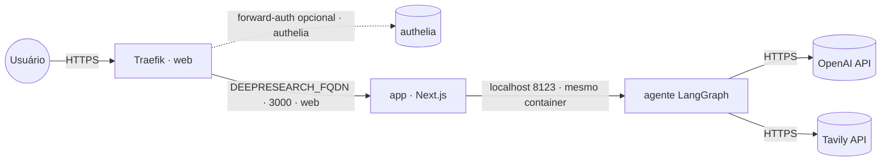

# deep-research — AI Deep Research Agent

Assistente de **pesquisa profunda**: planeja, busca na web (Tavily), escreve num filesystem
virtual e renderiza cada chamada de ferramenta como um card ao vivo. Front **Next.js** +
agente **LangGraph/FastAPI** com **CopilotKit** e **Deep Agents**.

Empacotado numa **imagem combinada** publicada em `ghcr.io/marcelofmatos/ai-deep-research-agent`
(fonte: [awesome-llm-apps](https://github.com/Shubhamsaboo/awesome-llm-apps), Apache-2.0 · repo de build
[marcelofmatos/ai-deep-research-agent](https://github.com/marcelofmatos/ai-deep-research-agent)).

| Componente | Porta | Papel |
|---|---|---|
| Front (Next.js) | `3000` | UI web exposta via Traefik |
| Agente (LangGraph/FastAPI) | `8123` | Interno (mesmo container); busca Tavily; detém as chaves |

> **Sem login próprio.** A UI não tem autenticação — não deixe aberta no público. Proteja com
> forward-auth (stack `authelia`) descomentando a label de middleware no compose.
>
> **Stateless.** O "filesystem" da pesquisa vive em memória por sessão — não há volume nem banco.

## Arquitetura



## Variáveis de ambiente

| Variável | Obrigatória | Default | Descrição |
|---|:---:|---|---|
| `DEEPRESEARCH_FQDN` | ✅ | — | Domínio (FQDN) onde a UI é exposta |
| `OPENAI_API_KEY` | ✅ | — | Chave OpenAI usada pelo agente |
| `TAVILY_API_KEY` | ✅ | — | Chave Tavily (busca web) |
| `OPENAI_MODEL` | ❌ | `gpt-5.2` | Modelo OpenAI |
| `DEEPRESEARCH_IMAGE_TAG` | ❌ | `latest` | Tag da imagem no GHCR |
| `PROXY_NET` | ❌ | `web` | Rede externa do proxy (Traefik) |
| `DEEPRESEARCH_AUTH_MIDDLEWARE` | ❌ | — | Middleware de forward-auth (ex.: `authelia@docker`), se descomentar a label |

## Pré-requisitos

- **Swarm** (App Template `type 2`): rede externa `web` já criada pelo Traefik.
- **Standalone** (`docker compose`): crie a rede antes — `docker network create web`.
- Chaves **OpenAI** e **Tavily** válidas.

## Uso

1. No Portainer, escolha o template **deep-research — AI Deep Research Agent** e preencha
   `DEEPRESEARCH_FQDN`, `OPENAI_API_KEY` e `TAVILY_API_KEY`.
2. Aponte o DNS de `DEEPRESEARCH_FQDN` para o proxy; o Traefik emite o certificado.
3. Acesse `https://DEEPRESEARCH_FQDN` e peça uma pesquisa no chat.

Fora do Portainer:

```bash
cp .env.example .env   # preencha as obrigatórias
docker compose -f docker-compose.standalone.yml up -d
```

## Troubleshooting

| Sintoma | Causa | Ação |
|---|---|---|
| 502 / Bad Gateway logo após subir | Front ainda buildando/subindo, ou agente falhou ao iniciar | Aguarde ~30s; veja os logs do serviço (`app`) |
| Chat responde com erro de autenticação | `OPENAI_API_KEY`/`TAVILY_API_KEY` ausente ou inválida | Confira as chaves nas variáveis da stack |
| UI abre mas a pesquisa não retorna fontes | `TAVILY_API_KEY` inválida ou sem crédito | Valide a chave em app.tavily.com |
| Certificado TLS não emitido | DNS não aponta para o proxy | Ajuste o registro A/AAAA de `DEEPRESEARCH_FQDN` |
| UI acessível sem senha no público | forward-auth não configurado | Descomente a label de middleware e configure a stack `authelia` |
