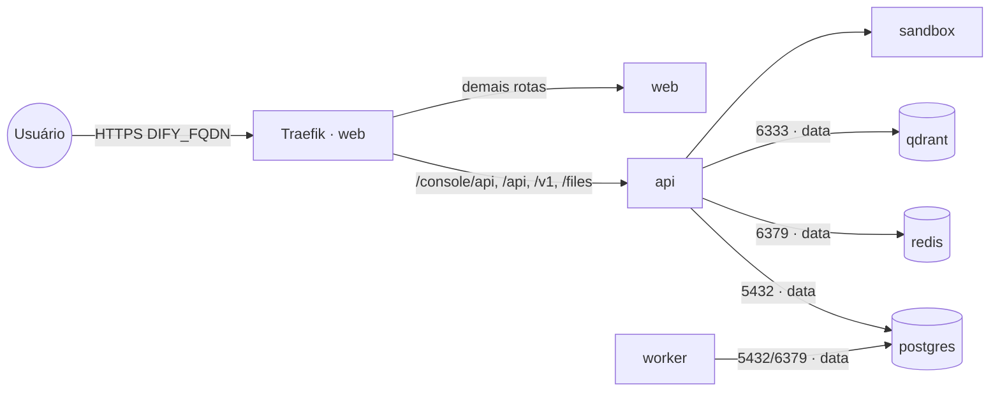

# dify — Dify (plataforma LLMOps / RAG)

**Dify** é uma plataforma para criar apps de LLM (chatbots, agentes, workflows, RAG, datasets).
Publicado via Traefik v3 com TLS. Reaproveita **PostgreSQL** (stack `postgres-pgvector`), **Redis**
(stack `redis`) e **Qdrant** (stack `qdrant`) na rede `data` — não sobe banco/cache/vetor próprios.

> Dify é um produto **multi-serviço** que evolui rápido. Esta stack cobre os serviços essenciais
> (`api`, `worker`, `web`, `sandbox`); confira as variáveis com a versão fixada em `DIFY_IMAGE_TAG`.

## Componentes
| Serviço | Imagem | Função |
|---|---|---|
| `api` | `langgenius/dify-api` | API/console (porta 5001) — recebe as rotas `/console/api`, `/api`, `/v1`, `/files` |
| `worker` | `langgenius/dify-api` | Filas/jobs assíncronos (Celery sobre Redis) |
| `web` | `langgenius/dify-web` | Front-end (porta 3000) — recebe o restante das rotas |
| `sandbox` | `langgenius/dify-sandbox` | Execução isolada de código |

## Arquitetura



## Variáveis de ambiente
| Variável | Obrigatória | Default | Descrição |
|---|---|---|---|
| `DIFY_FQDN` | sim | — | domínio público (ex.: `dify.exemplo.com`) |
| `DIFY_SECRET_KEY` | sim | — | segredo da app (`openssl rand -base64 42`) |
| `DIFY_DB_PASSWORD` | sim | — | senha do usuário do PostgreSQL |
| `DIFY_SANDBOX_API_KEY` | sim | — | chave compartilhada entre `api`/`worker` e o `sandbox` |
| `DIFY_DB_HOST` | não | `postgres` | host do PostgreSQL na rede `data` |
| `DIFY_DB_NAME` | não | `dify` | banco usado pelo Dify |
| `DIFY_DB_USER` | não | `postgres` | usuário do PostgreSQL |
| `DIFY_REDIS_HOST` | não | `redis` | host do Redis na rede `data` |
| `DIFY_REDIS_PASSWORD` | não | — | senha do Redis (se houver) |
| `DIFY_QDRANT_URL` | não | `http://qdrant:6333` | URL do Qdrant na rede `data` |
| `DIFY_QDRANT_API_KEY` | não | — | API key do Qdrant (se definida) |
| `DIFY_IMAGE_TAG` | não | `latest` | tag das imagens dify-api/dify-web |
| `DIFY_SANDBOX_IMAGE_TAG` | não | `latest` | tag da imagem dify-sandbox |
| `PROXY_NET` | não | `web` | rede externa do Traefik |
| `DATA_NET` | não | `data` | rede overlay dos serviços compartilhados |

## Pré-requisitos
- **Hardware mínimo:** 2 vCPU · 4 GB RAM · 20 GB disco
- **Hardware ideal:** 4 vCPU · 8 GB RAM · 40 GB disco
- Stack `balancer` (Traefik) + rede `web`; DNS de `DIFY_FQDN` apontando para o host.
- Rede `data` e as stacks **`postgres-pgvector`**, **`redis`** e **`qdrant`** ativas.
- Banco para o Dify:
  ```sql
  CREATE DATABASE dify;
  ```

## Uso
1. Crie o banco `dify`, gere `DIFY_SECRET_KEY` e `DIFY_SANDBOX_API_KEY` e faça o deploy. O `api` roda as
   migrações (`MIGRATION_ENABLED=true`) no primeiro start.
2. Acesse `https://DIFY_FQDN` — a primeira tela faz a configuração do conta admin.
3. Configure os modelos (ex.: aponte para `litellm`/`ollama`) em **Settings → Model Provider**.

## Troubleshooting
| Sintoma | Causa | Ação |
|---|---|---|
| Front carrega mas API dá 404/500 | roteamento de path / migração | conferir os routers do Traefik e os logs do `api` |
| Erro de banco | banco `dify` ausente / senha errada | criar o banco e conferir `DIFY_DB_*` |
| Execução de código falha | `DIFY_SANDBOX_API_KEY` divergente | usar a MESMA chave em api/worker e sandbox |
| RAG não indexa | Qdrant inacessível | conferir `DIFY_QDRANT_URL` e a rede `data` |
| 404/sem TLS | DNS não aponta / fora da `web` | conferir rede/labels e DNS |
