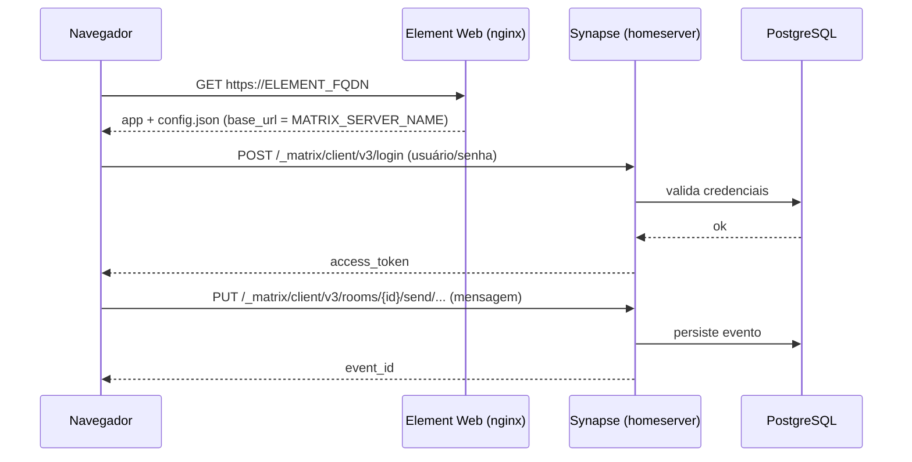

# element — Matrix (Synapse) + Element Web

Plataforma de mensageria **self-hosted** baseada no protocolo [Matrix](https://matrix.org):

- **Synapse** — o *homeserver* (servidor Matrix): contas, salas, DMs, chamadas, mídia.
- **Element Web** — o cliente web, na imagem **white-label** `ghcr.io/marcelofmatos/element`
  (branding criado — paleta do [marcelomatos.dev](https://marcelomatos.dev); homeserver e nome
  da marca via env), servido como estático.
- **PostgreSQL** — banco **próprio** da stack (locale `C`, exigido pelo Synapse).

Tudo publicado pelo **Traefik v3** com TLS Let's Encrypt. É o análogo "Matrix" ao `rocketchat`.

> **Swarm vs standalone.** `docker-compose.yml` = Docker **Swarm** (App Template type 2).
> `docker-compose.standalone.yml` = Docker **standalone** (type 3): labels do Traefik no container
> (provider `docker`), rede `web` bridge (`docker network create web`), `restart`/`depends_on` no
> lugar de `deploy`. Variáveis e uso são idênticos.

---

## Pré-requisitos

1. Rede externa (uma vez por cluster):
   ```bash
   docker network create --driver overlay --attachable web
   ```
2. Stack `balancer` (Traefik) rodando.
3. **Dois** registros DNS apontando para o host:
   - `MATRIX_SERVER_NAME` (ex.: `matrix.exemplo.com`) → o homeserver / identidade.
   - `ELEMENT_FQDN` (ex.: `chat.exemplo.com`) → o cliente web.

## Variáveis

| Variável | Obrigatória | Padrão | Descrição |
|---|---|---|---|
| `MATRIX_SERVER_NAME` | ✅ | — | Domínio do homeserver. Vira a identidade dos usuários (`@usuario:MATRIX_SERVER_NAME`) **e** o host onde o Synapse é servido. Ex.: `matrix.exemplo.com` |
| `ELEMENT_FQDN` | ✅ | — | Domínio do cliente web. Ex.: `chat.exemplo.com` |
| `MATRIX_DB_PASSWORD` | ✅ | — | Senha do PostgreSQL embarcado (segredo) |
| `ELEMENT_BRAND` | — | `Chat` | Nome da marca exibido no cliente (título e tela de boas-vindas). Ex.: `Acme Chat` |
| `SYNAPSE_ENABLE_REGISTRATION` | — | `false` | `true` libera auto-cadastro público na web. Em `false`, cria-se usuários via CLI (recomendado) |
| `SYNAPSE_REPORT_STATS` | — | `no` | Envia estatísticas anônimas ao matrix.org (`yes`/`no`) |
| `SYNAPSE_DB_NAME` | — | `synapse` | Nome do banco |
| `SYNAPSE_DB_USER` | — | `synapse` | Usuário do banco |
| `SYNAPSE_DB_HOST` | — | `db` | Serviço de banco desta stack. Só altere para um Postgres externo |
| `SYNAPSE_IMAGE_TAG` | — | `latest` | Tag de `matrixdotorg/synapse` |
| `ELEMENT_IMAGE_TAG` | — | `latest` | Tag de `ghcr.io/marcelofmatos/element` (imagem white-label custom) |
| `MATRIX_DB_IMAGE_TAG` | — | `16-alpine` | Tag de `postgres` |
| `PROXY_NET` | — | `web` | Nome da rede externa do Traefik |

> **Por que `MATRIX_SERVER_NAME` = host do Synapse?** Mantendo a identidade no mesmo domínio
> onde o homeserver é servido, **não é preciso delegação `.well-known`** para o cliente
> funcionar. Se você quer `@usuario:exemplo.com` mas serve em `matrix.exemplo.com`, veja
> **Federação** abaixo.

## Uso

### 1. Deploy
Suba a stack pelo Portainer (App Template **element** ou o `docker-compose.yml`) preenchendo as
variáveis obrigatórias. No **primeiro start** o Synapse gera `/data/homeserver.yaml`, a *signing
key* e os segredos, e ajusta o banco para o PostgreSQL desta stack.

### 2. Crie o primeiro usuário (admin)
O registro vem **fechado** por padrão. Crie o admin pelo CLI dentro do container do Synapse:

```bash
# descubra o container do serviço synapse
docker ps --filter name=synapse --format '{{.Names}}'

docker exec -it <container_synapse> \
  register_new_matrix_user -c /data/homeserver.yaml http://localhost:8008
```
Responda usuário/senha e confirme `admin = yes`.

### 3. Acesse
Abra `https://ELEMENT_FQDN`, e logue (o cliente já aponta para `https://MATRIX_SERVER_NAME`).

---

## Arquitetura

```mermaid
flowchart LR
  user([Navegador do usuário])

  subgraph web[rede web]
    traefik[Traefik v3<br/>TLS Let's Encrypt]
    element[web<br/>ghcr.io/marcelofmatos/element<br/>white-label · nginx :8080]
    synapse[synapse<br/>matrixdotorg/synapse<br/>homeserver :8008]
  end

  subgraph default[rede default - interna]
    db[(db<br/>PostgreSQL<br/>locale C)]
  end

  user -->|https ELEMENT_FQDN| traefik --> element
  user -->|https MATRIX_SERVER_NAME| traefik --> synapse
  element -. serve config.json (gerado do template via env)<br/>base_url p/ MATRIX_SERVER_NAME .-> user
  synapse -->|psycopg2 :5432| db
```

O cliente **Element** é estático: ele roda no navegador e fala com o homeserver **direto pela
internet** (`https://MATRIX_SERVER_NAME`), não pela rede interna do Docker. Por isso o serviço
`web` só precisa da rede `web`. A imagem é a white-label `ghcr.io/marcelofmatos/element`
(branding criado; homeserver e nome da marca vêm das envs `ELEMENT_*`).

## Fluxo (login + envio de mensagem)



---

## Como a config é gerada (detalhe técnico)

A imagem do Synapse **não** monta mais a config a partir de variáveis de ambiente (recurso
descontinuado). Por isso o `command` desta stack:

1. Se `/data/homeserver.yaml` não existe, roda `/start.py generate` (cria config + chaves).
2. Ajusta via Python/pyyaml: `database` → PostgreSQL, `listeners` → `bind_addresses: 0.0.0.0`
   e `x_forwarded: true` (atrás do Traefik), e `enable_registration` conforme a variável.
3. `exec /start.py run`.

Nos próximos starts o passo 1–2 é pulado (a config já existe no volume `synapse-data`).

O **Element** (imagem white-label `ghcr.io/marcelofmatos/element`) gera, no start,
`/app/config.json` e `/app/branding/welcome.html` a partir de templates via `envsubst`
(usando `ELEMENT_BASE_URL`, `ELEMENT_SERVER_NAME` e `ELEMENT_BRAND`) — o `base_url` aponta
para `https://MATRIX_SERVER_NAME` — e então sobe o nginx. O branding (tema, logos, fundo)
já vem criado na imagem.

---

## Federação (opcional)

Por padrão a stack expõe só a **API cliente** (porta 8008) — suficiente para uso próprio.
Para **federar** com outros servidores Matrix há duas opções:

- **`MATRIX_SERVER_NAME` = host servido** (o caso desta stack): outros servidores tentam
  `https://MATRIX_SERVER_NAME/.well-known/matrix/server`. Publique um `.well-known/matrix/server`
  com `{ "m.server": "MATRIX_SERVER_NAME:443" }` (via Traefik/host) **ou** exponha a porta 8448.
- **Identidade em domínio "bonito"** (`@usuario:exemplo.com` servindo em `matrix.exemplo.com`):
  exige delegação `.well-known` no domínio raiz (`exemplo.com`). Mais trabalho — veja a
  [documentação do Synapse](https://element-hq.github.io/synapse/latest/delegate.html).

---

## Migração de host

Copie os volumes `synapse-data` (config, chaves, mídia) e `db-data` (banco) para o novo host.
A *signing key* fica em `synapse-data` — preservá-la mantém a identidade do servidor.

## Observações

- **`MATRIX_SERVER_NAME` é imutável após o 1º start.** Ele entra na *signing key* e nas
  identidades. Trocar depois quebra o servidor — defina certo desde o início.
- `locale=C` do PostgreSQL só é aplicado na **criação** do volume `db-data`. Banco criado com
  outro locale faz o Synapse recusar a subir.
- Em cluster multi-worker, fixe `synapse` e `db` no mesmo nó (`WORKER_HOSTNAME` + constraint de
  hostname) — os volumes são locais ao nó.
