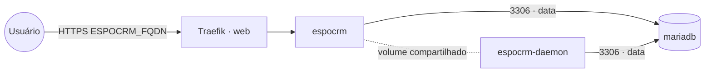

# espocrm — EspoCRM

**EspoCRM** (CRM open source: contas, contatos, oportunidades, funil de vendas, e-mail, automações)
publicado via Traefik v3 com TLS. Reaproveita o **MariaDB** compartilhado (stack `mariadb`) na rede
`data` — não sobe banco próprio. O serviço `espocrm-daemon` executa o cron/jobs do EspoCRM.

## Componentes
| Serviço | Imagem | Função |
|---|---|---|
| `espocrm` | `espocrm/espocrm` | Web (Apache/PHP), exposto via Traefik na porta 80 |
| `espocrm-daemon` | `espocrm/espocrm` | Roda os jobs agendados (`docker-daemon.sh`), compartilha o volume do web |

## Arquitetura



## Variáveis de ambiente
| Variável | Obrigatória | Default | Descrição |
|---|---|---|---|
| `ESPOCRM_FQDN` | sim | — | domínio público (ex.: `crm.exemplo.com`) |
| `ESPOCRM_DB_PASSWORD` | sim | — | senha do usuário do MariaDB (segredo) |
| `ESPOCRM_ADMIN_PASSWORD` | sim | — | senha do admin criado no primeiro deploy (segredo) |
| `ESPOCRM_ADMIN_USERNAME` | não | `admin` | usuário admin inicial |
| `ESPOCRM_DB_HOST` | não | `mariadb` | host do MariaDB na rede `data` |
| `ESPOCRM_DB_PORT` | não | `3306` | porta do MariaDB |
| `ESPOCRM_DB_USER` | não | `espocrm` | usuário do MariaDB |
| `ESPOCRM_DB_NAME` | não | `espocrm` | banco usado pelo EspoCRM |
| `ESPOCRM_IMAGE_TAG` | não | `8.4` | tag da imagem espocrm/espocrm |
| `PROXY_NET` | não | `web` | rede externa do Traefik |
| `DATA_NET` | não | `data` | rede overlay dos serviços compartilhados |
| `WORKER_HOSTNAME` | não | — | fixa os serviços num nó (cluster multi-worker) |

## Pré-requisitos
- Stack `balancer` (Traefik) + rede `web`; DNS de `ESPOCRM_FQDN` apontando para o host.
- Rede `data`: `docker network create --driver overlay --attachable data`.
- Stack **`mariadb`** na rede `data` com banco e usuário para o EspoCRM:
  ```sql
  CREATE DATABASE espocrm CHARACTER SET utf8mb4 COLLATE utf8mb4_unicode_ci;
  CREATE USER 'espocrm'@'%' IDENTIFIED BY 'senha-forte';
  GRANT ALL PRIVILEGES ON espocrm.* TO 'espocrm'@'%';
  FLUSH PRIVILEGES;
  ```

## Uso
1. Crie o banco e o usuário no MariaDB compartilhado (acima).
2. Faça o deploy. No primeiro start o EspoCRM instala o schema e cria o admin
   (`ESPOCRM_ADMIN_USERNAME` / `ESPOCRM_ADMIN_PASSWORD`).
3. Acesse `https://ESPOCRM_FQDN` e entre com o admin. Configure SMTP, papéis e equipes em
   **Administration**.

## Troubleshooting
| Sintoma | Causa | Ação |
|---|---|---|
| Erro de conexão com o banco | `data` ausente / banco-usuário não criados / senha errada | criar a rede, o banco e conferir `ESPOCRM_DB_*` |
| Jobs/notificações não rodam | serviço `espocrm-daemon` parado ou em outro nó | garantir o daemon ativo e no MESMO nó do web |
| 404/sem TLS | fora da `web` / DNS não aponta | conferir rede/labels e DNS |
| Dados somem ao reagendar | volume local ao nó (multi-worker) | fixar `node.hostname` via `WORKER_HOSTNAME` nos dois serviços |
