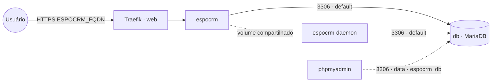

# espocrm — EspoCRM

**EspoCRM** (CRM open source: contas, contatos, oportunidades, funil de vendas, e-mail, automações)
publicado via Traefik v3 com TLS, com **MariaDB embarcado** (serviço `db` próprio da stack). O banco
fica na rede interna `default` e também na `data` **só** para ferramentas de administração (phpmyadmin)
o alcançarem como `espocrm_db`. O serviço `espocrm-daemon` executa o cron/jobs do EspoCRM. Volumes
dedicados = fácil migrar de host.

## Componentes
| Serviço | Imagem | Função |
|---|---|---|
| `espocrm` | `espocrm/espocrm` | Web (Apache/PHP), exposto via Traefik na porta 80 |
| `espocrm-daemon` | `espocrm/espocrm` | Roda os jobs agendados (`docker-daemon.sh`), compartilha o volume do web |
| `db` | `mariadb` | Banco PRÓPRIO da stack; na `data` só p/ admin como `espocrm_db` |

## Arquitetura

## Variáveis de ambiente
| Variável | Obrigatória | Default | Descrição |
|---|---|---|---|
| `ESPOCRM_FQDN` | sim | — | domínio público (ex.: `crm.exemplo.com`) |
| `ESPOCRM_ADMIN_PASSWORD` | sim | — | senha do admin criado no primeiro deploy (segredo) |
| `ESPOCRM_DB_PASSWORD` | sim | — | senha do usuário do banco (usada pelo app e pelo `db`) |
| `ESPOCRM_DB_ROOT_PASSWORD` | sim | — | senha **root** do MariaDB embarcado |
| `ESPOCRM_ADMIN_USERNAME` | não | `admin` | usuário admin inicial |
| `ESPOCRM_DB_HOST` | não | `db` | host do banco (serviço interno desta stack) |
| `ESPOCRM_DB_PORT` | não | `3306` | porta do banco |
| `ESPOCRM_DB_USER` | não | `espocrm` | usuário do banco |
| `ESPOCRM_DB_NAME` | não | `espocrm` | banco usado pelo EspoCRM |
| `ESPOCRM_IMAGE_TAG` | não | `8.4` | tag da imagem espocrm/espocrm |
| `ESPOCRM_DB_IMAGE_TAG` | não | `11` | tag da imagem MariaDB |
| `PROXY_NET` | não | `web` | rede externa do Traefik |
| `DATA_NET` | não | `data` | rede externa p/ ferramentas de admin alcançarem o banco |
| `WORKER_HOSTNAME` | não | — | fixa os serviços num nó (cluster multi-worker) |

## Pré-requisitos
- **Hardware mínimo:** 1 vCPU · 1 GB RAM · 10 GB disco
- **Hardware ideal:** 2 vCPU · 2 GB RAM · 20 GB disco
- Stack `balancer` (Traefik) + rede `web`; DNS de `ESPOCRM_FQDN` apontando para o host.
- Rede `data`: `docker network create --driver overlay --attachable data` (usada pelas ferramentas de admin).
- **Não** precisa da stack `mariadb`: o banco sobe junto. Para administrá-lo, aponte o `phpmyadmin`
  para o host `espocrm_db` (porta 3306) na rede `data`.

## Uso
1. Faça o deploy informando `ESPOCRM_FQDN`, `ESPOCRM_ADMIN_PASSWORD`, `ESPOCRM_DB_PASSWORD` e
   `ESPOCRM_DB_ROOT_PASSWORD`. O banco e o usuário são criados automaticamente na primeira subida.
2. No primeiro start o EspoCRM instala o schema e cria o admin
   (`ESPOCRM_ADMIN_USERNAME` / `ESPOCRM_ADMIN_PASSWORD`).
3. Acesse `https://ESPOCRM_FQDN` e entre com o admin. Configure SMTP, papéis e equipes em
   **Administration**.

### Migrar para outro host
Como o banco é dedicado, basta migrar dois volumes (`espocrm-data` e `db-data`) para o novo nó e
subir a stack lá — sem mexer em banco compartilhado de outras stacks.

## Troubleshooting
| Sintoma | Causa | Ação |
|---|---|---|
| Erro de conexão com o banco | `db` ainda subindo / senha divergente | aguardar o `db`; conferir `ESPOCRM_DB_PASSWORD` igual no app e no banco |
| `db` não inicia na primeira vez | falta `ESPOCRM_DB_ROOT_PASSWORD` | definir a senha root (obrigatória) |
| Jobs/notificações não rodam | serviço `espocrm-daemon` parado ou em outro nó | garantir o daemon ativo e no MESMO nó do web |
| 404/sem TLS | fora da `web` / DNS não aponta | conferir rede/labels e DNS |
| phpmyadmin não acha o banco | host errado | usar `espocrm_db:3306` na rede `data` |
| Dados somem ao reagendar | volume local ao nó (multi-worker) | fixar `node.hostname` via `WORKER_HOSTNAME` nos serviços |
