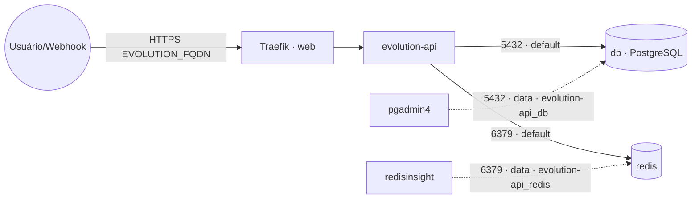

# evolution-api — Evolution API (WhatsApp)

**Evolution API** (gateway de API para WhatsApp) publicado via Traefik v3 com TLS, com **PostgreSQL
e Redis embarcados** (serviços `db` e `redis` próprios da stack). Banco e cache ficam na rede interna
`default` e também na `data` **só** para ferramentas de administração os alcançarem como
`evolution-api_db` (pgadmin4) e `evolution-api_redis` (redisinsight). As instâncias/dados ficam no
banco e no volume dedicado, então é fácil migrar de host.

## Arquitetura

## Variáveis de ambiente
| Variável | Obrigatória | Default | Descrição |
|---|---|---|---|
| `EVOLUTION_FQDN` | sim | — | domínio público (ex.: `evolution.exemplo.com`) |
| `EVOLUTION_API_KEY` | sim | — | chave global de autenticação da API (segredo) |
| `EVOLUTION_DB_PASSWORD` | sim | — | senha do PostgreSQL (usada pelo app e pelo `db`) |
| `EVOLUTION_DB_HOST` | não | `db` | host do banco (serviço interno desta stack) |
| `EVOLUTION_DB_PORT` | não | `5432` | porta do PostgreSQL |
| `EVOLUTION_DB_USER` | não | `postgres` | usuário do banco |
| `EVOLUTION_DB_NAME` | não | `evolution` | banco usado pela Evolution |
| `EVOLUTION_DB_IMAGE_TAG` | não | `16-alpine` | tag da imagem PostgreSQL |
| `EVOLUTION_REDIS_URI` | não | `redis://redis:6379/6` | URI do Redis embarcado (com senha: `redis://default:<senha>@redis:6379/6`) |
| `EVOLUTION_REDIS_IMAGE_TAG` | não | `7-alpine` | tag da imagem Redis |
| `EVOLUTION_LANGUAGE` | não | `pt-BR` | idioma |
| `EVOLUTION_IMAGE_TAG` | não | `v2.2.3` | tag da imagem atendai/evolution-api |
| `PROXY_NET` | não | `web` | rede externa do Traefik |
| `DATA_NET` | não | `data` | rede externa p/ ferramentas de admin alcançarem banco/cache |
| `WORKER_HOSTNAME` | não | — | fixa os volumes num nó (cluster multi-worker) |

## Pré-requisitos
- Stack `balancer` (Traefik) + rede `web`; DNS de `EVOLUTION_FQDN` apontando para o host.
- Rede `data`: `docker network create --driver overlay --attachable data` (usada pelas ferramentas de admin).
- **Não** precisa das stacks `postgres-pgvector`/`redis`: banco e cache sobem junto. Para administrá-los,
  aponte o `pgadmin4` para o host `evolution-api_db` (porta 5432) e o `redisinsight` para
  `evolution-api_redis` (porta 6379) na rede `data`.

## Uso
1. Faça o deploy informando `EVOLUTION_FQDN`, `EVOLUTION_API_KEY` e `EVOLUTION_DB_PASSWORD`. O banco/
   usuário são criados automaticamente na primeira subida.
2. A API responde em `https://EVOLUTION_FQDN`.
3. Autentique chamadas com o header `apikey: <EVOLUTION_API_KEY>`. Crie instâncias via
   `POST /instance/create` e leia o QR Code para parear o WhatsApp.

### Migrar para outro host
Como banco e cache são dedicados, basta migrar os volumes `db-data`, `redis-data` e
`evolution-instances` para o novo nó e subir a stack lá — sem mexer em banco/cache compartilhado de
outras stacks.

## Segurança
- `EVOLUTION_API_KEY` é a chave mestra — use um valor forte e mantenha em segredo.
- Considere proteger rotas administrativas com middleware no Traefik (basicauth/authelia).

## Troubleshooting
| Sintoma | Causa | Ação |
|---|---|---|
| Erro de conexão com o banco | `db` ainda subindo / senha divergente | aguardar o `db`; conferir `EVOLUTION_DB_PASSWORD` igual no app e no banco |
| `NOAUTH`/erro no Redis | URI sem credenciais (se você configurou senha) | usar `redis://default:<senha>@redis:6379/6` em `EVOLUTION_REDIS_URI` |
| 404/sem TLS | fora da `web` / DNS não aponta | conferir rede/labels e DNS |
| Instâncias/dados somem ao reagendar | volume local ao nó (multi-worker) | fixar `node.hostname` via `WORKER_HOSTNAME` e preservar os volumes |
| pgadmin4/redisinsight não acham o serviço | host errado | usar `evolution-api_db:5432` / `evolution-api_redis:6379` na rede `data` |
