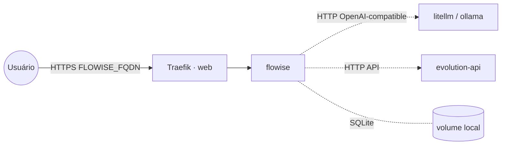

# flowise — Flowise (builder de agentes de IA)

**Flowise** (construtor visual de chatbots/agentes LLM, RAG e fluxos com nós arrastáveis) publicado via
Traefik v3 com TLS. Persiste em **SQLite** num volume local (`/root/.flowise`) e protege o acesso por
usuário/senha. Consome LLMs das stacks `litellm`/`ollama` e pode entregar respostas no WhatsApp via
stack **`evolution-api`**.

## Arquitetura

## Variáveis de ambiente
| Variável | Obrigatória | Default | Descrição |
|---|---|---|---|
| `FLOWISE_FQDN` | sim | — | domínio público (ex.: `flowise.exemplo.com`) |
| `FLOWISE_PASSWORD` | sim | — | senha de login da UI (segredo) |
| `FLOWISE_USERNAME` | não | `admin` | usuário de login da UI |
| `FLOWISE_IMAGE_TAG` | não | `latest` | tag da imagem flowiseai/flowise |
| `PROXY_NET` | não | `web` | rede externa do Traefik |
| `WORKER_HOSTNAME` | não | — | fixa o volume num nó (cluster multi-worker) |

## Pré-requisitos
- **Hardware mínimo:** 1 vCPU · 1 GB RAM · 10 GB disco
- **Hardware ideal:** 2 vCPU · 2 GB RAM · 20 GB disco
- Stack `balancer` (Traefik) + rede `web`; DNS de `FLOWISE_FQDN` apontando para o host.
- (Opcional) Stacks `litellm`/`ollama` para os modelos e `evolution-api` para o canal de WhatsApp.

## Uso
1. Defina `FLOWISE_PASSWORD` e faça o deploy.
2. Acesse `https://FLOWISE_FQDN` e entre com `FLOWISE_USERNAME` / `FLOWISE_PASSWORD`.
3. **LLM:** adicione um nó *ChatOpenAI* (ou *Ollama*) apontando para o endpoint da stack `litellm`
   (`https://<litellm_fqdn>`, base path OpenAI) ou `ollama` (`https://<ollama_fqdn>`).
4. **WhatsApp via Evolution API:** num nó *HTTP/Custom Tool*, chame
   `POST https://<evolution_fqdn>/message/sendText/<instância>` com o header `apikey` para enviar a
   resposta do agente.

## Troubleshooting
| Sintoma | Causa | Ação |
|---|---|---|
| Pede login em loop / não autentica | `FLOWISE_PASSWORD` vazio | definir `FLOWISE_USERNAME`/`FLOWISE_PASSWORD` |
| Fluxos/credenciais somem ao reagendar | volume local ao nó (multi-worker) | fixar `node.hostname` via `WORKER_HOSTNAME` |
| Erro ao chamar o LLM | endpoint/credencial do litellm/ollama incorretos | conferir base URL e API key do provedor |
| 404/sem TLS | DNS não aponta / fora da `web` | conferir rede/labels e DNS |
