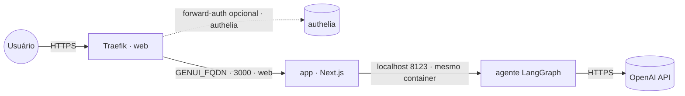

# gen-ui-starter — Generative UI Starter

App de **demonstração/starter** de **UI generativa dirigida por agente**: o assistente monta e
atualiza componentes de UI na tela (um **kanban** de tarefas, cards de voo, dashboards com
métricas/gráficos/tabelas) — indo além do chat. Serve como template para novos projetos com
CopilotKit + LangGraph. Front **Next.js** com **CopilotKit** + **AG-UI** e agente **LangGraph**
(Python, OpenAI).

Empacotado numa **imagem combinada** publicada em `ghcr.io/marcelofmatos/generative-ui-starter-project`
(fonte: [awesome-llm-apps](https://github.com/Shubhamsaboo/awesome-llm-apps), Apache-2.0 · repo de build
[marcelofmatos/generative-ui-starter-project](https://github.com/marcelofmatos/generative-ui-starter-project)).

| Componente | Porta | Papel |
|---|---|---|
| Front (Next.js) | `3000` | UI web exposta via Traefik |
| Agente (LangGraph/AG-UI) | `8123` | Interno (mesmo container); OpenAI; detém a chave |

> **Demo/starter.** É um exemplo/template de UI generativa — o kanban e os cards são para
> mostrar o padrão de estado agente↔UI, não um produto de produção.
>
> **Sem login próprio.** A UI não tem autenticação — não deixe aberta no público. Proteja com
> forward-auth (stack `authelia`) descomentando a label de middleware no compose.
>
> **Stateless.** O kanban e o estado da sessão vivem em memória no agente — não há volume nem banco.

## Arquitetura



## Variáveis de ambiente

| Variável | Obrigatória | Default | Descrição |
|---|:---:|---|---|
| `GENUI_FQDN` | ✅ | — | Domínio (FQDN) onde a UI é exposta |
| `OPENAI_API_KEY` | ✅ | — | Chave OpenAI usada pelo agente LangGraph |
| `GENUI_IMAGE_TAG` | ❌ | `latest` | Tag da imagem no GHCR |
| `PROXY_NET` | ❌ | `web` | Rede externa do proxy (Traefik) |
| `GENUI_AUTH_MIDDLEWARE` | ❌ | — | Middleware de forward-auth (ex.: `authelia@docker`), se descomentar a label |

## Pré-requisitos

- **Swarm** (App Template `type 2`): rede externa `web` já criada pelo Traefik.
- **Standalone** (`docker compose`): crie a rede antes — `docker network create web`.
- Chave **OpenAI** válida (https://platform.openai.com/api-keys).
- **Porte: Leve** — sem banco; RAM ~256 MB → 512 MB por réplica. O custo real é a API OpenAI.

## Uso

1. No Portainer, escolha o template **gen-ui-starter — Generative UI Starter** e preencha
   `GENUI_FQDN` e `OPENAI_API_KEY`.
2. Aponte o DNS de `GENUI_FQDN` para o proxy; o Traefik emite o certificado.
3. Acesse `https://GENUI_FQDN` e converse com o assistente (ex.: "adicione três tarefas ao kanban"
   ou "mostre voos de São Paulo para Lisboa").

Fora do Portainer:

```bash
cp .env.example .env   # preencha as obrigatórias
docker compose -f docker-compose.standalone.yml up -d
```

## Troubleshooting

| Sintoma | Causa | Ação |
|---|---|---|
| 502 / Bad Gateway logo após subir | Front ainda subindo, ou agente falhou ao iniciar | Aguarde ~30s; veja os logs do serviço (`app`) |
| Chat responde com erro de autenticação | `OPENAI_API_KEY` ausente ou inválida | Confira a chave nas variáveis da stack |
| UI abre mas a geração de UI não acontece | Chave sem cota ou sem acesso ao modelo | Valide a chave em platform.openai.com |
| Certificado TLS não emitido | DNS não aponta para o proxy | Ajuste o registro A/AAAA de `GENUI_FQDN` |
| UI acessível sem senha no público | forward-auth não configurado | Descomente a label de middleware e configure a stack `authelia` |
