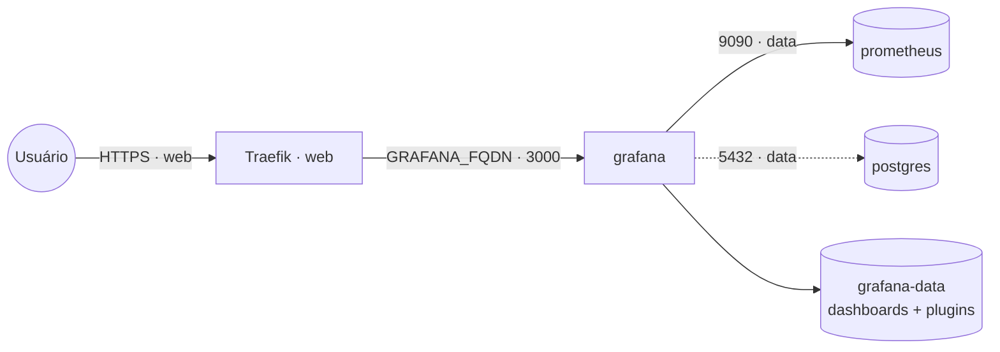

# grafana — Grafana (dashboards / observabilidade)

[Grafana](https://grafana.com/) para dashboards e visualização de métricas/logs/traces. Sobe
**vazio** — você conecta os *datasources* (Prometheus, PostgreSQL, Loki, InfluxDB, MySQL, etc.) na
UI. Publicado via **Traefik v3** com TLS Let's Encrypt.

> **`grafana` vs `swarmprom`:** o `swarmprom` já traz Prometheus + Alertmanager + Grafana +
> exporters (bundle de monitoramento de Swarm). Use esta stack quando quiser **só o Grafana** e
> apontar para datasources que você já tem.

## Arquitetura

O Grafana entra na rede **`data`** para alcançar datasources deste cluster pelo **nome do serviço**
(ex.: `http://prometheus:9090`, `postgres:5432`). Datasources externos (URL pública) funcionam sem a
rede `data`.

## Variáveis de ambiente

| Variável | Obrigatória | Default | Descrição |
|---|---|---|---|
| `GRAFANA_FQDN` | sim | — | domínio público (ex.: `grafana.exemplo.com`) |
| `GRAFANA_ADMIN_PASSWORD` | sim | — | senha do usuário admin (segredo) |
| `GRAFANA_ADMIN_USER` | não | `admin` | usuário admin |
| `GRAFANA_PLUGINS` | não | — | plugins a instalar no start (lista por vírgula, ex.: `grafana-piechart-panel,grafana-clock-panel`) |
| `GRAFANA_IMAGE_TAG` | não | `latest` | tag de `grafana/grafana` |
| `PROXY_NET` / `DATA_NET` | não | `web` / `data` | nomes das redes externas |

## Pré-requisitos

1. Redes externas:
   - `web` (proxy): `docker network create --driver overlay --attachable web` (Swarm) ou `docker network create web` (standalone).
   - `data` (datasources internos): idem, `data`.
2. Stack `balancer` (Traefik) rodando e DNS de `GRAFANA_FQDN` apontando para o host.

## Uso

1. Suba a stack informando `GRAFANA_FQDN` e `GRAFANA_ADMIN_PASSWORD`.
2. Acesse `https://GRAFANA_FQDN` e logue com `admin` / a senha definida.
3. **Configure os datasources** (Connections → Data sources):
   - Prometheus deste cluster: `http://prometheus:9090` (pela rede `data`).
   - PostgreSQL/MySQL interno: host `postgres`/`mariadb` (pela rede `data`).
   - Qualquer fonte externa: use a URL pública.
4. Importe dashboards prontos pelo ID em [grafana.com/dashboards](https://grafana.com/grafana/dashboards/).

## Troubleshooting

| Sintoma | Causa | Ação |
|---|---|---|
| Datasource interno não conecta | Grafana e a fonte não compartilham a rede `data` | ponha a fonte na rede `data` e use o nome do serviço |
| Login falha após redeploy | volume `grafana-data` recriado (senha/estado perdidos) | preserve o volume; `GF_SECURITY_ADMIN_PASSWORD` redefine só o admin no start |
| Assets/redirect quebrados atrás do proxy | `GF_SERVER_ROOT_URL` incorreto | confirme `= https://GRAFANA_FQDN` |
| Plugin não aparece | `GRAFANA_PLUGINS` só instala no **start** | ajuste a variável e recrie o serviço (ou instale pela CLI/UI) |
| Dashboards somem ao reagendar (Swarm) | volume local ao nó | fixe o serviço no nó (`WORKER_HOSTNAME`) |
