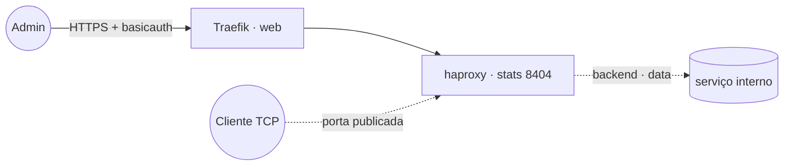

# haproxy — HAProxy (load balancer TCP/HTTP)

**HAProxy** para balanceamento/proxy **TCP ou HTTP** dentro do cluster — útil para distribuir conexões
a bancos, filas ou serviços internos. A **página de stats** (porta 8404) é publicada via Traefik v3 com
TLS e protegida por basicauth. A configuração vem de um **Docker config** externo (template em
`config/haproxy.cfg`).

## Arquitetura



## Variáveis de ambiente
| Variável | Obrigatória | Default | Descrição |
|---|---|---|---|
| `HAPROXY_FQDN` | sim | — | domínio da página de stats (ex.: `haproxy.exemplo.com`) |
| `HAPROXY_AUTH_BASIC` | sim | — | basicauth do Traefik `usuario:hash_bcrypt` (`htpasswd -nbB`) |
| `HAPROXY_CONFIG_NAME` | não | `haproxy_config_v1` | nome do Docker config com o `haproxy.cfg` |
| `HAPROXY_IMAGE_TAG` | não | `lts-alpine` | tag da imagem haproxy |
| `PROXY_NET` | não | `web` | rede externa do Traefik |
| `DATA_NET` | não | `data` | rede overlay dos serviços compartilhados |

## Pré-requisitos
- **Hardware mínimo:** 0.5 vCPU · 128 MB RAM · 2 GB disco
- **Hardware ideal:** 1 vCPU · 256 MB RAM · 5 GB disco
- Stack `balancer` (Traefik) + rede `web`; DNS de `HAPROXY_FQDN` apontando para o host.
- Rede `data` (se for balancear serviços internos): `docker network create --driver overlay --attachable data`.
- Gere o basicauth: `htpasswd -nbB usuario senha` → `HAPROXY_AUTH_BASIC`.
- Crie o Docker config a partir do template (ajuste antes conforme seu caso):
  ```bash
  docker config create haproxy_config_v1 haproxy/config/haproxy.cfg
  ```

## Uso
1. Edite `config/haproxy.cfg`, crie o Docker config e faça o deploy.
2. Acesse a página de stats em `https://HAPROXY_FQDN` (passa pelo basicauth).
3. **Balanceamento TCP:** defina `frontend`/`backend` em modo `tcp` no `haproxy.cfg` e **publique a
   porta** correspondente no bloco `ports` do `docker-compose.yml` (descomente e ajuste).
4. Para alterar a config depois, crie `haproxy_config_v2` (configs são imutáveis) e ajuste
   `HAPROXY_CONFIG_NAME`.

## Troubleshooting
| Sintoma | Causa | Ação |
|---|---|---|
| Serviço não sobe | `haproxy.cfg` inválido / config inexistente | validar a sintaxe e conferir `docker config ls` |
| Stats pede senha e nega | hash do basicauth incorreto | regerar com `htpasswd -nbB` e atualizar `HAPROXY_AUTH_BASIC` |
| Backend TCP não conecta | porta não publicada / fora da rede do alvo | publicar a porta em `ports` e anexar `data` |
| Mudança no cfg não aplica | Docker config é imutável | criar `_v2` e atualizar `HAPROXY_CONFIG_NAME` |
| 404/sem TLS nas stats | DNS não aponta / fora da `web` | conferir rede/labels e DNS |
