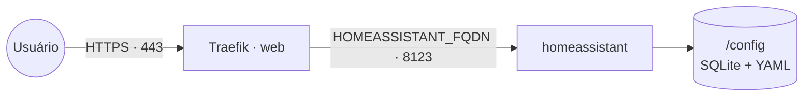

# home-assistant — Home Assistant

[Home Assistant](https://www.home-assistant.io/) (versão **Container**) — plataforma open source
de automação residencial: dashboards, automações, integrações com milhares de dispositivos e
serviços. Publicado via **Traefik v3** com TLS Let's Encrypt.

Banco e estado ficam no volume `/config` (SQLite por padrão) — sem serviço de banco separado.

> **Escopo:** esta stack é o Home Assistant **Container**, pensado para um servidor/cloud **atrás
> de proxy**. A descoberta automática de dispositivos locais (mDNS/Bonjour, Bluetooth, dongles
> Zigbee/Z-Wave USB) depende de `network_mode: host` ou de hardware dedicado (**Home Assistant
> OS**) e **não** se aplica a um cluster Swarm com rede overlay. Integrações via rede/cloud
> (MQTT, APIs, webhooks, integrações IP) funcionam normalmente.

## Arquitetura



## Variáveis de ambiente

| Variável | Obrigatória | Default | Descrição |
|---|---|---|---|
| `HOMEASSISTANT_FQDN` | ✅ | — | Domínio público. Ex.: `casa.exemplo.com` |
| `TZ` | — | `America/Sao_Paulo` | Fuso horário do container |
| `HOMEASSISTANT_IMAGE_TAG` | — | `stable` | Tag de `ghcr.io/home-assistant/home-assistant` |
| `PROXY_NET` | — | `web` | Nome da rede externa do proxy |

## Pré-requisitos

1. Rede externa (uma vez por cluster):
   ```bash
   docker network create --driver overlay --attachable web
   ```
2. Stack `balancer` (Traefik) rodando.
3. DNS de `HOMEASSISTANT_FQDN` apontando para o host.

## Uso

1. Suba a stack (App Template **home-assistant** ou o `docker-compose.yml`) informando `HOMEASSISTANT_FQDN`.
2. Acesse `https://HOMEASSISTANT_FQDN` e faça o **onboarding** (cria o 1º usuário/administrador).

### Reverse proxy — IP real do cliente (recomendado)

O Home Assistant funciona atrás do Traefik sem ajuste, mas por padrão ele enxerga o **IP do
proxy** como cliente (afeta banimento por IP, logs e geolocalização). Para que ele use o
`X-Forwarded-For`, adicione ao `/config/configuration.yaml` e **reinicie** o serviço:

```yaml
http:
  use_x_forwarded_for: true
  trusted_proxies:
    - 10.0.0.0/8        # sub-redes overlay do Docker Swarm
    - 172.16.0.0/12
    - 192.168.0.0/16
```

> Edite o `configuration.yaml` pelo add-on/editor de arquivos do próprio HA, ou direto no volume
> `homeassistant-config`. Restrinja `trusted_proxies` ao mínimo necessário no seu ambiente.

## Troubleshooting

| Sintoma | Causa | Ação |
|---|---|---|
| `400: Bad Request` ao acessar via domínio | `use_x_forwarded_for: true` sem o proxy em `trusted_proxies` | Inclua a sub-rede overlay correta em `trusted_proxies` (ver acima) e reinicie |
| Log: *"A request from a reverse proxy was received…"* | HA sem o bloco `http:` de proxy | Adicione o bloco `http:` recomendado (opcional, mas recomendado) |
| Dispositivo local não é descoberto | Sem `network_mode: host` no Swarm/overlay | Esperado neste escopo — use integrações IP/MQTT/cloud, ou HAOS em hardware dedicado |
| Mudança no `configuration.yaml` não aplica | HA não recarregou | Reinicie a stack ou use *Developer Tools → Restart* na UI |
| Migrar para outro host | Estado fica em `/config` | Copie o volume `homeassistant-config` para o novo host |
