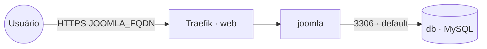

# joomla — Joomla (CMS) + MySQL

**Joomla** publicado via Traefik v3 com TLS, usando **MySQL** como banco de dados. O Joomla é
exposto na rede `web`; o banco fica apenas na rede interna `default`.

## Componentes
| Serviço | Imagem | Função |
|---|---|---|
| `joomla` | `joomla` | CMS Joomla (porta interna 80, exposto via Traefik) |
| `db` | `mysql` | Banco de dados MySQL (somente rede interna) |

## Arquitetura



## Variáveis de ambiente
| Variável | Obrigatória | Default | Descrição |
|---|---|---|---|
| `JOOMLA_FQDN` | sim | — | domínio público do Joomla (ex.: `joomla.exemplo.com`) |
| `JOOMLA_DB_PASSWORD` | sim | — | senha do usuário do banco do Joomla |
| `MYSQL_ROOT_PASSWORD` | sim | — | senha do usuário root do MySQL |
| `JOOMLA_DB_USER` | não | `joomla` | usuário do banco do Joomla |
| `JOOMLA_DB_NAME` | não | `joomla` | nome do banco do Joomla |
| `JOOMLA_IMAGE_TAG` | não | `latest` | tag da imagem do Joomla |
| `MYSQL_IMAGE_TAG` | não | `8.0` | tag da imagem do MySQL |
| `PROXY_NET` | não | `web` | rede externa do Traefik |
| `WORKER_HOSTNAME` | não | — | nó fixo para os volumes em cluster multi-worker |

## Pré-requisitos
- Docker Swarm inicializado.
- Stack `balancer` (Traefik) e rede `web` ativos.
- DNS de `JOOMLA_FQDN` apontando para o host (porta 80 acessível para o desafio Let's Encrypt).

## Uso
1. Defina as variáveis obrigatórias e faça o deploy:
   ```bash
   export JOOMLA_FQDN=joomla.exemplo.com JOOMLA_DB_PASSWORD=... MYSQL_ROOT_PASSWORD=...
   docker stack deploy -c joomla/docker-compose.yml joomla
   ```
2. Acesse `https://JOOMLA_FQDN` e conclua o assistente de instalação do Joomla.
3. Na etapa de banco de dados, use: **host** `db`, **usuário/senha/banco** conforme as variáveis
   `JOOMLA_DB_*` (já pré-preenchidos via ambiente).

> Volumes locais ao nó: em cluster com mais de um worker, fixe `joomla` e `db` no mesmo nó
> definindo `WORKER_HOSTNAME` e descomentando o constraint `node.hostname` no compose.

## Troubleshooting
| Sintoma | Causa | Ação |
|---|---|---|
| 404/sem TLS | serviço fora da `web` / DNS não aponta | conferir rede/labels e DNS do `JOOMLA_FQDN` |
| Joomla não conecta ao banco | banco ainda iniciando ou senha divergente | aguardar o `db` subir; conferir `JOOMLA_DB_PASSWORD` |
| "Access denied for user" | `JOOMLA_DB_PASSWORD` mudou após o 1º deploy | a senha do usuário é fixada na criação do volume; recriar volume `mysql` ou ajustar a senha no MySQL |
| Certificado não emite | porta 80 inacessível / DNS errado | garantir DNS e porta 80 abertos para o desafio HTTP |
| Dados perdidos após redeploy em outro nó | volume local em nó diferente | fixar o nó com `WORKER_HOSTNAME` |
