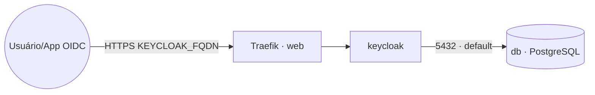

# keycloak — Keycloak (IAM/SSO) + PostgreSQL

**Keycloak** (Identity and Access Management / Single Sign-On) publicado via Traefik v3 com TLS,
usando **PostgreSQL** como banco de dados. O Keycloak roda em modo produção (`start`) atrás do
proxy: o TLS é terminado no Traefik e o Keycloak confia nos cabeçalhos `X-Forwarded-*`
(`KC_PROXY_HEADERS=xforwarded`, `KC_HTTP_ENABLED=true`).

## Componentes
| Serviço | Imagem | Rede | Função |
|---|---|---|---|
| `keycloak` | `quay.io/keycloak/keycloak` | `default` + `web` | servidor IAM/SSO (porta interna 8080) |
| `db` | `postgres` | `default` | banco de dados PostgreSQL (volume `pgdata`) |

## Arquitetura



## Variáveis de ambiente
| Variável | Obrigatória | Default | Descrição |
|---|---|---|---|
| `KEYCLOAK_FQDN` | sim | — | domínio público do Keycloak (ex.: `auth.exemplo.com`) |
| `KEYCLOAK_ADMIN_PASSWORD` | sim | — | senha do admin bootstrap (segredo) |
| `KEYCLOAK_DB_PASSWORD` | sim | — | senha do banco PostgreSQL (segredo) |
| `KEYCLOAK_ADMIN` | não | `admin` | usuário admin bootstrap |
| `KEYCLOAK_DB_USER` | não | `keycloak` | usuário do banco PostgreSQL |
| `KEYCLOAK_DB_NAME` | não | `keycloak` | nome do banco de dados |
| `KEYCLOAK_IMAGE_TAG` | não | `latest` | tag da imagem do Keycloak |
| `POSTGRES_IMAGE_TAG` | não | `16-alpine` | tag da imagem do PostgreSQL |
| `WORKER_HOSTNAME` | não | — | hostname do worker para fixar o `db` (cluster multi-worker) |
| `PROXY_NET` | não | `web` | rede externa do Traefik |

## Pré-requisitos
- Docker Swarm inicializado e stack `balancer` (Traefik) em execução.
- Rede overlay pública `web`: `docker network create --driver overlay --attachable web`.
- DNS de `KEYCLOAK_FQDN` apontando para o host (porta 80 acessível para o desafio HTTP do
  Let's Encrypt).
- Em cluster com mais de um worker, defina `WORKER_HOSTNAME` e descomente o constraint
  `node.hostname` do serviço `db` no `docker-compose.yml` (o volume `pgdata` é local ao nó).

## Uso
Deploy manual:
```bash
export KEYCLOAK_FQDN=auth.exemplo.com KEYCLOAK_ADMIN_PASSWORD=... KEYCLOAK_DB_PASSWORD=...
docker stack deploy -c keycloak/docker-compose.yml keycloak
```
Acesse `https://KEYCLOAK_FQDN` e faça login com `KEYCLOAK_ADMIN` / `KEYCLOAK_ADMIN_PASSWORD`.

> As variáveis `KC_BOOTSTRAP_ADMIN_*` criam o usuário admin apenas no primeiro start (banco vazio).
> Depois disso, gerencie o admin pela interface; alterar as variáveis não recria/redefine a senha.

## Troubleshooting
| Sintoma | Causa | Ação |
|---|---|---|
| 404 / sem TLS | serviço fora da `web` / DNS não aponta | conferir rede, labels e DNS de `KEYCLOAK_FQDN` |
| Loop de redirect ou URLs com `http://` | proxy headers não confiáveis | confirmar `KC_PROXY_HEADERS=xforwarded` e que o Traefik envia `X-Forwarded-*` |
| "Hostname" / página em branco no admin | `KC_HOSTNAME` divergente do FQDN acessado | ajustar `KEYCLOAK_FQDN` para o domínio real |
| Keycloak não sobe / erro de conexão ao banco | `db` indisponível ou senha errada | verificar serviço `db`, `KEYCLOAK_DB_PASSWORD` e a rede `default` |
| Dados perdidos após mover o serviço | volume `pgdata` é local ao nó | fixar `db` com `WORKER_HOSTNAME` em cluster multi-worker |
