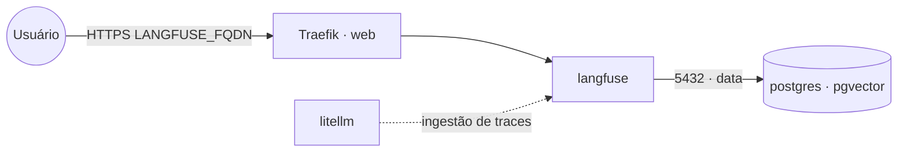

# langfuse — Langfuse (observabilidade de LLM)

**Langfuse** faz tracing/observabilidade de aplicações LLM (traces, prompts, custos, avaliações).
Pareia com a stack `litellm` (que pode enviar logs para o Langfuse). Esta stack usa o **Langfuse v2**
(serviço único), que precisa apenas do **PostgreSQL** compartilhado (stack `postgres-pgvector`).

> O Langfuse **v3** adiciona ClickHouse, Redis e armazenamento S3 (mais componentes). Aqui optamos
> pelo v2 por simplicidade; para o v3, monte os serviços extras conforme a doc oficial.

## Arquitetura



## Variáveis de ambiente
| Variável | Obrigatória | Default | Descrição |
|---|---|---|---|
| `LANGFUSE_FQDN` | sim | — | domínio público (ex.: `langfuse.exemplo.com`) |
| `LANGFUSE_DB_PASSWORD` | sim | — | senha do usuário do PostgreSQL |
| `LANGFUSE_NEXTAUTH_SECRET` | sim | — | segredo de sessão (gere com `openssl rand -base64 32`) |
| `LANGFUSE_SALT` | sim | — | salt para hash de chaves de API (gere com `openssl rand -base64 32`) |
| `LANGFUSE_DB_HOST` | não | `postgres` | host do PostgreSQL na rede `data` |
| `LANGFUSE_DB_PORT` | não | `5432` | porta do PostgreSQL |
| `LANGFUSE_DB_USER` | não | `postgres` | usuário do PostgreSQL |
| `LANGFUSE_DB_NAME` | não | `langfuse` | banco usado pelo Langfuse |
| `LANGFUSE_DISABLE_SIGNUP` | não | `false` | bloqueia auto-cadastro após criar o admin |
| `LANGFUSE_IMAGE_TAG` | não | `2` | tag da imagem langfuse/langfuse (v2) |
| `PROXY_NET` | não | `web` | rede externa do Traefik |
| `DATA_NET` | não | `data` | rede overlay dos serviços compartilhados |

## Pré-requisitos
- Stack `balancer` (Traefik) + rede `web`; DNS de `LANGFUSE_FQDN` apontando para o host.
- Rede `data` e stack **`postgres-pgvector`** com um banco para o Langfuse:
  ```sql
  CREATE DATABASE langfuse;
  ```

## Uso
1. Crie o banco `langfuse`, gere os segredos e faça o deploy (migrações aplicadas no start).
2. Acesse `https://LANGFUSE_FQDN`, crie a conta e um projeto; gere as chaves (public/secret).
3. **Feche o signup** após criar sua conta: defina `LANGFUSE_DISABLE_SIGNUP=true` e reimplante (a app
   é exposta publicamente; sem isso qualquer um pode se cadastrar).
4. Aponte o cliente (ex.: `litellm`, SDK) para `https://LANGFUSE_FQDN` com as chaves do projeto.

## Troubleshooting
| Sintoma | Causa | Ação |
|---|---|---|
| App não sobe / erro de migração | banco não criado / senha errada | criar o banco e conferir `LANGFUSE_DB_*` |
| Login não persiste | `NEXTAUTH_SECRET` vazio/alterado | fixar o segredo |
| Chaves de API inválidas após restart | `SALT` mudou | manter o `SALT` fixo |
| 404/sem TLS | DNS não aponta / fora da `web` | conferir rede/labels e DNS |
