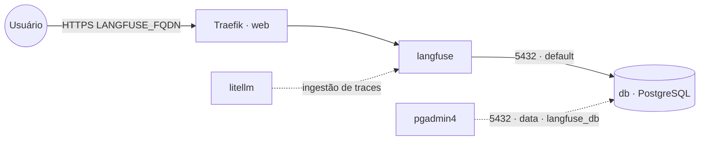

# langfuse — Langfuse (observabilidade de LLM)

**Langfuse** faz tracing/observabilidade de aplicações LLM (traces, prompts, custos, avaliações).
Pareia com a stack `litellm` (que pode enviar logs para o Langfuse). Esta stack usa o **Langfuse v2**
(serviço único), com **PostgreSQL embarcado** (serviço `db` próprio da stack). O banco fica na rede
interna `default` e também na `data` **só** para ferramentas de administração (pgadmin4) o alcançarem
como `langfuse_db`. Os dados ficam no banco, então o serviço da app é stateless; volume dedicado =
fácil migrar de host.

> O Langfuse **v3** adiciona ClickHouse, Redis e armazenamento S3 (mais componentes). Aqui optamos
> pelo v2 por simplicidade; para o v3, monte os serviços extras conforme a doc oficial.

## Arquitetura

## Variáveis de ambiente
| Variável | Obrigatória | Default | Descrição |
|---|---|---|---|
| `LANGFUSE_FQDN` | sim | — | domínio público (ex.: `langfuse.exemplo.com`) |
| `LANGFUSE_DB_PASSWORD` | sim | — | senha do PostgreSQL (usada pelo app e pelo `db`) |
| `LANGFUSE_NEXTAUTH_SECRET` | sim | — | segredo de sessão (gere com `openssl rand -base64 32`) |
| `LANGFUSE_SALT` | sim | — | salt para hash de chaves de API (gere com `openssl rand -base64 32`) |
| `LANGFUSE_DB_HOST` | não | `db` | host do banco (serviço interno desta stack) |
| `LANGFUSE_DB_PORT` | não | `5432` | porta do PostgreSQL |
| `LANGFUSE_DB_USER` | não | `postgres` | usuário do banco |
| `LANGFUSE_DB_NAME` | não | `langfuse` | banco usado pelo Langfuse |
| `LANGFUSE_DISABLE_SIGNUP` | não | `true` | bloqueia auto-cadastro (fechado por padrão; abra só p/ criar a 1ª conta) |
| `LANGFUSE_IMAGE_TAG` | não | `2` | tag da imagem langfuse/langfuse (v2) |
| `LANGFUSE_DB_IMAGE_TAG` | não | `16-alpine` | tag da imagem PostgreSQL |
| `PROXY_NET` | não | `web` | rede externa do Traefik |
| `DATA_NET` | não | `data` | rede externa p/ ferramentas de admin alcançarem o banco |

## Pré-requisitos
- **Hardware mínimo:** 2 vCPU · 2 GB RAM · 20 GB disco
- **Hardware ideal:** 4 vCPU · 4 GB RAM · 40 GB disco
- Stack `balancer` (Traefik) + rede `web`; DNS de `LANGFUSE_FQDN` apontando para o host.
- Rede `data`: `docker network create --driver overlay --attachable data` (usada pelas ferramentas de admin).
- **Não** precisa da stack `postgres-pgvector`: o banco sobe junto. Para administrá-lo, aponte o
  `pgadmin4` para o host `langfuse_db` (porta 5432) na rede `data`.

## Uso
1. Gere os segredos (`NEXTAUTH_SECRET`, `SALT`) e faça o deploy informando `LANGFUSE_FQDN` e
   `LANGFUSE_DB_PASSWORD`. O banco/usuário são criados automaticamente e as migrações aplicadas no start.
2. **Criar a 1ª conta:** o signup vem **fechado** (`LANGFUSE_DISABLE_SIGNUP=true`). Suba com
   `LANGFUSE_DISABLE_SIGNUP=false`, acesse `https://LANGFUSE_FQDN`, crie sua conta/projeto e **volte
   para `true`** reimplantando (a app é pública; sem isso qualquer um pode se cadastrar).
3. Aponte o cliente (ex.: `litellm`, SDK) para `https://LANGFUSE_FQDN` com as chaves do projeto.

### Migrar para outro host
Como o banco é dedicado, basta migrar o volume `db-data` para o novo nó e subir a stack lá — sem
mexer em banco compartilhado de outras stacks.

## Troubleshooting
| Sintoma | Causa | Ação |
|---|---|---|
| App não sobe / erro de migração | `db` ainda subindo / senha divergente | aguardar o `db`; conferir `LANGFUSE_DB_PASSWORD` igual no app e no banco |
| Login não persiste | `NEXTAUTH_SECRET` vazio/alterado | fixar o segredo |
| Chaves de API inválidas após restart | `SALT` mudou | manter o `SALT` fixo |
| 404/sem TLS | DNS não aponta / fora da `web` | conferir rede/labels e DNS |
| pgadmin4 não acha o banco | host errado | usar `langfuse_db:5432` na rede `data` |
| Setup reaparece | volume do banco resetado | preservar o volume `db-data` |
