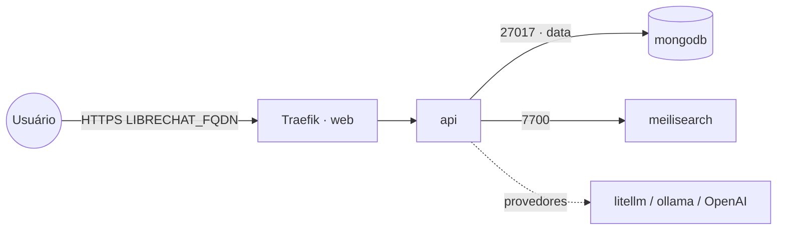

# librechat — LibreChat (UI multi-provedor de LLMs)

**LibreChat** é uma interface de chat tipo ChatGPT com **múltiplos provedores** (OpenAI, Anthropic,
Ollama, litellm), busca, RAG e agentes. Publicado via Traefik v3 com TLS. Reaproveita o **MongoDB**
compartilhado (stack `mongodb`) na rede `data` e sobe um **Meilisearch** próprio (busca nas conversas).

## Componentes
| Serviço | Imagem | Função |
|---|---|---|
| `api` | `ghcr.io/danny-avila/librechat` | Web + API, exposto via Traefik (porta 3080) |
| `meilisearch` | `getmeili/meilisearch` | Índice de busca das conversas |

## Arquitetura

## Variáveis de ambiente
| Variável | Obrigatória | Default | Descrição |
|---|---|---|---|
| `LIBRECHAT_FQDN` | sim | — | domínio público (ex.: `librechat.exemplo.com`) |
| `LIBRECHAT_MONGO_PASSWORD` | sim | — | senha do usuário do MongoDB (segredo) |
| `LIBRECHAT_CREDS_KEY` | sim | — | chave de criptografia (32 bytes hex: `openssl rand -hex 32`) |
| `LIBRECHAT_CREDS_IV` | sim | — | IV de criptografia (16 bytes hex: `openssl rand -hex 16`) |
| `LIBRECHAT_JWT_SECRET` | sim | — | segredo JWT (`openssl rand -hex 32`) |
| `LIBRECHAT_JWT_REFRESH_SECRET` | sim | — | segredo JWT refresh (`openssl rand -hex 32`) |
| `LIBRECHAT_MEILI_MASTER_KEY` | sim | — | master key do Meilisearch (`openssl rand -hex 32`) |
| `LIBRECHAT_MONGO_USER` | não | `root` | usuário do MongoDB |
| `LIBRECHAT_MONGO_HOST` | não | `mongodb` | host do MongoDB na rede `data` |
| `LIBRECHAT_MONGO_DB` | não | `LibreChat` | banco usado pelo LibreChat |
| `LIBRECHAT_ALLOW_REGISTRATION` | não | `false` | cadastro de novos usuários (fechado por padrão; abra só para criar a 1ª conta) |
| `LIBRECHAT_OPENAI_API_KEY` | não | — | chave OpenAI (ou do litellm) |
| `LIBRECHAT_OPENAI_REVERSE_PROXY` | não | — | base OpenAI-compatible (ex.: `https://litellm.exemplo.com/v1`) |
| `LIBRECHAT_IMAGE_TAG` | não | `latest` | tag da imagem librechat |
| `LIBRECHAT_MEILI_IMAGE_TAG` | não | `v1.12` | tag da imagem meilisearch |
| `PROXY_NET` | não | `web` | rede externa do Traefik |
| `DATA_NET` | não | `data` | rede overlay dos serviços compartilhados |

## Pré-requisitos
- Stack `balancer` (Traefik) + rede `web`; DNS de `LIBRECHAT_FQDN` apontando para o host.
- Rede `data` e stack **`mongodb`** ativa.
- Gere os segredos (`CREDS_KEY`, `CREDS_IV`, `JWT_*`, `MEILI_MASTER_KEY`) conforme a tabela.

## Uso
1. Defina os segredos e faça o deploy. O LibreChat cria as coleções no MongoDB no primeiro start.
2. **Criar a 1ª conta:** o registro vem **fechado** (`LIBRECHAT_ALLOW_REGISTRATION=false`). Suba com
   `LIBRECHAT_ALLOW_REGISTRATION=true`, acesse `https://LIBRECHAT_FQDN`, registre seu usuário e então
   **volte para `false`** e reimplante (o LibreChat não tem admin pré-criado).
3. Para usar o `litellm` como backend, defina `LIBRECHAT_OPENAI_REVERSE_PROXY` e a chave; modelos
   adicionais podem ser configurados via `librechat.yaml` (config avançada — ver doc oficial).

## Troubleshooting
| Sintoma | Causa | Ação |
|---|---|---|
| App não conecta ao Mongo | fora da `data` / credenciais erradas | conferir `LIBRECHAT_MONGO_*` e `authSource=admin` |
| Busca não funciona | Meilisearch fora / master key divergente | conferir `LIBRECHAT_MEILI_MASTER_KEY` nos dois serviços |
| Credenciais salvas "quebram" após restart | `CREDS_KEY`/`CREDS_IV` mudaram | manter os valores fixos |
| 404/sem TLS | DNS não aponta / fora da `web` | conferir rede/labels e DNS |
