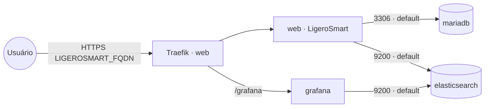

# ligerosmart — LigeroSmart

**LigeroSmart** — central de serviços / help desk / ITSM (open source, base OTRS). Adaptado do
projeto público [LigeroSmart/ligerosmart-stack](https://github.com/LigeroSmart/ligerosmart-stack)
para Traefik v3 + TLS. Inclui o app, MariaDB, Elasticsearch e Grafana.

## Componentes
| Serviço | Imagem | Função |
|---|---|---|
| `web` | `ligero/ligerosmart` | aplicação (porta interna 80) |
| `database` | `mariadb` | banco de dados |
| `elasticsearch` | `ligero/elasticsearch` | indexação/busca |
| `grafana` | `ligero/grafana` | dashboards (sob `/grafana`) |

## Arquitetura

## Variáveis de ambiente
| Variável | Obrigatória | Default | Descrição |
|---|---|---|---|
| `LIGEROSMART_FQDN` | sim | — | domínio público (ex.: `suporte.exemplo.com`) |
| `LIGEROSMART_DB_PASSWORD` | sim | — | senha do usuário do banco |
| `LIGEROSMART_DB_ROOT_PASSWORD` | sim | — | senha root do MariaDB |
| `LIGEROSMART_DB_NAME` | não | `ligerosmart` | nome do banco |
| `LIGEROSMART_DB_USER` | não | `ligerosmart` | usuário do banco |
| `LIGEROSMART_CUSTOMER_ID` | não | `ligerosmart` | CustomerID da instância |
| `LIGEROSMART_LANGUAGE` | não | `pt_BR` | idioma padrão |
| `TZ` | não | `America/Sao_Paulo` | timezone |
| `ES_JAVA_OPTS` | não | `-Xms512m -Xmx512m` | heap do Elasticsearch |
| `ES_MEMORY_LOCK` | não | `false` | memlock do ES (`true` exige ulimits no host) |
| `LIGEROSMART_IMAGE_TAG` | não | `6.1-nginx` | tag da imagem do app |
| `MARIADB_IMAGE_TAG` | não | `10.3` | tag do MariaDB |
| `ELASTICSEARCH_IMAGE_TAG` | não | `6.8.23` | tag do Elasticsearch |
| `LIGERO_GRAFANA_IMAGE_TAG` | não | `8` | tag do Grafana |
| `PROXY_NET` | não | `web` | rede externa do Traefik |
| `NODE_HOSTNAME_WEBSERVER` | sim | — | hostname do nó onde fixar o serviço `web` |
| `NODE_HOSTNAME_DATABASE` | sim | — | hostname do nó onde fixar o `database` (MariaDB) |
| `NODE_HOSTNAME_ELASTICSEARCH` | sim | — | hostname do nó onde fixar o `elasticsearch` |
| `NODE_HOSTNAME_GRAFANA` | sim | — | hostname do nó onde fixar o `grafana` |

> **Fixar serviços por nó (obrigatório).** Cada serviço tem volume local ao nó, então é fixado no
> host indicado por `NODE_HOSTNAME_*`. Preencha os quatro com o hostname do nó desejado (`docker
> node ls`) — pode ser o mesmo nó para todos. **Mantenha o mesmo host entre redeploys**, senão o
> serviço sobe num nó sem o volume e os dados "somem". Em nó único, use o hostname desse nó.
>
> Obs.: o interpolador do Portainer não suporta `${VAR:+...}`/`${VAR:-...}`, por isso o pin é por
> variável obrigatória simples (`node.hostname == ${NODE_HOSTNAME_*}`), não opcional.

## Pré-requisitos
- **Hardware mínimo:** 2 vCPU · 4 GB RAM · 20 GB disco
- **Hardware ideal:** 4 vCPU · 8 GB RAM · 40 GB disco
- Stack `balancer` (Traefik) + rede `web`; DNS de `LIGEROSMART_FQDN` apontando para o host.
- Recursos: Elasticsearch e o app consomem RAM (ajuste `ES_JAVA_OPTS` conforme o nó).

## Uso
1. Faça o deploy. O primeiro boot inicializa o banco e o app (pode demorar).
2. Acesse `https://LIGEROSMART_FQDN` — interface do agente em `/otrs` (ou o atalho `/atendente`).
3. Dashboards do Grafana em `https://LIGEROSMART_FQDN/grafana`.
4. Após subir, rode a indexação inicial do Elasticsearch pelo painel de admin do LigeroSmart.

## Troubleshooting
| Sintoma | Causa | Ação |
|---|---|---|
| App não conecta ao banco | senha divergente entre app e MariaDB | `LIGEROSMART_DB_PASSWORD` deve ser a mesma nos dois (já compartilham a var) |
| Elasticsearch não sobe | `ES_MEMORY_LOCK=true` sem ulimits no host | manter `ES_MEMORY_LOCK=false` ou configurar memlock no nó |
| ES travando por memória | heap inadequado | ajustar `ES_JAVA_OPTS` (ex.: `-Xms1g -Xmx1g`) |
| 404/sem TLS | fora da rede `web` / DNS não aponta | conferir rede/labels e DNS |
| `/grafana` em branco | proxy/root url | confirmar `GF_SERVER_ROOT_URL` = `https://LIGEROSMART_FQDN/grafana/` |
| Dados somem ao reagendar | volumes locais ao nó (multi-worker) | fixar cada serviço no nó via `NODE_HOSTNAME_*` |
