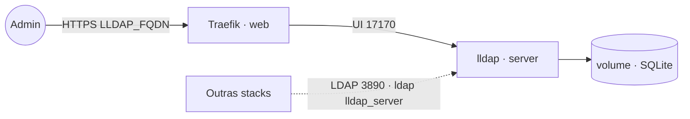

# lldap — Light LDAP

Servidor **LDAP leve** (usuários + grupos) com **UI web**, alternativa simples
ao OpenLDAP/Active Directory. Fala LDAP de verdade (porta **3890**) e expõe a
rede externa `ldap` para que outras stacks autentiquem no diretório
(host `lldap_server:3890`). Pareia bem com `authelia`, `keycloak`, `drive`,
`wikijs` e outros apps que falam LDAP.

## Componente
| Serviço | Imagem | URL | Função |
|---|---|---|---|
| `server` | `lldap/lldap` | `LLDAP_FQDN` (UI) · `lldap_server:3890` (LDAP) | diretório + administração web |

## Arquitetura



## Variáveis de ambiente
| Variável | Obrigatória | Default | Descrição |
|---|---|---|---|
| `LLDAP_FQDN` | sim | — | domínio da UI (ex.: `lldap.exemplo.com`) |
| `LLDAP_JWT_SECRET` | sim | — | segredo dos tokens da UI (`openssl rand -hex 32`) |
| `LLDAP_KEY_SEED` | sim | — | semente que deriva a chave privada (`openssl rand -hex 32`) |
| `LLDAP_ADMIN_PASSWORD` | sim | — | senha do usuário administrador |
| `LLDAP_BASE_DN` | não | `dc=example,dc=com` | base DN do diretório |
| `LLDAP_ADMIN_USERNAME` | não | `admin` | login do administrador |
| `LLDAP_IMAGE_TAG` | não | `stable` | tag da imagem |
| `PROXY_NET` | não | `web` | rede externa do Traefik |
| `LDAP_NET` | não | `ldap` | rede externa compartilhada do LDAP |
| `TZ` | não | `UTC` | fuso horário |
| `WORKER_HOSTNAME` | não | — | hostname do worker para fixar o volume (multi-worker) |

## Pré-requisitos
- Swarm com a stack `balancer` (Traefik) ativa e a rede overlay `web`.
- Rede overlay compartilhada do LDAP:
  `docker network create --driver overlay --attachable ldap`.
- Segredos gerados: `openssl rand -hex 32` para `LLDAP_JWT_SECRET` e `LLDAP_KEY_SEED`.

## Uso
1. Deploy da stack (Portainer App Template ou `docker stack deploy`).
2. Acesse a UI em `https://LLDAP_FQDN` e logue como `admin` (senha =
   `LLDAP_ADMIN_PASSWORD`). Crie usuários, grupos e associações.
3. **Outras stacks autenticam** apontando o LDAP delas para `ldap://lldap_server:3890`,
   base `LLDAP_BASE_DN`, conta de bind `uid=admin,ou=people,<base_dn>`. Exemplo
   com Authelia:
   ```yaml
   authentication_backend:
     ldap:
       implementation: lldap
       address: ldap://lldap_server:3890
       base_dn: dc=example,dc=com
       user: uid=admin,ou=people,dc=example,dc=com
       password: ${LLDAP_ADMIN_PASSWORD}
   ```
   > O serviço consumidor precisa estar anexado à rede externa `ldap`.

### Provisionar usuários por script (opcional)
A UI cobre o uso normal; para automação há a API GraphQL e o `lldap_set_password`:
```bash
# token de admin
TOKEN=$(curl -s -X POST https://LLDAP_FQDN/auth/simple/login \
  -H 'Content-Type: application/json' \
  -d '{"username":"admin","password":"SENHA_ADMIN"}' | jq -r .token)
# criar usuário
curl -s https://LLDAP_FQDN/api/graphql -H "Authorization: Bearer $TOKEN" \
  -H 'Content-Type: application/json' \
  -d '{"query":"mutation($u:CreateUserInput!){createUser(user:$u){id}}","variables":{"u":{"id":"alice","email":"alice@exemplo.com","displayName":"Alice"}}}'
```

## Troubleshooting
| Sintoma | Causa | Ação |
|---|---|---|
| Outra stack não acha o LDAP | serviço não está na rede `ldap` | anexar o consumidor à rede externa `ldap`; host = `lldap_server:3890` |
| 404 / sem TLS na UI | fora da rede `web` ou DNS não aponta | conferir labels/rede e o DNS do `LLDAP_FQDN` |
| Container reinicia citando `KEY_SEED`/`JWT_SECRET` | segredo ausente ou alterado | definir `LLDAP_JWT_SECRET` e `LLDAP_KEY_SEED` (não troque o seed depois de criar dados) |
| Login do app falha (bind) | conta/base erradas | bind `uid=admin,ou=people,<base_dn>`; base = `LLDAP_BASE_DN` |
| Senha rejeitada ao criar usuário | política de comprimento mínimo | usar senha mais longa |
| Dados perdidos após redeploy | volume local ao nó em multi-worker | fixar via `WORKER_HOSTNAME` (constraint `node.hostname`) |
