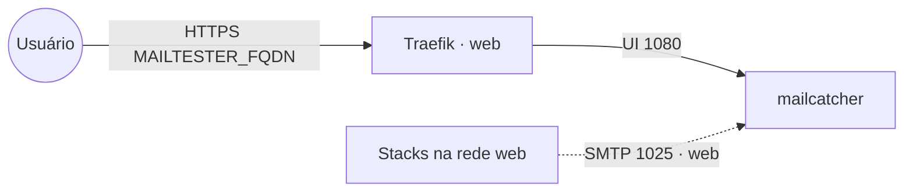

# mailtester — MailCatcher

Servidor SMTP de **captura** para dev/homologação: os apps enviam e-mail
normalmente, **nada sai de verdade**, e tudo cai numa **interface web** para
inspeção. Útil para testar reset de senha, notificações, confirmações etc. sem
um SMTP real.

## Arquitetura



Os apps na rede `web` apontam o SMTP deles para **`mailtester_mailcatcher:1025`**
(sem TLS, sem autenticação); a leitura dos e-mails fica em `MAILTESTER_FQDN`.

## Variáveis de ambiente
| Variável | Obrigatória | Default | Descrição |
|---|---|---|---|
| `MAILTESTER_FQDN` | sim | — | domínio da UI (ex.: `mail.exemplo.com`) |
| `MAILCATCHER_IMAGE_TAG` | não | `latest` | tag da imagem `jeanberu/mailcatcher` |
| `PROXY_NET` | não | `web` | rede externa do Traefik |
| `TZ` | não | `UTC` | fuso horário |

## Pré-requisitos
- **Hardware mínimo:** 0.5 vCPU · 128 MB RAM · 2 GB disco
- **Hardware ideal:** 0.5 vCPU · 256 MB RAM · 5 GB disco
- Swarm com a stack `balancer` (Traefik) e a rede overlay `web`.
- Os apps que vão enviar e-mail precisam estar anexados à mesma rede `web`.

## Uso
1. Deploy da stack (Portainer App Template ou `docker stack deploy`).
2. Acesse a UI em `https://MAILTESTER_FQDN` para ver os e-mails capturados.
3. Nos apps, configure o SMTP:
   - **host:** `mailtester_mailcatcher`
   - **porta:** `1025`
   - **TLS/SSL:** desligado · **autenticação:** nenhuma

   Exemplo (notifier SMTP do Authelia):
   ```yaml
   notifier:
     smtp:
       address: submission://mailtester_mailcatcher:1025
       sender: "Authelia <no-reply@exemplo.com>"
       disable_require_tls: true
   ```

## Troubleshooting
| Sintoma | Causa | Ação |
|---|---|---|
| App não entrega e-mail | não está na rede `web` ou host errado | anexar o app à rede `web`; host = `mailtester_mailcatcher:1025` |
| UI 404 / sem TLS | fora da rede `web` ou DNS não aponta | conferir labels/rede e o DNS do `MAILTESTER_FQDN` |
| Nada aparece na UI | app tentando STARTTLS/auth | desligar TLS e autenticação no SMTP do app (MailCatcher não usa) |
| E-mails somem após redeploy | sem persistência (proposital em dev) | é um sink efêmero; não há volume |
