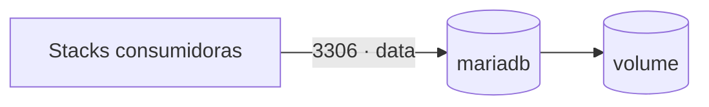

# mariadb — MariaDB (banco interno)

**MariaDB** como banco de dados **interno** do cluster Docker Swarm. Não é exposto via
Traefik nem fica na rede `web`. O serviço entra numa rede overlay externa compartilhada
`data`; outras stacks anexam essa mesma rede e conectam ao banco pelo nome do serviço
(`mariadb`, porta `3306`).

## Arquitetura



## Variáveis de ambiente
| Variável | Obrigatória | Default | Descrição |
|---|---|---|---|
| `MARIADB_ROOT_PASSWORD` | sim | — | senha do usuário `root` (segredo) |
| `MARIADB_PASSWORD` | sim | — | senha do usuário de aplicação `MARIADB_USER` (segredo) |
| `MARIADB_DATABASE` | não | `appdb` | banco criado na inicialização |
| `MARIADB_USER` | não | `app` | usuário de aplicação criado na inicialização |
| `MARIADB_IMAGE_TAG` | não | `11` | tag da imagem `mariadb` |
| `MARIADB_PORT` | não | `3306` | porta publicada em modo host (só se o bloco `ports` for descomentado) |
| `WORKER_HOSTNAME` | não | — | hostname do worker para fixar o volume em cluster multi-worker |
| `DATA_NET` | não | `data` | nome da rede overlay externa compartilhada |

## Pré-requisitos
- **Hardware mínimo:** 1 vCPU · 512 MB RAM · 10 GB disco
- **Hardware ideal:** 2 vCPU · 2 GB RAM · 20 GB disco
- Docker Swarm ativo.
- Rede overlay externa `data` criada (compartilhada com as stacks que consomem o banco):
  ```
  docker network create --driver overlay --attachable data
  ```
- Em cluster com mais de um worker: definir `WORKER_HOSTNAME` e descomentar o constraint
  `node.hostname` no compose, pois volumes Swarm são locais ao nó.

## Uso
1. Crie a rede `data` (comando acima) — uma única vez, antes da primeira stack.
2. Suba a stack informando os segredos `MARIADB_ROOT_PASSWORD` e `MARIADB_PASSWORD`.
3. Outras stacks consomem o banco anexando a rede `data` e usando o host `mariadb:3306`.
   No compose da stack consumidora:
   ```yaml
   services:
     app:
       networks:
         - default
         - data
       environment:
         - DB_HOST=mariadb
         - DB_PORT=3306
         - DB_NAME=appdb
   networks:
     data:
       external: true
       name: data
   ```
4. **Acesso externo (opcional):** para conectar de fora do cluster, descomente o bloco
   `ports:` (modo host) no compose. Ele publica a `3306` no nó onde o container roda.
   Exponha apenas se necessário e proteja com firewall/restrição de IP — o banco passa a
   ser alcançável diretamente no IP do nó.

## Backup e restore
Backup lógico com `mysqldump` (rode no nó onde o container está):
```
CID=$(docker ps -q -f name=mariadb)
docker exec "$CID" sh -c 'exec mysqldump -uroot -p"$MARIADB_ROOT_PASSWORD" --single-transaction --routines --triggers --all-databases' > backup.sql
```
Para um banco específico, troque `--all-databases` por `appdb` (ou `$MARIADB_DATABASE`).

Restore:
```
CID=$(docker ps -q -f name=mariadb)
docker exec -i "$CID" sh -c 'exec mariadb -uroot -p"$MARIADB_ROOT_PASSWORD"' < backup.sql
```

## Troubleshooting
| Sintoma | Causa | Ação |
|---|---|---|
| App não resolve `mariadb` | stack consumidora não está na rede `data` | anexar a rede `data` ao serviço da app |
| `network data not found` | rede externa não criada | rodar `docker network create --driver overlay --attachable data` |
| `Access denied for user` | senha errada ou usuário inexistente | conferir `MARIADB_USER`/`MARIADB_PASSWORD` (segredos) |
| Dados sumiram após redeploy | container reagendado em outro nó (volume local) | fixar `WORKER_HOSTNAME` e descomentar o constraint `node.hostname` |
| Conexão externa recusada | bloco `ports` comentado / firewall | descomentar `ports` e liberar a porta `MARIADB_PORT` no nó |
| `Port is already allocated` | `3306` já em uso no nó | ajustar `MARIADB_PORT` para outra porta |
