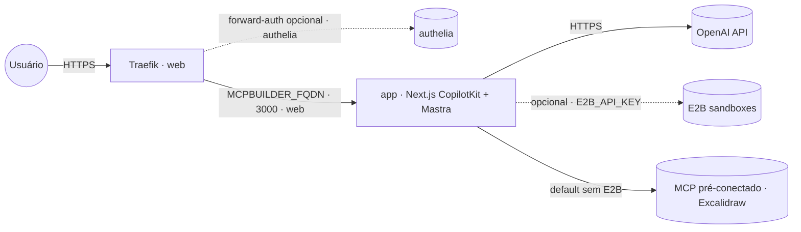

# mcp-app-builder — AI MCP App Builder

Descreva um app MCP no chat e receba uma **instância viva** renderizada **inline** na conversa.
Em vez de escolher componentes de um catálogo fixo, o agente **autora um app MCP novo em tempo de
execução** — o "componente" que ele emite *é um app inteiro*. Front **Next.js** com **CopilotKit**
+ **AG-UI** e agente **Mastra** (`/api/mastra-agent`); sandboxes **E2B** são opcionais.

Empacotado numa **imagem node-only** publicada em `ghcr.io/marcelofmatos/ai-mcp-app-builder`
(fonte: [awesome-llm-apps](https://github.com/Shubhamsaboo/awesome-llm-apps), app sob MIT · repo de build
[marcelofmatos/ai-mcp-app-builder](https://github.com/marcelofmatos/ai-mcp-app-builder)).

| Componente | Porta | Papel |
|---|---|---|
| Front (Next.js/CopilotKit) | `3000` | UI web exposta via Traefik; detém a `OPENAI_API_KEY`; agente Mastra em `/api/mastra-agent` |

> **E2B é opcional.** Sem `E2B_API_KEY`, o app usa **MCP servers pré-conectados** (default embutido:
> **Excalidraw**, `https://mcp.excalidraw.com`). Com `E2B_API_KEY`, o app **desbloqueia provisionar
> sandboxes novos** em runtime para hospedar os apps MCP gerados.
>
> **Sem login próprio.** A UI não tem autenticação — não deixe aberta no público. Proteja com
> forward-auth (stack `authelia`) descomentando a label de middleware no compose.
>
> **Stateless.** Os apps gerados vivem em memória por sessão — não há volume nem banco.

## Arquitetura



## Variáveis de ambiente

| Variável | Obrigatória | Default | Descrição |
|---|:---:|---|---|
| `MCPBUILDER_FQDN` | ✅ | — | Domínio (FQDN) onde a UI é exposta |
| `OPENAI_API_KEY` | ✅ | — | Chave OpenAI usada pelo chat/agente Mastra |
| `E2B_API_KEY` | ❌ | — | Sandboxes E2B (provisiona apps novos em runtime); vazio usa MCP pré-conectados |
| `MCPBUILDER_IMAGE_TAG` | ❌ | `latest` | Tag da imagem no GHCR |
| `PROXY_NET` | ❌ | `web` | Rede externa do proxy (Traefik) |
| `MCPBUILDER_AUTH_MIDDLEWARE` | ❌ | — | Middleware de forward-auth (ex.: `authelia@docker`), se descomentar a label |

## Pré-requisitos

- **Swarm** (App Template `type 2`): rede externa `web` já criada pelo Traefik.
- **Standalone** (`docker compose`): crie a rede antes — `docker network create web`.
- Chave **OpenAI** válida (https://platform.openai.com/api-keys).
- Opcional: chave **E2B** (https://e2b.dev/dashboard) para sandboxes em runtime.
- Hardware: **Leve** — mínimo ~256 MB RAM, ideal ~512 MB (sem banco; o custo real é a API OpenAI/E2B).

## Uso

1. No Portainer, escolha o template **mcp-app-builder — AI MCP App Builder** e preencha
   `MCPBUILDER_FQDN` e `OPENAI_API_KEY` (deixe `E2B_API_KEY` vazio se não for usar sandboxes).
2. Aponte o DNS de `MCPBUILDER_FQDN` para o proxy; o Traefik emite o certificado.
3. Acesse `https://MCPBUILDER_FQDN` e descreva um app (ex.: "Create a tic tac toe game").

Fora do Portainer:

```bash
cp .env.example .env   # preencha as obrigatórias
docker compose -f docker-compose.standalone.yml up -d
```

## Troubleshooting

| Sintoma | Causa | Ação |
|---|---|---|
| 502 / Bad Gateway logo após subir | Front ainda subindo | Aguarde ~30s; veja os logs do serviço (`app`) |
| Chat responde com erro de autenticação | `OPENAI_API_KEY` ausente ou inválida | Confira a chave nas variáveis da stack |
| App gerado não provisiona sandbox novo | `E2B_API_KEY` ausente | É esperado sem E2B — só os MCP pré-conectados (Excalidraw) funcionam; adicione a chave para sandboxes |
| Certificado TLS não emitido | DNS não aponta para o proxy | Ajuste o registro A/AAAA de `MCPBUILDER_FQDN` |
| UI acessível sem senha no público | forward-auth não configurado | Descomente a label de middleware e configure a stack `authelia` |
