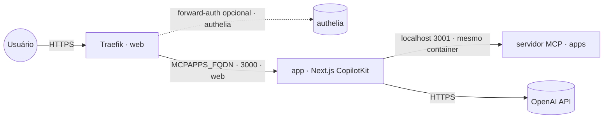

# mcp-apps-showcase — MCP Apps Generative UI Showcase

Reserve voos, hotéis, monte portfólios e gerencie um kanban **dentro do chat**. Cada ferramenta
do servidor MCP é ligada a um app HTML/JS que a interface monta como **iframe sandbox** na conversa
(MCP Apps Extension, SEP-1865). Front **Next.js** com **CopilotKit** + **AG-UI** e um **servidor MCP**
Node/Express que registra as ferramentas e serve os apps.

Empacotado numa **imagem combinada node-only** publicada em `ghcr.io/marcelofmatos/mcp-apps-generative-ui-showcase`
(fonte: [awesome-llm-apps](https://github.com/Shubhamsaboo/awesome-llm-apps), Apache-2.0 · repo de build
[marcelofmatos/mcp-apps-generative-ui-showcase](https://github.com/marcelofmatos/mcp-apps-generative-ui-showcase)).

| Componente | Porta | Papel |
|---|---|---|
| Front (Next.js/CopilotKit) | `3000` | UI web exposta via Traefik; detém a `OPENAI_API_KEY` |
| Servidor MCP (Node/Express) | `3001` | Interno (mesmo container); registra ferramentas e serve os apps em `/mcp` |

> **Sem login próprio.** A UI não tem autenticação — não deixe aberta no público. Proteja com
> forward-auth (stack `authelia`) descomentando a label de middleware no compose.
>
> **Stateless.** Os apps (portfólios, boards, reservas) vivem em memória por sessão — não há volume nem banco.

## Arquitetura



## Variáveis de ambiente

| Variável | Obrigatória | Default | Descrição |
|---|:---:|---|---|
| `MCPAPPS_FQDN` | ✅ | — | Domínio (FQDN) onde a UI é exposta |
| `OPENAI_API_KEY` | ✅ | — | Chave OpenAI usada pelo CopilotKit runtime (front) |
| `MCPAPPS_IMAGE_TAG` | ❌ | `latest` | Tag da imagem no GHCR |
| `PROXY_NET` | ❌ | `web` | Rede externa do proxy (Traefik) |
| `MCPAPPS_AUTH_MIDDLEWARE` | ❌ | — | Middleware de forward-auth (ex.: `authelia@docker`), se descomentar a label |

## Pré-requisitos

- **Swarm** (App Template `type 2`): rede externa `web` já criada pelo Traefik.
- **Standalone** (`docker compose`): crie a rede antes — `docker network create web`.
- Chave **OpenAI** válida (https://platform.openai.com/api-keys).
- Hardware: **Leve** — mínimo ~256 MB RAM, ideal ~512 MB (sem banco; o custo real é a API OpenAI).

## Uso

1. No Portainer, escolha o template **mcp-apps-showcase — MCP Apps Generative UI Showcase** e preencha
   `MCPAPPS_FQDN` e `OPENAI_API_KEY`.
2. Aponte o DNS de `MCPAPPS_FQDN` para o proxy; o Traefik emite o certificado.
3. Acesse `https://MCPAPPS_FQDN` e experimente um prompt (ex.: "Book a flight from JFK to LAX on January 20th for 2 passengers").

Fora do Portainer:

```bash
cp .env.example .env   # preencha as obrigatórias
docker compose -f docker-compose.standalone.yml up -d
```

## Troubleshooting

| Sintoma | Causa | Ação |
|---|---|---|
| 502 / Bad Gateway logo após subir | Front ainda subindo, ou servidor MCP falhou ao iniciar | Aguarde ~30s; veja os logs do serviço (`app`) |
| Chat responde com erro de autenticação | `OPENAI_API_KEY` ausente ou inválida | Confira a chave nas variáveis da stack |
| Chat responde, mas os apps não renderizam no chat | Servidor MCP interno indisponível (`:3001`) | Veja os logs `[mcp-server]`; o front usa `MCP_SERVER_URL=http://localhost:3001/mcp` |
| Certificado TLS não emitido | DNS não aponta para o proxy | Ajuste o registro A/AAAA de `MCPAPPS_FQDN` |
| UI acessível sem senha no público | forward-auth não configurado | Descomente a label de middleware e configure a stack `authelia` |
