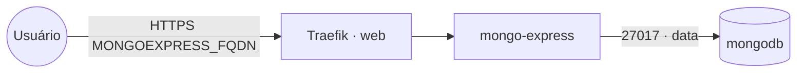

# mongo-express — admin web do MongoDB

**Mongo Express** (interface web de administração do MongoDB) publicado via Traefik v3 com TLS.
Conecta no **MongoDB** compartilhado (stack `mongodb`) pela rede `data`. Protegido por basicauth
próprio (`ME_CONFIG_BASICAUTH_*`).

## Arquitetura

## Variáveis de ambiente
| Variável | Obrigatória | Default | Descrição |
|---|---|---|---|
| `MONGOEXPRESS_FQDN` | sim | — | domínio público (ex.: `mongo.exemplo.com`) |
| `MONGOEXPRESS_MONGO_PASSWORD` | sim | — | senha do usuário do MongoDB (segredo) |
| `MONGOEXPRESS_PASSWORD` | sim | — | senha de login do Mongo Express (segredo) |
| `MONGOEXPRESS_USERNAME` | não | `admin` | usuário de login do Mongo Express |
| `MONGOEXPRESS_MONGO_USER` | não | `root` | usuário do MongoDB |
| `MONGOEXPRESS_MONGO_HOST` | não | `mongodb` | host do MongoDB na rede `data` |
| `MONGOEXPRESS_MONGO_PORT` | não | `27017` | porta do MongoDB |
| `MONGO_EXPRESS_IMAGE_TAG` | não | `1.0.2` | tag da imagem mongo-express |
| `PROXY_NET` | não | `web` | rede externa do Traefik |
| `DATA_NET` | não | `data` | rede overlay dos serviços compartilhados |

## Pré-requisitos
- Stack `balancer` (Traefik) + rede `web`; DNS de `MONGOEXPRESS_FQDN` apontando para o host.
- Rede `data` e stack **`mongodb`** ativa.

## Uso
1. Defina as senhas e faça o deploy.
2. Acesse `https://MONGOEXPRESS_FQDN` e entre com `MONGOEXPRESS_USERNAME` / `MONGOEXPRESS_PASSWORD`.

## Troubleshooting
| Sintoma | Causa | Ação |
|---|---|---|
| `MongoNetworkError` | fora da `data` / host ou porta errados | conferir `MONGOEXPRESS_MONGO_HOST/PORT` e a rede |
| Auth do Mongo falha | credenciais erradas / faltou `authSource=admin` | conferir usuário/senha do MongoDB |
| 404/sem TLS | DNS não aponta / fora da `web` | conferir rede/labels e DNS |
