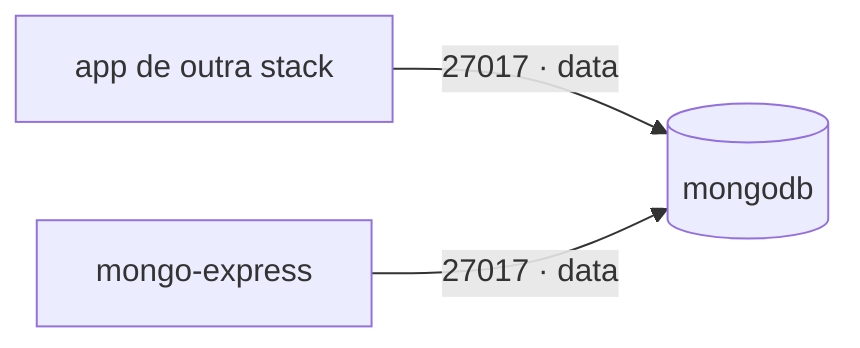

# mongodb — MongoDB (compartilhado)

**MongoDB** como banco NoSQL **interno/compartilhado** do cluster. Não usa Traefik nem a rede `web`:
fica só na rede overlay `data` e as outras stacks conectam pelo host `mongodb:27017`. Para administrar
via navegador, use a stack **`mongo-express`**.

## Arquitetura

## Variáveis de ambiente
| Variável | Obrigatória | Default | Descrição |
|---|---|---|---|
| `MONGO_ROOT_PASSWORD` | sim | — | senha do usuário root (segredo) |
| `MONGO_ROOT_USERNAME` | não | `root` | usuário root inicial |
| `MONGO_DATABASE` | não | `appdb` | banco criado no primeiro start |
| `MONGO_IMAGE_TAG` | não | `7` | tag da imagem mongo |
| `MONGO_PORT` | não | `27017` | porta publicada (só se descomentar o bloco `ports`) |
| `DATA_NET` | não | `data` | rede overlay dos serviços compartilhados |
| `WORKER_HOSTNAME` | não | — | fixa o volume num nó (cluster multi-worker) |

## Pré-requisitos
- Rede `data`: `docker network create --driver overlay --attachable data`.

## Uso
1. Defina `MONGO_ROOT_PASSWORD` e faça o deploy.
2. Outras stacks na rede `data` conectam com
   `mongodb://${MONGO_ROOT_USERNAME}:<senha>@mongodb:27017/<banco>?authSource=admin`.
3. Para criar bancos/usuários de aplicação, use o `mongosh` ou a stack `mongo-express`.

## Segurança
- Mantenha o MongoDB **fora da `web`**. Só publique a porta 27017 (bloco `ports`) se realmente
  precisar de acesso externo — e nunca sem autenticação.

## Troubleshooting
| Sintoma | Causa | Ação |
|---|---|---|
| App não conecta | fora da rede `data` / credenciais erradas | anexar a `data` e conferir usuário/senha + `authSource=admin` |
| Auth falha | esqueceu `authSource=admin` na URI | incluir `?authSource=admin` |
| Dados somem ao reagendar | volume local ao nó (multi-worker) | fixar `node.hostname` via `WORKER_HOSTNAME` |
