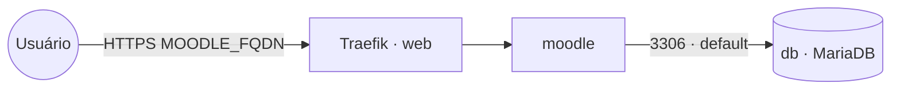

# moodle — Moodle LMS (Bitnami) + MariaDB

**Moodle** (plataforma de ensino / LMS) usando a imagem Bitnami, com **MariaDB** como banco de
dados, publicado via Traefik v3 com TLS Let's Encrypt. O Moodle roda atrás do reverse proxy
(`MOODLE_REVERSEPROXY=yes`, `MOODLE_SSLPROXY=yes`), gerando URLs em `https://MOODLE_FQDN`.

## Componentes

| Serviço | Imagem | Função | Redes |
|---|---|---|---|
| `moodle` | `bitnami/moodle` | Aplicação LMS (porta interna 8080) | `default`, `web` |
| `db` | `bitnami/mariadb` | Banco de dados MariaDB | `default` |

## Arquitetura



## Variáveis de ambiente
| Variável | Obrigatória | Default | Descrição |
|---|---|---|---|
| `MOODLE_FQDN` | sim | — | domínio público do Moodle (ex.: `moodle.exemplo.com`) |
| `MOODLE_DB_PASSWORD` | sim | — | senha do usuário do banco (Moodle e MariaDB) |
| `MOODLE_ADMIN_PASSWORD` | sim | — | senha do usuário administrador do Moodle |
| `MARIADB_ROOT_PASSWORD` | sim | — | senha do usuário `root` do MariaDB |
| `MOODLE_DB_NAME` | não | `moodle` | nome do banco de dados |
| `MOODLE_DB_USER` | não | `moodle` | usuário do banco de dados |
| `MOODLE_ADMIN_USER` | não | `admin` | login do administrador do Moodle |
| `MOODLE_ADMIN_EMAIL` | não | `admin@example.com` | e-mail do administrador do Moodle |
| `MOODLE_IMAGE_TAG` | não | `latest` | tag da imagem `bitnami/moodle` |
| `MARIADB_IMAGE_TAG` | não | `latest` | tag da imagem `bitnami/mariadb` |
| `PROXY_NET` | não | `web` | rede externa do Traefik |
| `WORKER_HOSTNAME` | não | — | hostname do worker para fixar serviços com volume (multi-worker) |

## Pré-requisitos
- Docker Swarm inicializado.
- Traefik (stack `balancer`) e rede `web` ativos.
- DNS de `MOODLE_FQDN` apontando para o host (porta 80 acessível para o desafio HTTP do Let's Encrypt).

## Uso
1. Defina as variáveis obrigatórias e faça o deploy:
   ```bash
   export MOODLE_FQDN=moodle.exemplo.com MOODLE_DB_PASSWORD=... MOODLE_ADMIN_PASSWORD=... MARIADB_ROOT_PASSWORD=...
   docker stack deploy -c moodle/docker-compose.yml moodle
   ```
2. Acesse `https://MOODLE_FQDN` e faça login com `MOODLE_ADMIN_USER` / `MOODLE_ADMIN_PASSWORD`.

> A primeira inicialização do Moodle é demorada (instala/popula o banco). Acompanhe os logs do
> serviço `moodle` até a aplicação ficar disponível.

## Volumes
Os volumes são **locais ao nó** (limitação do Swarm). Em cluster com mais de um worker, fixe os
serviços `moodle` e `db` ao mesmo nó definindo `WORKER_HOSTNAME` e descomentando o constraint
`node.hostname` no `docker-compose.yml`.

## Troubleshooting
| Sintoma | Causa | Ação |
|---|---|---|
| 404/sem TLS | serviço fora da `web` / DNS não aponta | conferir rede, labels do Traefik e DNS |
| Loop de redirecionamento ou CSS/links quebrados | proxy reverso não reconhecido | confirmar `MOODLE_REVERSEPROXY=yes`, `MOODLE_SSLPROXY=yes` e `MOODLE_HOST=MOODLE_FQDN` |
| `moodle` reinicia sem conectar ao banco | senha divergente / banco ainda inicializando | garantir mesma `MOODLE_DB_PASSWORD` nos dois serviços e aguardar o `db` subir |
| `db` não sobe | senha vazia ou ausente | definir `MARIADB_ROOT_PASSWORD` e `MOODLE_DB_PASSWORD` (`ALLOW_EMPTY_PASSWORD=no`) |
| Dados sumiram após mover o serviço | volume é local ao nó | fixar serviços ao mesmo worker via `WORKER_HOSTNAME` |
