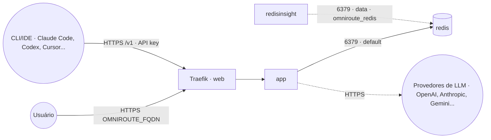

# omniroute — OmniRoute (gateway de IA multi-provedor)

**OmniRoute** ([diegosouzapw/OmniRoute](https://github.com/diegosouzapw/OmniRoute)) é um gateway
OpenAI-compatible que unifica dezenas de provedores de LLM (com foco em cobrir tiers gratuitos) atrás
de um único endpoint, com dashboard de gerenciamento, roteamento/fallback entre provedores e
compressão de prompt. Publicado via Traefik v3 com TLS, com **Redis embarcado** (serviço próprio
desta stack, usado como backend do rate limiter) — sem Redis o app cai para rate limiting em memória.

## Componentes
| Serviço | Imagem | Função |
|---|---|---|
| `app` | `diegosouzapw/omniroute` | Dashboard + API OpenAI-compatible, exposto via Traefik na porta 20128 |
| `redis` | `redis` | Cache/rate-limiter embarcado desta stack |

## Arquitetura

## Variáveis de ambiente
| Variável | Obrigatória | Default | Descrição |
|---|---|---|---|
| `OMNIROUTE_FQDN` | sim | — | domínio público (ex.: `omniroute.exemplo.com`) |
| `OMNIROUTE_JWT_SECRET` | sim | — | chave de assinatura das sessões do dashboard (`openssl rand -base64 48`) |
| `OMNIROUTE_API_KEY_SECRET` | sim | — | chave de criptografia das API keys dos provedores no SQLite (`openssl rand -hex 32`) |
| `OMNIROUTE_INITIAL_PASSWORD` | sim | — | senha inicial do admin do dashboard — troque no primeiro login |
| `OMNIROUTE_STORAGE_ENCRYPTION_KEY` | não | *(vazio)* | criptografia do SQLite inteiro em repouso (`openssl rand -hex 32`); vazio = desabilitada |
| `OMNIROUTE_REQUIRE_API_KEY` | não | `true` | exige API key nos endpoints `/v1/*`; **mantenha `true`** com o FQDN público (default upstream é `false`, pensado p/ loopback) |
| `OMNIROUTE_IMAGE_TAG` | não | `latest` | tag da imagem (`latest-web` para provedores web-cookie — ver abaixo) |
| `OMNIROUTE_REDIS_IMAGE_TAG` | não | `8-alpine` | tag da imagem Redis |
| `OMNIROUTE_REDIS_URL` | não | `redis://redis:6379` | URI do Redis (rate limiter) |
| `PROXY_NET` | não | `web` | rede externa do Traefik |
| `DATA_NET` | não | `data` | rede externa p/ ferramentas de admin alcançarem o Redis |
| `WORKER_HOSTNAME` | não | — | fixa os serviços num nó (cluster multi-worker) |
| `OMNIROUTE_EXTERNAL_PORT` | não | `8135` | porta host p/ acesso direto ao `app` (bypass do Traefik, ver compose) |
| `OMNIROUTE_REDIS_EXTERNAL_PORT` | não | `6382` | porta host p/ acesso direto ao Redis (bypass do Traefik, ver compose) |

## Flavors de imagem

A imagem publicada no Docker Hub tem dois perfis (esta stack **não** builda do source):

- **`latest`** (default) — enxuta, sem Chromium. Cobre a maioria dos provedores.
- **`latest-web`** — inclui Playwright/Chromium (~300 MB a mais). **Necessária** para os provedores
  "web-cookie" (`gemini-web`, `claude-web`, `claude-turnstile`). Troque com
  `OMNIROUTE_IMAGE_TAG=latest-web`.

**Limitação conhecida:** o compose upstream do OmniRoute inclui um sidecar
`chatgpt-web-codex-browser` (Chromium dedicado ao provider "ChatGPT Web (Codex)") que **não** tem
imagem publicada — só builda a partir do Dockerfile do repositório fonte. Como esta stack usa apenas
imagens pré-buildadas do Docker Hub, esse sidecar **não está incluído** e o provider "ChatGPT Web
(Codex)" não funciona aqui. Os demais ~350 provedores (incluindo os que usam `latest-web`) funcionam
normalmente.

## Pré-requisitos
- **Hardware mínimo:** 1 vCPU · 1 GB RAM · 5 GB disco
- **Hardware ideal:** 2 vCPU · 2 GB RAM · 15 GB disco
- Stack `balancer` (Traefik) + rede `web`; DNS de `OMNIROUTE_FQDN` apontando para o host.
- Rede `data`: `docker network create --driver overlay --attachable data` (usada pelo `redisinsight`).
- Gere `OMNIROUTE_JWT_SECRET` (`openssl rand -base64 48`), `OMNIROUTE_API_KEY_SECRET`
  (`openssl rand -hex 32`) e defina `OMNIROUTE_INITIAL_PASSWORD` antes do primeiro deploy.

## Uso
1. Gere os segredos e faça o deploy da stack.
2. Acesse `https://OMNIROUTE_FQDN`, faça login com `OMNIROUTE_INITIAL_PASSWORD` e troque a senha em
   **Dashboard → Settings → Security**.
3. Configure os provedores (chaves de API ou OAuth) em **Providers**; o dashboard mostra o endpoint
   OpenAI-compatible (`https://OMNIROUTE_FQDN/v1`) a apontar nos seus CLIs/IDEs (Claude Code, Codex,
   Cursor, Cline...).
4. Gere uma API key própria do OmniRoute em **API Keys** — com `OMNIROUTE_REQUIRE_API_KEY=true`
   (default), ela é obrigatória em toda chamada a `/v1/*`.
5. Para provedores `gemini-web`/`claude-web`/`claude-turnstile`, redeploye com
   `OMNIROUTE_IMAGE_TAG=latest-web`.

### Migrar para outro host
Como o Redis é dedicado, basta migrar os volumes `omniroute-data` e `redis-data` para o novo nó e
subir a stack lá.

## Troubleshooting
| Sintoma | Causa | Ação |
|---|---|---|
| 401 em `/v1/*` mesmo com key certa | key não gerada no dashboard ou `Authorization: Bearer` ausente | conferir **API Keys** no dashboard e o header enviado pelo cliente |
| `/v1/*` respondendo sem nenhuma key | `OMNIROUTE_REQUIRE_API_KEY=false` num FQDN público | volte para `true` (default) — proxy fica aberto a qualquer um que ache o domínio |
| Provider `gemini-web`/`claude-web`/`claude-turnstile` falha (`Executable doesn't exist ... chromium`) | rodando no flavor `latest` (sem Chromium) | redeploy com `OMNIROUTE_IMAGE_TAG=latest-web` |
| Provider "ChatGPT Web (Codex)" não conecta | sidecar `chatgpt-web-codex-browser` não está nesta stack (sem imagem publicada) | usar outro provider, ou rodar o OmniRoute a partir do source (fora desta stack) |
| Rate limit "vazando" entre réplicas/restarts | Redis fora do ar / `REDIS_URL` errado | conferir o serviço `redis` e a env `OMNIROUTE_REDIS_URL` |
| 404/sem TLS | fora da `web` / DNS não aponta | conferir rede/labels e DNS |
| Setup/API keys somem | volume `omniroute-data` resetado | preservar o volume `omniroute-data` |
| redisinsight não acha o Redis | host errado | usar `omniroute_redis:6379` na rede `data` |
