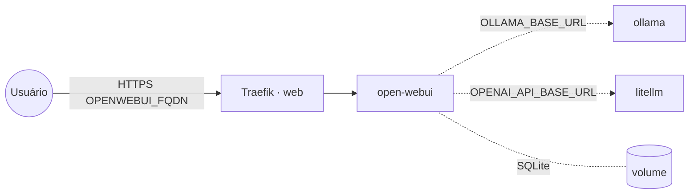

# open-webui — Open WebUI (chat de LLMs)

**Open WebUI** é uma interface de chat (estilo ChatGPT) para **Ollama** e endpoints
**OpenAI-compatible** (ex.: as stacks `ollama` e `litellm`). Publicado via Traefik v3 com TLS; persiste
em volume local (SQLite por padrão).

## Arquitetura

## Variáveis de ambiente
| Variável | Obrigatória | Default | Descrição |
|---|---|---|---|
| `OPENWEBUI_FQDN` | sim | — | domínio público (ex.: `chat.exemplo.com`) |
| `OPENWEBUI_SECRET_KEY` | sim | — | chave de sessão (gere com `openssl rand -hex 32`) |
| `OPENWEBUI_OLLAMA_URL` | não | — | URL do Ollama (ex.: `https://ollama.exemplo.com`) |
| `OPENWEBUI_OPENAI_BASE_URL` | não | — | base OpenAI-compatible (ex.: `https://litellm.exemplo.com/v1`) |
| `OPENWEBUI_OPENAI_API_KEY` | não | — | chave do endpoint OpenAI-compatible (ex.: master key do litellm) |
| `OPENWEBUI_ENABLE_SIGNUP` | não | `false` | permite auto-cadastro de usuários |
| `OPENWEBUI_IMAGE_TAG` | não | `main` | tag da imagem ghcr.io/open-webui/open-webui |
| `PROXY_NET` | não | `web` | rede externa do Traefik |
| `WORKER_HOSTNAME` | não | — | fixa o volume num nó (cluster multi-worker) |

## Pré-requisitos
- **Hardware mínimo:** 1 vCPU · 1 GB RAM · 10 GB disco
- **Hardware ideal:** 2 vCPU · 2 GB RAM · 20 GB disco
- Stack `balancer` (Traefik) + rede `web`; DNS de `OPENWEBUI_FQDN` apontando para o host.
- Pelo menos um backend de LLM: stack `ollama` e/ou `litellm`.

## Uso
1. Defina `OPENWEBUI_SECRET_KEY` e aponte `OPENWEBUI_OLLAMA_URL` e/ou `OPENWEBUI_OPENAI_BASE_URL`.
2. Faça o deploy e acesse `https://OPENWEBUI_FQDN`. O **primeiro usuário cadastrado vira admin**
   (depois desative o signup com `OPENWEBUI_ENABLE_SIGNUP=false`).

## Troubleshooting
| Sintoma | Causa | Ação |
|---|---|---|
| Sem modelos na lista | URL do Ollama/OpenAI vazia ou inacessível | conferir `OPENWEBUI_OLLAMA_URL`/`OPENWEBUI_OPENAI_BASE_URL` |
| 401 no endpoint OpenAI | chave ausente/errada | conferir `OPENWEBUI_OPENAI_API_KEY` |
| Sessões/logins resetam | `OPENWEBUI_SECRET_KEY` mudou/vazio | fixar a chave |
| Conversas somem ao reagendar | volume local ao nó (multi-worker) | fixar `node.hostname` via `WORKER_HOSTNAME` |
