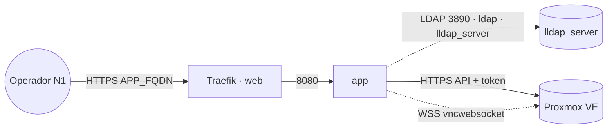

# orquestrator4proxmox — Painel de VMs Proxmox

Painel web para **operadores N1** provisionarem e gerenciarem **VMs de cliente** num
**Proxmox VE**, sem lhes dar acesso ao Proxmox nativo. Lista só VMs marcadas por tag,
cria por **clone de template** (com ajustes de recursos, rede e cloud-init), faz ciclo de
vida (start/stop/reboot/delete) e dá **console noVNC embutido**. Autentica no **LLDAP**.
Imagem única em GHCR; **stateless** (o estado vive no Proxmox e no LLDAP).

## Componente

| Serviço | Imagem | URL | Função |
|---|---|---|---|
| `app` | `ghcr.io/marcelofmatos/orquestrator4proxmox` | `APP_FQDN` | SPA + API (porta interna 8080) |

## Arquitetura

O **token do Proxmox nunca vai ao browser** — fica só no `app`. O consumidor precisa estar
anexado à rede externa **`ldap`** para alcançar o `lldap_server:3890`, e à rede **`web`**
para ser publicado pelo Traefik. A API do Proxmox é alcançada por HTTPS (rede padrão/saída).

## Variáveis de ambiente

| Variável | Obrigatória | Default | Descrição |
|---|---|---|---|
| `APP_FQDN` | sim | — | Domínio público servido pelo Traefik |
| `PROXMOX_URL` | sim | — | URL da API Proxmox (ex.: `https://proxmox.exemplo.com:8006/`) |
| `PROXMOX_TOKEN_ID` | sim | — | ID do API token de serviço (`user@realm!nome`) |
| `PROXMOX_TOKEN_SECRET` | sim | — | Segredo do API token |
| `LDAP_BIND_PASSWORD` | sim | — | Senha da conta de bind (admin do lldap) |
| `JWT_SECRET` | sim | — | Segredo das sessões (`openssl rand -hex 32`) |
| `APP_IMAGE_TAG` | não | `latest` | Tag da imagem |
| `APP_BRAND` | não | `orquestrator4proxmox` | Marca no topo do painel (personalizável) |
| `HOST_DOMAIN` | não | (vazio) | Sufixo de domínio das VMs p/ a instrução SSH (`ssh <user>@<vm>.<HOST_DOMAIN>`) |
| `PROXMOX_TLS_INSECURE` | não | `false` | `true` só p/ cert self-signed (dev) |
| `PROXMOX_CLIENT_TAG` | não | `cliente` | Tag que revela VMs de cliente |
| `PROXMOX_HIDDEN_TAGS` | não | `mgmt,infra` | Tags que ocultam VMs |
| `PROXMOX_TARGET_STORAGE` | não | `local-zfs` | Storage de destino do clone |
| `LDAP_URL` | não | `ldap://lldap-server-1:3890` | Endpoint LDAP (standalone; em Swarm use `lldap_server`) |
| `LDAP_BASE_DN` | não | `dc=example,dc=com` | Base DN |
| `LDAP_BIND_DN` | não | `uid=admin,ou=people,dc=example,dc=com` | Conta de bind |
| `LDAP_REQUIRED_GROUP` | não | (vazio) | Restringe login a um grupo |
| `SESSION_TTL` | não | `8h` | Duração da sessão |
| `PROXY_NET` | não | `web` | Rede externa do Traefik |
| `LDAP_NET` | não | `ldap` | Rede externa do LDAP |

## Pré-requisitos

- **Hardware mínimo:** 0.25 vCPU · 128 MB RAM. Ideal: 0.5 vCPU · 256 MB RAM.
- Traefik (stack `balancer`) ativo e a rede externa `web`.
- Rede externa `ldap` (stack `lldap`) — o `app` precisa estar anexado a ela.
- Um **API token de serviço** no Proxmox com permissão de gerenciar VMs.
- Usuários/grupos no LLDAP (o operador N1 loga com a conta do diretório).

## Uso

1. Deploy da stack (Portainer App Template ou `docker compose`), preenchendo as variáveis.
2. Aponte o DNS de `APP_FQDN` para o proxy e acesse `https://APP_FQDN`.
3. Logue com um usuário do LLDAP. Os operadores só veem VMs com a tag `PROXMOX_CLIENT_TAG`.
4. As VMs criadas pelo painel recebem a tag de cliente automaticamente.

## Troubleshooting

| Sintoma | Causa | Ação |
|---|---|---|
| Login falha (bind) | conta/base LDAP erradas | conferir `LDAP_BIND_DN`/`LDAP_BASE_DN`; senha em `LDAP_BIND_PASSWORD` |
| App não acha o LDAP | fora da rede `ldap` | anexar à rede externa `ldap`; host = `lldap-server-1:3890` (standalone) ou `lldap_server` (Swarm) |
| 404/sem TLS na UI | fora da rede `web` ou DNS | conferir labels/rede e o DNS de `APP_FQDN` |
| Erro TLS ao falar com o Proxmox | cert self-signed | `PROXMOX_TLS_INSECURE=true` (dev) ou usar cert válido |
| Nenhuma VM aparece | tags divergentes | as VMs de cliente precisam da tag `PROXMOX_CLIENT_TAG` (default `cliente`) |
| Console não abre | VM sem VNC/agent ou rede | conferir o node/VM no Proxmox; o backend proxia o `vncwebsocket` |
