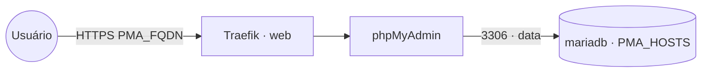

# phpmyadmin — phpMyAdmin

**phpMyAdmin** publicado via Traefik v3 com TLS. Já entra na rede overlay compartilhada `data`,
então alcança a stack `mariadb` direto pelo host `mariadb`. `PMA_ARBITRARY=1` ainda permite
informar outro host do banco na própria tela de login (para administrar vários MySQL/MariaDB).

## Arquitetura

## Variáveis de ambiente
| Variável | Obrigatória | Default | Descrição |
|---|---|---|---|
| `PMA_FQDN` | sim | — | domínio público (ex.: `pma.exemplo.com`) |
| `PMA_HOSTS` | não | `mariadb` | host(s) de banco pré-preenchidos (separados por vírgula) |
| `PMA_UPLOAD_LIMIT` | não | `256M` | limite de upload de import |
| `PMA_IMAGE_TAG` | não | `latest` | tag da imagem phpMyAdmin |
| `PROXY_NET` | não | `web` | rede externa do Traefik |
| `DATA_NET` | não | `data` | rede overlay externa dos bancos compartilhados |

## Pré-requisitos
- **Hardware mínimo:** 0.5 vCPU · 256 MB RAM · 2 GB disco
- **Hardware ideal:** 1 vCPU · 512 MB RAM · 5 GB disco
- Traefik (stack `balancer`) e rede `web` ativos.
- Rede `data` criada: `docker network create --driver overlay --attachable data` (usada pela stack `mariadb`).
- DNS de `PMA_FQDN` apontando para o host.

## Uso
Acesse `https://PMA_FQDN`. O servidor `mariadb` já vem pré-preenchido (via `PMA_HOSTS`); informe
usuário e senha. Para outro banco, digite o host no campo **Servidor** (precisa estar alcançável
pela rede `data` ou `web` — anexe a rede correspondente ao serviço se necessário).

## Segurança
- Exponha apenas se necessário; considere proteger com middleware de autenticação no Traefik
  (basicauth/authelia) ou restrição de IP.
- `PMA_ARBITRARY=1` permite conectar a qualquer host alcançável pelo container — avalie o risco.

## Troubleshooting
| Sintoma | Causa | Ação |
|---|---|---|
| 404/sem TLS | fora da `web` / DNS não aponta | conferir rede/labels e DNS |
| "mysqli::real_connect: No such host" | host do banco não resolve pela rede do container | conferir se está na rede `data`; anexar a rede do banco ao serviço `pma` |
| Banco `mariadb` não aparece | rede `data` não existe ou stack `mariadb` fora dela | criar a rede `data` e subir a stack `mariadb` |
| Import falha por tamanho | limite baixo | aumentar `PMA_UPLOAD_LIMIT` |
