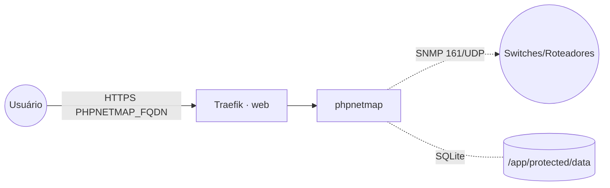

# phpnetmap — PHPNetMap (mapa de rede via SNMP)

**PHPNetMap** descobre e mapeia a topologia da rede consultando dispositivos via **SNMP**
(tabelas FIB/CAM e ARP), exibindo conexões entre hosts e status das portas. App PHP (framework Yii)
publicado via Traefik v3 com TLS. Usa **SQLite** embutido, persistido em `/app/protected/data`.

## Arquitetura

## Variáveis de ambiente
| Variável | Obrigatória | Default | Descrição |
|---|---|---|---|
| `PHPNETMAP_FQDN` | sim | — | domínio público (ex.: `netmap.exemplo.com`) |
| `PHPNETMAP_ADMIN_PASSWORD` | sim | — | senha do usuário admin (segredo) |
| `PHPNETMAP_ADMIN_USER` | não | `admin` | usuário admin (basicauth do app) |
| `PHPNETMAP_IMAGE_TAG` | não | `latest` | tag da imagem ghcr.io/marcelofmatos/phpnetmap |
| `PROXY_NET` | não | `web` | rede externa do Traefik |
| `WORKER_HOSTNAME` | não | — | fixa o volume num nó (cluster multi-worker) |

## Pré-requisitos
- **Hardware mínimo:** 0.5 vCPU · 256 MB RAM · 5 GB disco
- **Hardware ideal:** 1 vCPU · 512 MB RAM · 10 GB disco
- Stack `balancer` (Traefik) + rede `web`; DNS de `PHPNETMAP_FQDN` apontando para o host.
- Acesso de rede do nó aos dispositivos a monitorar via SNMP (UDP/161) com a community correta.

## Uso
1. Defina `PHPNETMAP_ADMIN_PASSWORD` e faça o deploy. O volume é semeado com o banco inicial a partir
   da imagem.
2. Acesse `https://PHPNETMAP_FQDN` e entre com `PHPNETMAP_ADMIN_USER` / `PHPNETMAP_ADMIN_PASSWORD`.
3. Cadastre os dispositivos (IP + community SNMP) e gere o mapa de rede.

## Troubleshooting
| Sintoma | Causa | Ação |
|---|---|---|
| Dispositivos sem dados | SNMP inacessível / community errada | conferir rota até o device (UDP/161) e a community |
| Login falha | `ADMIN_*` divergente | conferir `PHPNETMAP_ADMIN_USER`/`PHPNETMAP_ADMIN_PASSWORD` |
| 404/sem TLS | DNS não aponta / fora da `web` | conferir rede/labels e DNS |
| Dados somem ao reagendar | volume local ao nó (multi-worker) | fixar `node.hostname` via `WORKER_HOSTNAME` |
