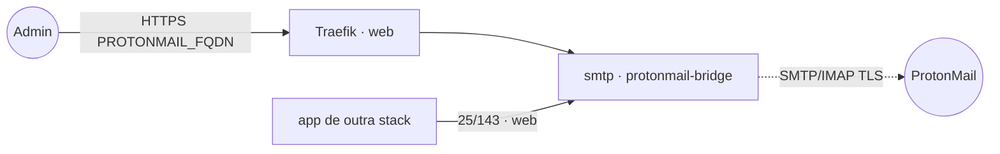

# protonmail-bridge — ProtonMail Bridge (SMTP/IMAP)

**ProtonMail Bridge** roda a ponte da Proton e expõe a sua conta como **SMTP/IMAP** em texto interno,
para que outras stacks do cluster enviem e leiam e-mail pela sua conta ProtonMail. A UI web (porta 3000,
para login e gerenciamento) é publicada via Traefik v3 com TLS e protegida pelo `WEBUI_AUTH_TOKEN` da
própria imagem.

## Arquitetura

## Variáveis de ambiente
| Variável | Obrigatória | Default | Descrição |
|---|---|---|---|
| `PROTONMAIL_FQDN` | sim | — | domínio da UI web (ex.: `proton.exemplo.com`) |
| `PROTONMAIL_WEBUI_AUTH_TOKEN` | sim | — | token de acesso à UI web (segredo; gere com `openssl rand -hex 32`) |
| `PROTONMAIL_IMAGE_TAG` | não | `latest` | tag da imagem pattertj/protonmail-bridge |
| `PROTONMAIL_SMTP_PORT` | não | `1025` | porta SMTP publicada no nó (só se descomentar `ports`) |
| `PROTONMAIL_IMAP_PORT` | não | `1143` | porta IMAP publicada no nó (só se descomentar `ports`) |
| `PROXY_NET` | não | `web` | rede externa do Traefik |
| `WORKER_HOSTNAME` | não | — | fixa o volume/login num nó (cluster multi-worker) |

## Pré-requisitos
- **Hardware mínimo:** 0.5 vCPU · 256 MB RAM · 2 GB disco
- **Hardware ideal:** 1 vCPU · 512 MB RAM · 5 GB disco
- Stack `balancer` (Traefik) + rede `web`; DNS de `PROTONMAIL_FQDN` apontando para o host.
- Uma conta ProtonMail (plano com Bridge habilitado).

## Uso
1. Defina `PROTONMAIL_WEBUI_AUTH_TOKEN` e faça o deploy.
2. Acesse `https://PROTONMAIL_FQDN`, informe o token e faça **login** na conta Proton (a primeira vez
   exige a senha da conta + 2FA, se ativo). O login fica persistido no volume.
3. Em outras stacks na rede `web`, configure o envio de e-mail apontando para o relay interno:
   - **SMTP host:** `protonmail-bridge_smtp` · **porta:** `25` · STARTTLS (sem verificar certificado)
   - **IMAP host:** `protonmail-bridge_smtp` · **porta:** `143` · STARTTLS (sem verificar certificado)
   - usuário/senha = os fornecidos pela UI do Bridge (senha específica do Bridge, não a da conta).

> **MCP de e-mail (opcional):** a imagem `ghcr.io/ai-zerolab/mcp-email-server` pode ler/enviar e-mail
> via este Bridge (IMAP/SMTP nas portas internas 143/25). Rode-a sob demanda apontando
> `MCP_EMAIL_SERVER_IMAP_HOST`/`SMTP_HOST` para o serviço `smtp` — não faz parte do deploy da stack.

## Troubleshooting
| Sintoma | Causa | Ação |
|---|---|---|
| UI pede token e nega | `WEBUI_AUTH_TOKEN` diferente do informado | conferir/!regerar `PROTONMAIL_WEBUI_AUTH_TOKEN` |
| Apps não enviam e-mail | host/porta errados ou TLS estrito | usar `protonmail-bridge_smtp:25` com STARTTLS e sem verificar cert |
| Pede login de novo após migrar | volume local ao nó (multi-worker) | fixar `node.hostname` via `WORKER_HOSTNAME` |
| 404/sem TLS na UI | DNS não aponta / fora da `web` | conferir rede/labels e DNS |
