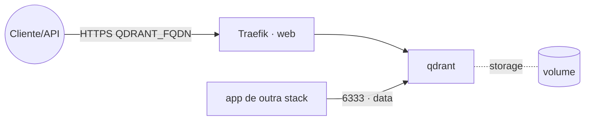

# qdrant — Qdrant (vector database)

**Qdrant** é um banco de dados vetorial de alta performance (RAG, busca semântica). Publicado via
Traefik v3 com TLS (API REST na 6333) e também disponível na rede `data` para outras stacks (ex.:
`dify`) conectarem internamente por `qdrant:6333`.

## Arquitetura

## Variáveis de ambiente
| Variável | Obrigatória | Default | Descrição |
|---|---|---|---|
| `QDRANT_FQDN` | sim | — | domínio público (ex.: `qdrant.exemplo.com`) |
| `QDRANT_API_KEY` | recomendado | — | exige o header `api-key`; sem ela a API fica **aberta** |
| `QDRANT_IMAGE_TAG` | não | `latest` | tag da imagem qdrant/qdrant |
| `PROXY_NET` | não | `web` | rede externa do Traefik |
| `DATA_NET` | não | `data` | rede overlay dos serviços compartilhados |
| `WORKER_HOSTNAME` | não | — | fixa o volume num nó (cluster multi-worker) |

## Pré-requisitos
- Stack `balancer` (Traefik) + rede `web`; DNS de `QDRANT_FQDN` apontando para o host.
- Rede `data`: `docker network create --driver overlay --attachable data`.

## Uso
1. Defina `QDRANT_API_KEY` e faça o deploy.
2. Externamente: `https://QDRANT_FQDN` com header `api-key: <chave>`. Internamente (rede `data`):
   `http://qdrant:6333`.

## Troubleshooting
| Sintoma | Causa | Ação |
|---|---|---|
| API acessível sem auth | `QDRANT_API_KEY` vazio | definir a chave e reimplantar |
| Outra stack não conecta | fora da `data` | anexar a stack à rede `data` e usar `qdrant:6333` |
| Dados somem ao reagendar | volume local ao nó (multi-worker) | fixar `node.hostname` via `WORKER_HOSTNAME` |
| 404/sem TLS | DNS não aponta / fora da `web` | conferir rede/labels e DNS |
