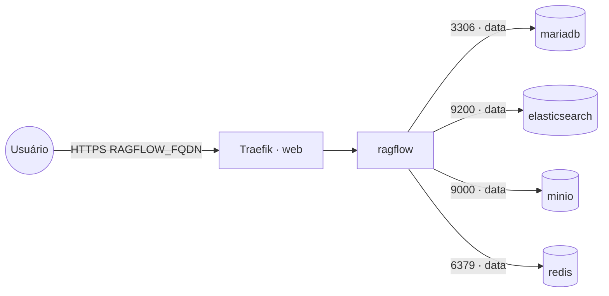

# ragflow — RAGFlow (motor de RAG)

**RAGFlow** é um motor de RAG com parsing avançado de documentos (OCR, tabelas, layout) e busca
híbrida. Publicado via Traefik v3 com TLS. Reaproveita os backends compartilhados da rede `data`:
**MariaDB/MySQL** (`mariadb`), **Redis** (`redis`), **Elasticsearch** (`elasticsearch`) e **MinIO**
(`minio`) — não sobe esses serviços.

> RAGFlow é **pesado** (imagem grande, usa modelos de embedding) e **sensível à versão**. Fixe
> `RAGFLOW_IMAGE_TAG` e confira os nomes de host/variáveis de cada backend conforme a release. Para
> controle total, é possível montar um `service_conf.yaml` próprio via Docker config.

## Arquitetura



## Variáveis de ambiente
| Variável | Obrigatória | Default | Descrição |
|---|---|---|---|
| `RAGFLOW_FQDN` | sim | — | domínio público (ex.: `ragflow.exemplo.com`) |
| `RAGFLOW_MYSQL_PASSWORD` | sim | — | senha do MySQL/MariaDB |
| `RAGFLOW_MINIO_PASSWORD` | sim | — | senha do usuário MinIO |
| `RAGFLOW_ES_PASSWORD` | sim | — | senha do usuário `elastic` |
| `RAGFLOW_MYSQL_HOST` | não | `mariadb` | host do MySQL/MariaDB na rede `data` |
| `RAGFLOW_MYSQL_DB` | não | `rag_flow` | banco usado pelo RAGFlow |
| `RAGFLOW_MINIO_HOST` | não | `minio:9000` | host:porta do MinIO |
| `RAGFLOW_MINIO_USER` | não | `ragflow` | usuário/access key do MinIO |
| `RAGFLOW_ES_HOST` | não | `elasticsearch` | host do Elasticsearch |
| `RAGFLOW_ES_PORT` | não | `9200` | porta do Elasticsearch |
| `RAGFLOW_REDIS_HOST` | não | `redis` | host do Redis |
| `RAGFLOW_REDIS_PASSWORD` | não | — | senha do Redis (se houver) |
| `RAGFLOW_TIMEZONE` | não | `America/Sao_Paulo` | fuso horário |
| `RAGFLOW_IMAGE_TAG` | não | `latest` | tag da imagem infiniflow/ragflow |
| `PROXY_NET` | não | `web` | rede externa do Traefik |
| `DATA_NET` | não | `data` | rede overlay dos serviços compartilhados |

## Pré-requisitos
- Stack `balancer` (Traefik) + rede `web`; DNS de `RAGFLOW_FQDN` apontando para o host.
- Rede `data` e as stacks **`mariadb`**, **`redis`**, **`elasticsearch`** e **`minio`** ativas.
- No MariaDB, crie o banco do RAGFlow:
  ```sql
  CREATE DATABASE rag_flow CHARACTER SET utf8mb4 COLLATE utf8mb4_unicode_ci;
  ```
- No MinIO, crie um bucket/usuário para o RAGFlow (access key = `RAGFLOW_MINIO_USER`).
- O nó precisa de RAM/CPU folgados (parsing + embeddings).

## Uso
1. Crie o banco e o acesso ao MinIO, defina as senhas e faça o deploy. O primeiro start baixa modelos
   de embedding (pode demorar).
2. Acesse `https://RAGFLOW_FQDN`, crie a conta e configure o provedor de LLM (ex.: `litellm`/`ollama`).
3. Crie uma base de conhecimento, suba documentos e faça as consultas.

## Troubleshooting
| Sintoma | Causa | Ação |
|---|---|---|
| App não sobe | algum backend inacessível / senha errada | conferir hosts e senhas de MySQL/ES/MinIO/Redis |
| Indexação falha | Elasticsearch sem auth correta | conferir `RAGFLOW_ES_PASSWORD` e o host `elasticsearch:9200` |
| Upload falha | bucket/credencial MinIO ausente | criar o bucket e conferir `RAGFLOW_MINIO_*` |
| Primeiro start muito lento | download de modelos de embedding | aguardar; garantir disco/RAM suficientes |
| 404/sem TLS | DNS não aponta / fora da `web` | conferir rede/labels e DNS |
