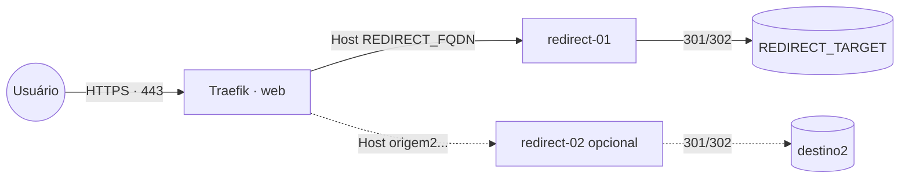

# redirect — hub de redirecionamentos HTTP

Stack que reúne **vários redirects HTTP numa única stack** — cada serviço redireciona um domínio
de origem para um destino (301/302), via [`morbz/docker-web-redirect`](https://hub.docker.com/r/morbz/docker-web-redirect),
publicado pelo **Traefik v3** com TLS Let's Encrypt.

> **`redirect` vs `web-redirect`:** use `web-redirect` quando quiser **um** redirect parametrizado
> por env (uma stack por redirect). Use `redirect` (esta) para **gerenciar vários redirects juntos**
> na mesma stack, adicionando um bloco de serviço por domínio.

## Componentes

| Serviço | Imagem | Função |
|---|---|---|
| `redirect-01` | `morbz/docker-web-redirect` | redireciona `REDIRECT_FQDN` → `REDIRECT_TARGET` (porta interna 80) |
| `redirect-02`, … | idem | redirects adicionais (blocos que você duplica — exemplo comentado no compose) |

## Arquitetura

## Variáveis de ambiente

| Variável | Obrigatória | Default | Descrição |
|---|---|---|---|
| `REDIRECT_FQDN` | sim | — | domínio de origem do 1º redirect (ex.: `antigo.exemplo.com`) |
| `REDIRECT_TARGET` | sim | — | destino do 1º redirect (ex.: `https://novo.exemplo.com`) |
| `REDIRECT_TYPE` | não | `redirect` | `redirect` (302 temporário) ou `redirect permanent` (301) |
| `REDIRECT_IMAGE_TAG` | não | `latest` | tag da imagem `morbz/docker-web-redirect` |
| `PROXY_NET` | não | `web` | rede externa do Traefik |

> O formulário do App Template configura o **1º** redirect (`redirect-01`). Redirects adicionais são
> adicionados editando o `docker-compose.yml` (ver abaixo) — o App Template não cria serviços extras
> por env.

## Pré-requisitos

1. Rede externa `web` (stack `balancer`/Traefik): `docker network create --driver overlay --attachable web`.
2. DNS de cada domínio de origem apontando para o host.

## Uso

### 1 redirect (App Template)
Suba a stack informando `REDIRECT_FQDN` e `REDIRECT_TARGET`. Pronto: `https://REDIRECT_FQDN` passa a
redirecionar para `REDIRECT_TARGET`.

### Vários redirects
Edite o `docker-compose.yml` e **duplique o bloco do serviço** para cada domínio (há um exemplo
`redirect-02` comentado). Em cada cópia, troque:

- o **nome do serviço** (`redirect-02`, `redirect-03`, …);
- os nomes de **router/service** do Traefik (`...routers.redirect-02...`, `...services.redirect-02...`) — precisam ser únicos;
- o **`Host(\`...\`)`** (domínio de origem);
- o **`REDIRECT_TARGET`** (destino).

Para **desabilitar** um redirect sem apagar o bloco, deixe `replicas: 0`.

## Troubleshooting

| Sintoma | Causa | Ação |
|---|---|---|
| `404` do Traefik no domínio | router sem `Host` correto ou DNS errado | confira o `Host(...)` do serviço e o DNS de origem |
| Roteia para o serviço errado | nomes de router/service repetidos entre blocos | use nomes únicos por serviço (`redirect-02`, `redirect-03`, …) |
| Redirect não “fixa” no navegador | usou 302 e o browser cacheou | para permanente use `REDIRECT_TYPE=redirect permanent` (301) |
| Certificado não emite | DNS do domínio de origem não aponta p/ o host | ajuste o DNS e aguarde o Let's Encrypt |
