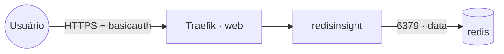

# redisinsight — GUI do Redis

**RedisInsight** (interface gráfica de administração do Redis) publicado via Traefik v3 com TLS.
Conecta no **Redis** compartilhado (stack `redis`) pela rede `data`. Como o RedisInsight não tem login
próprio, o acesso é protegido por **basicauth do Traefik**.

## Arquitetura

## Variáveis de ambiente
| Variável | Obrigatória | Default | Descrição |
|---|---|---|---|
| `REDISINSIGHT_FQDN` | sim | — | domínio público (ex.: `redis.exemplo.com`) |
| `REDISINSIGHT_AUTH_BASIC` | sim | — | basicauth do Traefik no formato `usuario:hash_bcrypt` (`htpasswd -nbB`) |
| `REDISINSIGHT_IMAGE_TAG` | não | `latest` | tag da imagem redis/redisinsight |
| `PROXY_NET` | não | `web` | rede externa do Traefik |
| `DATA_NET` | não | `data` | rede overlay dos serviços compartilhados |
| `WORKER_HOSTNAME` | não | — | fixa o volume num nó (cluster multi-worker) |

## Pré-requisitos
- Stack `balancer` (Traefik) + rede `web`; DNS de `REDISINSIGHT_FQDN` apontando para o host.
- Rede `data` e stack **`redis`** ativa.
- Gere o basicauth: `htpasswd -nbB usuario senha` → use a saída em `REDISINSIGHT_AUTH_BASIC`.

## Uso
1. Defina `REDISINSIGHT_AUTH_BASIC` e faça o deploy.
2. Acesse `https://REDISINSIGHT_FQDN` (passa pelo basicauth) e adicione um banco Redis apontando para
   o host `redis`, porta `6379` (com senha, se a stack `redis` tiver `requirepass`).

## Troubleshooting
| Sintoma | Causa | Ação |
|---|---|---|
| Pede usuário/senha e nega | hash do basicauth incorreto | regerar com `htpasswd -nbB` e atualizar `REDISINSIGHT_AUTH_BASIC` |
| Não conecta ao Redis | fora da `data` / host ou senha errados | usar host `redis:6379` e a senha do Redis |
| 404/sem TLS | DNS não aponta / fora da `web` | conferir rede/labels e DNS |
| Conexões somem ao reagendar | volume local ao nó (multi-worker) | fixar `node.hostname` via `WORKER_HOSTNAME` |
