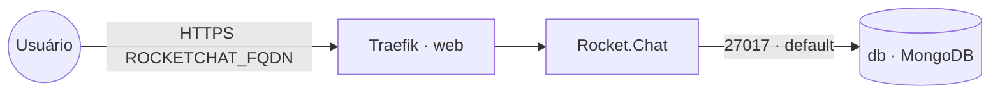

# rocketchat — Rocket.Chat + MongoDB

**Rocket.Chat** (plataforma de comunicação em equipe / chat) publicado via Traefik v3 com TLS,
usando **MongoDB** como banco. O MongoDB roda como **replica set** (`rs0`), requisito do
Rocket.Chat para usar o oplog (mensagens em tempo real).

## Componentes
| Serviço | Imagem | Função | Rede |
|---|---|---|---|
| `rocketchat` | `rocketchat/rocket.chat` | aplicação web (porta 3000) | `default`, `web` |
| `db` | `mongo` | banco MongoDB em replica set (`rs0`) | `default` |

## Arquitetura



## Variáveis de ambiente
| Variável | Obrigatória | Default | Descrição |
|---|---|---|---|
| `ROCKETCHAT_FQDN` | sim | — | domínio público (ex.: `chat.exemplo.com`) |
| `ROCKETCHAT_DB_NAME` | não | `rocketchat` | nome do banco de dados no MongoDB |
| `ROCKETCHAT_IMAGE_TAG` | não | `latest` | tag da imagem Rocket.Chat |
| `MONGO_IMAGE_TAG` | não | `6.0` | tag da imagem MongoDB |
| `PROXY_NET` | não | `web` | rede externa do Traefik |
| `WORKER_HOSTNAME` | não | — | hostname do worker para fixar o serviço com volume (multi-worker) |

## Pré-requisitos
- Docker Swarm inicializado.
- Stack `balancer` (Traefik) e rede `web` ativos.
- DNS de `ROCKETCHAT_FQDN` apontando para o host (porta 80 acessível para o desafio HTTP do
  Let's Encrypt).

## Uso
1. Faça o deploy da stack (App Template no Portainer ou `docker stack deploy`):
   ```bash
   export ROCKETCHAT_FQDN=chat.exemplo.com
   docker stack deploy -c rocketchat/docker-compose.yml rocketchat
   ```
2. **Inicialize o replica set na PRIMEIRA execução.** O Rocket.Chat só sobe depois que o
   MongoDB estiver com o replica set `rs0` ativo. Abra um shell no container do `db` e execute
   `rs.initiate()` via `mongosh`:
   ```bash
   # descubra o container do serviço db
   docker ps --filter name=rocketchat_db --format '{{.ID}}'

   # entre no shell do mongo (mongosh; em imagens antigas use "mongo")
   docker exec -it <CONTAINER_ID> mongosh

   # dentro do mongosh, inicialize o replica set apontando para o host do serviço:
   rs.initiate({ _id: "rs0", members: [ { _id: 0, host: "db:27017" } ] })

   # confirme que o membro virou PRIMARY:
   rs.status()
   ```
   Após o `rs0` ficar `PRIMARY`, o serviço `rocketchat` conecta e finaliza a inicialização.
3. Acesse `https://ROCKETCHAT_FQDN` e conclua o assistente de setup (admin inicial).

> O `rs.initiate()` só é necessário uma vez; o estado do replica set fica persistido no volume `mongo`.

## Troubleshooting
| Sintoma | Causa | Ação |
|---|---|---|
| 404/sem TLS | serviço fora da `web` / DNS não aponta | conferir rede/labels e DNS de `ROCKETCHAT_FQDN` |
| `rocketchat` reinicia em loop | replica set não inicializado | rodar `rs.initiate()` no `db` (ver Uso, passo 2) |
| "MongoError: not master" / oplog indisponível | membro do replica set não é PRIMARY | conferir `rs.status()`; reinicializar se necessário |
| Mensagens não atualizam em tempo real | `MONGO_OPLOG_URL` / replica set com problema | verificar `rs0` ativo e a conexão ao banco `local` |
| Dados sumiram após mover de nó | volume é local ao nó (Swarm) | fixar o `db` no nó com `WORKER_HOSTNAME` (constraint `node.hostname`) |
